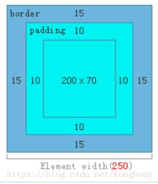
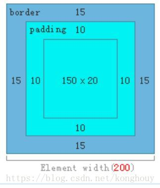
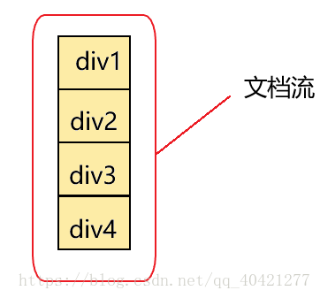
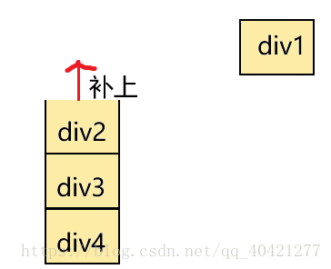
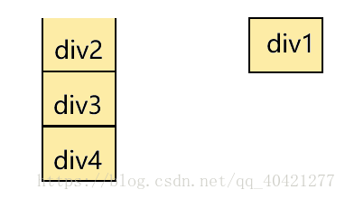
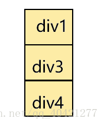

## CSS 的奥秘 <!-- omit in toc --> 
    目录
- [css 选择器](#css-选择器)
  - [各选择器的优先级](#各选择器的优先级)
  - [继承属性](#继承属性)
  - [无继承的属性](#无继承的属性)
- [盒子模型，box-sizing](#盒子模型box-sizing)
- [脱离文档流](#脱离文档流)
- [position 属性几个值的区别](#position-属性几个值的区别)
- [BFC](#bfc)
- [CSS3 新特性，animation 等](#css3-新特性animation-等)
- [熟练 flex 布局](#熟练-flex-布局)
- [了解 grid 布局](#了解-grid-布局)

=======

    正文

=======

### css 选择器
- 关于css属性选择器常用的有以下这些：
    ```css
    id选择器（#box） -->选择id为box的元素
    类选择器（.one） -->选择类名为one的所有元素
    标签选择器（div） -->选择标签为div的所有元素
    后代选择器（#box div） -->选择id为box元素内部所有的div元素
    子选择器（.one>one_1） -->选择父元素为.one的所有.one_1的元素
    相邻同胞选择器（.one+.two） -->选择紧接在.one之后的所有.two元素
    群组选择器（div,p） -->选择div、p的所有元素
    ```
- 还有一些使用频率相对没那么多的选择器：
    - 伪类选择器
        ```css
        :link ：选择未被访问的链接
        :visited：选取已被访问的链接
        :active：选择活动链接
        :hover ：鼠标指针浮动在上面的元素
        :focus ：选择具有焦点的
        :first-child：父元素的首个子元素
        ```
    - 伪元素选择器
        ```css
        :first-letter ：用于选取指定选择器的首字母
        :first-line ：选取指定选择器的首行
        :before : 选择器在被选元素的内容前面插入内容
        :after : 选择器在被选元素的内容后面插入内容
        ```
    - 属性选择器
        ```css
        [attribute] 选择带有attribute属性的元素
        [attribute=value] 选择所有使用attribute=value的元素
        [attribute~=value] 选择attribute属性包含value的元素
        [attribute|=value]：选择attribute属性以value开头的元素
        ```
- 在CSS3中新增的选择器还有：
    - 层次选择器（p~ul），选择前面有p元素的每个ul元素
    伪类选择器
        ```css
        :first-of-type 父元素的首个元素
        :last-of-type 父元素的最后一个元素
        :only-of-type 父元素的特定类型的唯一子元素
        :only-child 父元素中唯一子元素
        :nth-child(n) 选择父元素中第N个子元素
        :nth-last-of-type(n) 选择父元素中第N个子元素，从后往前
        :last-child 父元素的最后一个元素
        :root 设置HTML文档
        :empty 指定空的元素
        :enabled 选择被禁用元素
        :disabled 选择被禁用元素
        :checked 选择选中的元素
        ```
    - 属性选择器
        ```css 
        [attribute*=value]：选择attribute属性值包含value的所有元素
        [attribute^=value]：选择attribute属性开头为value的所有元素
        [attribute$=value]：选择attribute属性结尾为value的所有元素
        ```
#### 各选择器的优先级 
- 内联 > ID选择器 > 类选择器 > 标签选择器
- 到具体的计算层⾯，优先级是由 A 、B、C、D 的值来决定的，其中它们的值计算规则如下：
    - 如果存在内联样式，那么 A = 1, 否则 A = 0
    - B的值等于 ID选择器出现的次数
    - C的值等于 类选择器 和 属性选择器 和 伪类 出现的总次数
    - D 的值等于 标签选择器 和 伪元素 出现的总次数
- 这里举个例子：#nav-global > ul > li > a.nav-link
    - 套用上面的算法，依次求出 A B C D 的值：
        - 因为没有内联样式 ，所以 A = 0
        - ID选择器总共出现了1次， B = 1
        - 类选择器出现了1次， 属性选择器出现了0次，伪类选择器出现0次，所以 C = (1 + 0 + 0) = 1
        - 标签选择器出现了3次， 伪元素出现了0次，所以 D = (3 + 0) = 3
        - 上面算出的A 、 B、C、D 可以简记作：(0, 1, 1, 3)
- 知道了优先级是如何计算之后，就来看看比较规则：
    - 从左往右依次进行比较 ，较大者优先级更高
    - 如果相等，则继续往右移动一位进行比较
    - 如果4位全部相等，则后面的会覆盖前面的
    - 经过上面的优先级计算规则，我们知道内联样式的优先级最高，如果外部样式需要覆盖内联样式，就需要使用!important
#### 继承属性
- 字体系列属性
    ```css
    font:组合字体
    font-family:规定元素的字体系列
    font-weight:设置字体的粗细
    font-size:设置字体的尺寸
    font-style:定义字体的风格
    font-variant:偏大或偏小的字体
    ```
- 文本系列属性
    ```css
    text-indent：文本缩进
    text-align：文本水平
    line-height：行高
    word-spacing：增加或减少单词间的空白
    letter-spacing：增加或减少字符间的空白
    text-transform：控制文本大小写
    direction：规定文本的书写方向
    color：文本颜色
    ```
- 元素可见性
    ```css
    visibility
    ```
- 表格布局属性
    ```css
    caption-side：定位表格标题位置
    border-collapse：合并表格边框
    border-spacing：设置相邻单元格的边框间的距离
    empty-cells：单元格的边框的出现与消失
    table-layout：表格的宽度由什么决定
    ```
- 列表属性
    ```css
    list-style-type：文字前面的小点点样式
    list-style-position：小点点位置
    list-style：以上的属性可通过这属性集合
    ```
- 引用
    ```css
    quotes：设置嵌套引用的引号类型
    ```
- 光标属性
    ```css
    cursor：箭头可以变成需要的形状
    ```
- 继承中比较特殊的几点：
    ```css
    a 标签的字体颜色不能被继承
    h1-h6标签字体的大下也是不能被继承的
    ```
#### 无继承的属性
```css
display
文本属性：vertical-align、text-decoration
盒子模型的属性：宽度、高度、内外边距、边框等
背景属性：背景图片、颜色、位置等
定位属性：浮动、清除浮动、定位position等
生成内容属性：content、counter-reset、counter-increment
轮廓样式属性：outline-style、outline-width、outline-color、outline
页面样式属性：size、page-break-before、page-break-after
```
### 盒子模型，box-sizing  
盒子模型简单点理解就是外边距(margin)+边框(border)+内边距(padding)+内容(content)

box-sizing
- 语法：content-box | border-box | inherit
    - content-box  
    默认值，W3C盒子模型（标准盒模型）。盒子宽高是 content(内容) 的宽高。
        ```css
        .test1{
            box-sizing:content-box;
            width:200px;
            padding:10px;
            border:15px solid #eee;
        }
        ```
        
    - border-box  
    IE盒模型（怪异盒模型）。盒子宽高是 border + padding + content 的宽高。
        ```css
        .test1{
            box-sizing:border-box;
            width:200px;
            padding:10px;
            border:15px solid #eee;
        }
        ```
         

    - inherit 规定应从父元素继承 box-sizing 属性的值。
### 脱离文档流 
浏览器默认的排版方式就是文档流(或者叫标准流)排版方式：块级元素垂直排布，行内元素和行内块级水平排布。  

不脱离就是按照这种方式排版,从左到右，从上到下。  

脱离文档流就是不按照文档流的排版方式。  
- 元素脱离文档流之后，将不再在文档流中占据空间，而是处于浮动状态。脱离文档流的元素的定位基于正常的文档流，当一个元素脱离文档流后，依然在文档流中的其他元素将忽略该元素并填补其原先的空间。  
       
       
       
       
       
    div2被div1给覆盖了！因为脱离文档流的div1不占据页面的空间了，所以才会留有空间给后面的div补上，当然这也导致了div2给div1覆盖了！
- 目前常见的会影响元素脱离文档流的css属性有：
    - ①float浮动;
    - ②position的absolute和fixed定位。
### position 属性几个值的区别
- static（出现在正常的文档流中）  
默认。位置设置为 static 的元素，它始终会处于页面流给予的位置（static 元素会忽略任何 top、bottom、left 或 right 声明）。
- relative（不脱离文档流）  
发生偏移时的参照为 position 属性取 static 时盒子的位置
- absolute（脱离文档流）	  
元素相对于最近的非 static 定位的祖先元素发生偏移
- fixed（脱离文档流）  
元素相对于屏幕视口（viewport）的位置来发生偏移, 元素的位置在屏幕滚动时不会改变。这一点与 absolute 不同，absolute 在屏幕滚动时会跟着一起滚动
- sticky   
可以被认为是 relative 和 fixed 的混合，元素在跨越特定阈值前为相对定位，之后为固定定位： sticky 会让元素在页面滚动时如同在正常流中（relative定位），但当滚动到特定位置时就会固定在屏幕上如同 fixed 
    > sticky定位的阈值是相对它的最近滚动祖先来定义的，而 sticky 的作用区域也是它的第一个非static父元素内，也就是说粘性布局的效果只在该父元素内表现出来。
### BFC
1. 在解释什么是BFC之前，我们需要先知道Box、Formatting Context的概念：
    - Box：css布局的基本单位
      - 直观点来说，就是一个页面是由很多个 Box 组成的。元素的类型和 display 属性，决定了这个 Box 的类型。 不同类型的 Box， 会参与不同的 Formatting Context（一个决定如何渲染文档的容器），因此Box内的元素会以不同的方式渲染。有三种盒子：
        - block-level box：display 属性为 block, list-item, table 的元素，会生成 block-level box。并且参与 block fomatting context；
        - inline-level box：display 属性为 inline, inline-block, inline-table 的元素，会生成 inline-level box。并且参与 inline formatting context；
        - run-in box: css3 中才有
    - Formatting Context
      - 它是页面中的一块渲染区域，并且有一套渲染规则，它决定了其子元素将如何定位，以及和其他元素的关系和相互作用。最常见的 Formatting context 有 Block fomatting context (简称BFC)和 Inline formatting context (简称IFC)。
2. BFC(Block formatting context)直译为"块级格式化上下文"。它是一个独立的渲染区域，只有Block-level box参与， 它规定了内部的Block-level Box如何布局，并且与这个区域外部毫不相干，并且在一个BFC中，块盒与行盒（行盒由一行中所有的内联元素所组成）都会垂直的沿着其父元素的边框排列。
3. BFC的布局规则
    - 内部的Box会垂直方向，一个接一个地放置
    - Box垂直的距离有margin决定，适用于同一个BFC相邻的两个Box的margin距离会发生重叠
    - 每个元素margin box的左边与包含块border box左边相接解，即使在浮动也如此
    - BFC的区域不会与flont box 重叠
    - BFC就是页面上的一个隔离的独立容器，容器里面的子元素不会影响到外面的元素，反之如此
    - 计算BFC的高度是浮动元素也参与计算 
4. 如何创建BFC
    - 根元素或包含根元素的元素
    -  浮动元素（元素的 float 不是 none）
    -  绝对定位元素（元素的 position 为 absolute 或 fixed）
    -  行内块元素（元素的 display 为 inline-block）
    -  表格单元格（元素的 display为 table-cell，HTML表格单元格默认为该值）
    -  表格标题（元素的 display 为 table-caption，HTML表格标题默认为该值）
    -  匿名表格单元格元素【元素的 display为 table、table-row、 table-row-group、table-header-group、table-footer-group（分别是HTML table、row、tbody、thead、tfoot的默认属性）或 inline-table】
    -   overflow 值不为 visible 的块元素
    -   display 值为 [flow-root](https://drafts.csswg.org/css-display/#valdef-display-flow-root) 的元素
    -   contain 值为 layout、content或 strict 的元素
    -  弹性元素（display为 flex 或 inline-flex元素的直接子元素）
    -  网格元素（display为 grid 或 inline-grid 元素的直接子元素）
    -  多列容器（元素的 column-count 或 column-width 不为 auto，包括 ``column-count 为 1）
    -   column-span 为 all 的元素始终会创建一个新的BFC，即使该元素没有包裹在一个多列容器中（标准变更，Chrome bug）。
5. BFC的作用
    - 利用BFC避免margin重叠。
    - 阻止元素被浮动元素覆盖 -> 可应用于自适应两栏布局（避免右侧与左侧发生重叠)
    - 清除浮动
      - 当我们不给父节点设置高度，子节点设置浮动的时候，会发生高度塌陷，这个时候我们就要清除浮动。这个时候我们根据最后一条规则：计算BFC的高度时，浮动元素也参与计算。于是给父节点激活BFC
### CSS3 新特性，animation 等 
- 过渡  
transition： CSS属性，花费时间，效果曲线(默认ease)，延迟时间(默认0)。
    ```css
    // 简写：
    transition：width, 5s, ease, 2s

    transition-property: width;
    transition-duration: 1s;
    transition-timing-function: linear;
    transition-delay: 2s;
    ```
    transition-timing-function 属性
    |值|描述|
    |:--|:--|
    |linear|规定以相同速度开始至结束的过渡效果（等于 cubic-bezier(0,0,1,1)）|
    |ease|规定慢速开始，然后变快，然后慢速结束的过渡效果（cubic-bezier(0.25,0.1,0.25,1)）|
    |ease-in|规定以慢速开始的过渡效果（等于 cubic-bezier(0.42,0,1,1)）|
    |ease-out|规定以慢速结束的过渡效果（等于 cubic-bezier(0,0,0.58,1)）|
    |ease-in-out|	规定以慢速开始和结束的过渡效果（等于 cubic-bezier(0.42,0,0.58,1)）|
    |cubic-bezier(n,n,n,n)|在 cubic-bezier 函数中定义自己的值。可能的值是 0 至 1 之间的数值|
- 动画  
animation：动画名称，一个周期花费时间，运动曲线（默认ease），动画延迟（默认0），播放次数（默认1），是否反向播放动画（默认normal），是否暂停动画（默认running）
    ```css
    animation-name	规定动画的名称。
    animation-duration	规定动画完成一个周期所花费的秒或毫秒。默认是 0。
    animation-timing-function	规定动画的速度曲线。默认是 "ease"。
        linear	动画从头到尾的速度是相同的。	测试
        ease	默认。动画以低速开始，然后加快，在结束前变慢。	测试
        ease-in	动画以低速开始。	测试
        ease-out	动画以低速结束。	测试
        ease-in-out	动画以低速开始和结束。	测试
        cubic-bezier(n,n,n,n)	在 cubic-bezier 函数中自己的值。可能的值是从 0 到 1 的数值。

    animation-delay	规定动画何时开始。默认是 0。
    animation-iteration-count	规定动画被播放的次数。默认是 1
    animation-direction	规定动画是否在下一周期逆向地播放。默认是 "normal"。
        normal	默认值。动画应该正常播放。	测试
        alternate	动画应该轮流反向播放。	测试

    animation-play-state	规定动画是否正在运行或暂停。默认是 "running"。
        paused	规定动画已暂停。	测试
        running	规定动画正在播放。	测试

    animation-fill-mode	规定对象动画时间之外的状态。
        none	不改变默认行为。
        forwards	当动画完成后，保持最后一个属性值（在最后一个关键帧中定义）。
        backwards	在 animation-delay 所指定的一段时间内，在动画显示之前，应用开始属性值（在第一个关键帧中定义）。
        both	向前和向后填充模式都被应用。
    ```


- 形状转换  
  - 2D Transform 方法
    ```css
    translate(x,y)	定义 2D 转换，沿着 X 和 Y 轴移动元素。
    translateX(n)	定义 2D 转换，沿着 X 轴移动元素。
    translateY(n)	定义 2D 转换，沿着 Y 轴移动元素。
    rotate(angle)	定义 2D 旋转，在参数中规定角度。
    scale(x,y)	定义 2D 缩放转换，改变元素的宽度和高度。
    scaleX(n)	定义 2D 缩放转换，改变元素的宽度。
    scaleY(n)	定义 2D 缩放转换，改变元素的高度。
    matrix(n,n,n,n,n,n)	定义 2D 转换，使用六个值的矩阵。
    skew(x-angle,y-angle)	定义 2D 倾斜转换，沿着 X 和 Y 轴。
    skewX(angle)	定义 2D 倾斜转换，沿着 X 轴。
    skewY(angle)	定义 2D 倾斜转换，沿着 Y 轴。
    css
    ```
    - 所有 2D 变换属性：
        - transform	向元素应用 2D 或 3D 转换。
        - transform-origin	允许你改变被转换元素的位置。
            ```css 
            x-axis	定义视图被置于 X 轴的何处。可能的值：left，center，right，length，%
            y-axis	定义视图被置于 Y 轴的何处。可能的值：top，center，bottom，length，%
            z-axis	定义视图被置于 Z 轴的何处。可能的值：length
            css

  - 3D Transform 方法
    ```css
    matrix3d(n,n,n,n,n,n,n,n,n,n,n,n,n,n,n,n)	定义 3D 转换，使用 16 个值的 4x4 矩阵。
    translate3d(x,y,z)	定义 3D 转化。
        translateX(x)	定义 3D 转化，仅使用用于 X 轴的值。
        translateY(y)	定义 3D 转化，仅使用用于 Y 轴的值。
        translateZ(z)	定义 3D 转化，仅使用用于 Z 轴的值。

    scale3d(x,y,z)	定义 3D 缩放转换。
        scaleX(x)	定义 3D 缩放转换，通过给定一个 X 轴的值。
        scaleY(y)	定义 3D 缩放转换，通过给定一个 Y 轴的值。
        scaleZ(z)	定义 3D 缩放转换，通过给定一个 Z 轴的值。

    rotate3d(x,y,z,angle)	定义 3D 旋转。
        rotateX(angle)	定义沿 X 轴的 3D 旋转。
        rotateY(angle)	定义沿 Y 轴的 3D 旋转。
        rotateZ(angle)	定义沿 Z 轴的 3D 旋转。

    perspective(n)	定义 3D 转换元素的透视视图。
    ```
    - 所有 3D 变换属性：
        - transform	向元素应用 2D 或 3D 转换。
        - transform-origin	允许你改变被转换元素的位置。
            ```css 
            x-axis	定义视图被置于 X 轴的何处。可能的值：left，center，right，length，%
            y-axis	定义视图被置于 Y 轴的何处。可能的值：top，center，bottom，length，%
            z-axis	定义视图被置于 Z 轴的何处。可能的值：length
            transform-style	规定被嵌套元素如何在 3D 空间中显示。
                flat	子元素将不保留其 3D 位置。
                preserve-3d	子元素将保留其 3D 位置。

            perspective	规定 3D 元素的透视效果。
                number	元素距离视图的距离，以像素计。
                none	默认值。与 0 相同。不设置透视。

            perspective-origin	规定 3D 元素的底部位置。
                x-axis	定义该视图在 x 轴上的位置。默认值：50%。可能的值：left，center，right，length，%
                y-axis	定义该视图在 y 轴上的位置。默认值：50%。可能的值：top，center，bottom，length，%

            backface-visibility	定义元素在不面对屏幕时是否可见。
                visible	背面是可见的。
                hidden	背面是不可见的。
            ```
- 阴影  
box-shadow: 水平阴影的位置 垂直阴影的位置 模糊距离 阴影的大小 阴影的颜色 阴影开始方向（默认是从里往外，设置inset就是从外往里）;

- 边框  
border-image: 图片url 图像边界向内偏移 图像边界的宽度(默认为边框的宽度) 用于指定在边框外部绘制偏移的量（默认0） 铺满方式--重复（repeat）、拉伸（stretch）或铺满（round）（默认：拉伸（stretch））;

- 边框圆角  
border-radius: 左上角，右上角，右下角，左下角;

- 背景  
  - background-clip 规定背景的绘制区域	 	
      - border-box	背景被裁剪到边框盒。	测试
      - padding-box	背景被裁剪到内边距框。	测试
      - content-box	背景被裁剪到内容框。	测试
  - background-origin	 	 
      - padding-box	背景图像相对于内边距框来定位。	
      - border-box	背景图像相对于边框盒来定位。
      - content-box	背景图像相对于内容框来定位。
  - background-size
      - length	设置背景图像的高度和宽度。第一个值设置宽度，第二个值设置高度。如果只设置一个值，则第二个值会被设置为 "auto"。
      - percentage	以父元素的百分比来设置背景图像的宽度和高度。第一个值设置宽度，第二个值设置高度。如果只设置一个值，则第二个值会被设置为 "auto"。
      - cover	把背景图像扩展至足够大，以使背景图像完全覆盖背景区域。背景图像的某些部分也许无法显示在背景定位区域中。
      - contain	把图像图像扩展至最大尺寸，以使其宽度和高度完全适应内容区域。
- 反射  
-webkit-box-reflect:方向[ above-上 | below-下 | right-右 | left-左 ]，偏移量，遮罩图片

- 文字阴影  
text-shadow:水平阴影，垂直阴影，模糊的距离，以及阴影的颜色

- 颜色  
rgba（rgb为颜色值，a为透明度）  
hsla（h:色相”，“s：饱和度”，“l：亮度”，“a：透明度”）

- 渐变
- Filter（滤镜）
    - 黑白色filter: grayscale(100%)
    - 褐色filter:sepia(1)
    - 饱和度saturate(2)
    - 色相旋转hue-rotate(90deg)
    - 反色filter:invert(1)
    - 透明度opacity(.5)
    - 亮度brightness(.5)
    - 对比度contrast(2)
    - 模糊blur(3px)
    - 阴影drop-shadow(5px 5px 5px #000)
- 混合模式  
    - background-blend-mode（用于同一个元素的背景图片和背景颜色）
        - multiply正片叠底
        - screen滤色
        - overlay叠加
        - darken变暗
        - lighten变亮
        - color-dodge颜色减淡模式
        - color-burn颜色加深
        - hard-light强光
        - soft-light柔光
        - difference差值
        - exclusion排除
        - hue色相
        - saturation饱和度
        - color颜色
        - luminosity亮度
    - mix-blend-mode（用于一个元素的背景图片或者颜色和子元素）
        - 数值同background-blend-mode
- 多列布局  
    - 加上私有前缀，兼容
        - -webkit- （谷歌，Safari，新版Opera浏览器，以及几乎所有iOS系统中的浏览器（包括 iOS 系统中的火狐浏览器）；基本上所有基于WebKit 内核的浏览器）
        - -moz- （火狐浏览器）
        - -o- （旧版Opera浏览器）
        - -ms- （IE浏览器 和 Edge浏览器）

    - column-count	规定元素应该被分隔的列数。
    - column-fill	规定如何填充列。
    - column-gap	规定列之间的间隔。
    - column-rule	设置所有 column-rule-* 属性的简写属性。
    - column-rule-color	规定列之间规则的颜色。
    - column-rule-style	规定列之间规则的样式
    - column-rule-width	规定列之间规则的宽度。
    - column-span	规定元素应该横跨的列数。
    - column-width	规定列的宽度。
    - columns	规定设置 column-width 和 column-count 的简写属性
- 媒体查询  
语法：@media 媒体类型 and （媒体特性）{你的样式}
    ```css
    @media screen and (min-width:600px) and (max-width:900px) {
        body {background-color:#f5f5f5;}
    }
    ```
    - not关键词
        - 使用关键词“not”是用来排除某种制定的媒体类型，也就是用来排除符合表达式的设备。换句话说，not关键词表示对后面的表达式执行取反操作，如：
            ```css
            @media not print and (min-width:1200px) {
                样式代码
            }

            // 上面代码表示的是：样式代码将被使用在除打印设备和设备宽度小于1200px下的所有设备中
            ```
    - only关键词
        - [媒体查询使用方法@media](https://www.jianshu.com/p/927790abdd80)
    - 媒体类型
        - all	用于所有媒体类型设备。
        - print	用于打印机。
        - screen	用于计算机屏幕、平板电脑、智能手机等等。
        - speech	用于大声“读出”页面的屏幕阅读器。
    - 媒体特性
        - 如果是横屏landscape、竖屏portrait，则语法：orientation：portrait | landscape
            ```css
            @media only screen and (orientation:landscape) {
                body {
                    background-color:lightblue;
                }
            }
            ``` 
    但与CSS属性不同的是，媒体特性是通过min/max来表示大于等于或小于做为逻辑判断，而不是使用小于（<）和大于（>）这样的符号来判断
    ```css
    @media screen and (max-width:480px) {
        .ads{
            display:none;
        }
    }

    // 上面代码表示的是：当屏幕小于或等于480px时，页面中的广告区块（.ads）都讲被隐藏
    ```
    更复杂的媒体查询
    - 媒体查询中的“与”逻辑
        ```css
        @media screen and (min-width:400px) and (orientation:landscape) {
            body{
                color:blue;
            }
        }
        ```
    - 媒体查询中的“或”逻辑
        ```css
        @media screen and (min-width:400px), screen and (orientation:landscape) {
            body{
                color:blue;
            }
        }
        ``` 
    - 媒体查询中的“非”逻辑可以用not操作符让整个媒体查询失效。这就直接反转了整个媒体查询的含义。因而在下面的例子中，文本只会在朝向为竖着的时候变成蓝色。
        ```css
        @media not all and (orientation:landscape) {
            body{
                color:blue;
            }
        }
        ```  
### 熟练 flex 布局
> [Flex 布局教程：语法篇](http://www.ruanyifeng.com/blog/2015/07/flex-grammar.html)
### 了解 grid 布局 
> [CSS Grid 网格布局教程](https://www.ruanyifeng.com/blog/2019/03/grid-layout-tutorial.html)