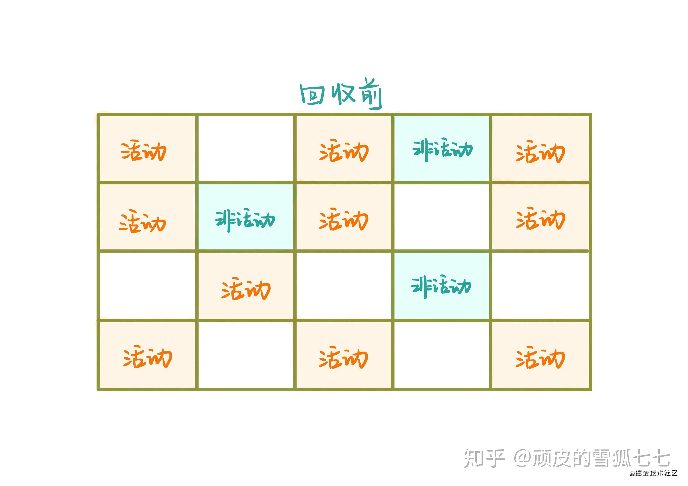
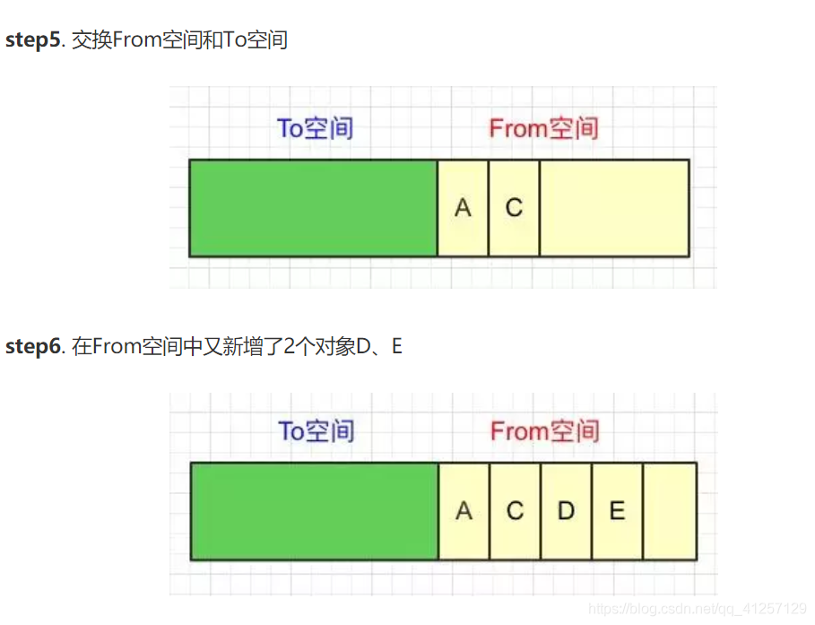
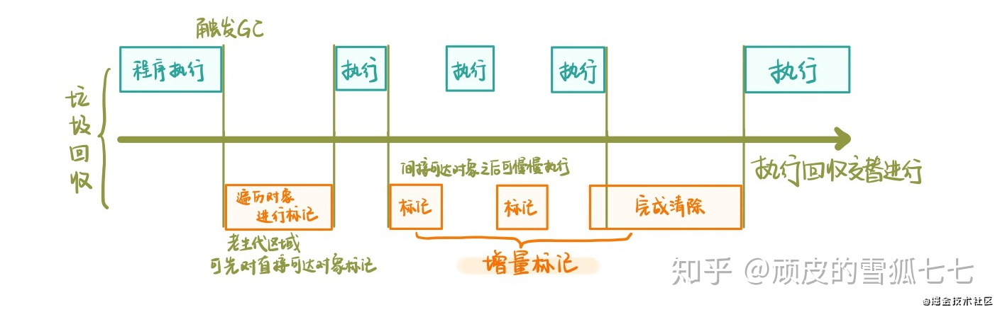

# 内存管理<!-- omit in toc -->
    目录
- [内存机制](#内存机制)
- [内存生命周期](#内存生命周期)
- [内存泄漏](#内存泄漏)
  - [定义](#定义)
  - [常见 JavaScript 内存泄露](#常见-javascript-内存泄露)
  - [内存泄露的解决方案](#内存泄露的解决方案)
- [V8 垃圾回收机制](#v8-垃圾回收机制)
  - [认识V8](#认识v8)
  - [什么是垃圾](#什么是垃圾)
  - [V8垃圾回收策略](#v8垃圾回收策略)
  - [GC](#gc)
  - [常见GC算法：](#常见gc算法)

=========

    正文

=========
## 内存机制
JS有两种数据类型，分别是原始数据类型（`String、Number、Boolean、Null、Undefined、Symbol`）和引用数据类型（`Object`）。  
而存放这两种数据类型的内存又可以分为两部分，分别是栈内存（Stack）和堆内存（Heap）。
|栈内存|堆内存|
|:--:|:--:|
|先进后出，后进先出|无序存储，根据引用直接获取|
|存储原始数据类型|存储引用数据类型|
|存储的值大小固定|存储的值大小不固定，可动态调整|
|按值访问|按引用访问|
|可以直接操作|不允许直接操作|
|空间小，但运行效率高|空间大，但运行效率相对低|
> [原始数据类型是如何存进栈内存的](http://www.dennisgo.cn/Articles/JavaScript/MemoryManagement.html#%E6%A0%88%E5%86%85%E5%AD%98)  
> [基本类型和引用类型发生复制行为后的不同影响](https://segmentfault.com/a/1190000015118062)
> 
## 内存生命周期
不管什么程序语言，内存生命周期基本是一致的：   
1. 分配你所需要的内存
2. 使用分配到的内存（读、写）
3. 不需要时将其释放/归还

JS的内存分配
1. 值的初始化  
在定义变量时就完成了内存分配
2. 使用值  
使用值的过程实际上是对分配内存进行读取与写入的操作。这个操作可能是写入一个变量或者一个对象的属性值，甚至传递函数的参数。
3. 释放不再需要的内存

## 内存泄漏
### 定义
不再用到的内存，没有及时释放，就叫做内存泄漏（memory leak），会导致内存溢出。
> 内存溢出： 指程序申请内存时，没有足够的内存供申请者使用。例如，给一块存储int类型数据的存储空间，但却存储long类型的数据，那么结果就是内存不够用，此时就会报错,即所谓的内存溢出。
### 常见 JavaScript 内存泄露 
1. 意外的全局变量   
①未定义的变量会在全局对象创建一个新变量。在浏览器中，全局对象是 window 。
    ```js
    function foo(arg) {
        bar = "this is a hidden global variable";
    }
    // 实际上是：
    function foo(arg) {
        window.bar = "this is an explicit global variable";
    }

    ```
    如果 bar 是一个应该指向 foo 函数作用域内变量的引用，但是你忘记使用 var 来声明这个变量，这时一个全局变量就会被创建出来。在这个例子中，一个简单的字符串泄露并不会造成很大的危害，但这无疑是错误的。
    
    ②另一种意外的全局变量可能由 this 创建：
    ```js
    function foo() {
        this.variable = "potential accidental global";
    }
    // 函数自身发生了调用，this 指向全局对象（window），（译者注：这时候会为全局对象 window 添加一个 variable 属性）而不是 undefined。
    
    foo();
    
    ```
    为了防止这种错误的发生，可以在你的 JavaScript 文件开头添加 'use strict'; 语句。这个语句实际上开启了解释 JavaScript 代码的严格模式，这种模式可以避免创建意外的全局变量。
    - 全局变量的注意事项：如果你必须使用全局变量来存储很多的数据，请确保在使用过后将它设置为 `null` 或者将它**重新赋值**。常见的和全局变量相关的引发内存消耗增长的原因就是缓存。（缓存存储着可复用的数据）
    - 为了让这种做法更高效，必须为缓存的容量规定一个上界。由于缓存不能被及时回收的缘故，缓存无限制地增长会导致很高的内存消耗。
    - 解决方法：①避免创建全局变量；②使用严格模式,在 JavaScript 文件头部或者函数的顶部加上 use strict。
1. 闭包引起的内存泄漏  
    原理：闭包可以读取函数内部的变量，然后让这些变量始终保存在内存中。如果在使用结束后没有将局部变量清除，就可能导致内存泄露。 
    ```js
    var leaks = (function(){  
        var leak = 'xxxxxx';// 被闭包所引用，不会被回收
        return function(){
            console.log(leak);
        }
    })()
    ```
    解决方法：将事件处理函数定义在外部，解除闭包，或者在定义事件处理函数的外部函数中。
    ```js
    // 比如：在循环中的函数表达式，能复用最好放到循环外面。
    // bad
    for(var k = 0; k < 10; k++) {
        var t = function(a) {
            // 创建了10次函数对象
            console.log(a)
        }
        t(k)
    }

    // good
    function t(a) {
        console.log(a)
    }
    for(var k = 0; k < 10; k++) {
        t(k)
    }
    t = null
    ```
2. 没有清理的 DOM 元素引用  
原因：虽然别的地方删除了，但是对象中还存在对 dom 的引用。
    ```js
    // 在对象中引用DOM
    var elements = {
        btn:document.getElementById('btn'),
    }
    function doSomeThing() {
        elements.btn.click()
    }
    function removeBtn() {
        // 将body中的btn移除，也就是移除DOM树中的btn
        document.body.removeChild(document.getElementById('button'))
        // 但是此时全局变量elements还是保留了对btn的引用，btn还是存在于内存中，不能被GC回收
    }
    ```
    解决方法：手动删除，elements.btn = null。
1. 没有移除计时器或回调函数
    ```js
    // 定时器中有 dom 的引用，即使 dom 删除了，但是定时器还在，所以内存中还是有这个 dom。
    
    // 定时器
    var serverData = loadData()
    setInterval(function() {
        var renderer = document.getElementById('renderer')
        if(renderer) {
            renderer.innerHTML = JSON.stringify(serverData)
        }
    }, 5000)

    // 观察者模式
    var btn = document.getElementById('btn')
    function onClick(element) {
        element.innerHTML = "I'm innerHTML"
    }
    btn.addEventListener('click', onClick)
    ```
    解决方法：①手动删除定时器和 dom；②removeEventListener 移除事件监听
5. 循环引用  
当出现了一个含有DOM对象的循环引用时，就会发生内存泄露。
    ```js
    function A() {
        var a = document.createElement("div");
        a.onclick = function() {
            alert("hi")
        }
    }
    A();
    ```
### 内存泄露的解决方案
-  显式类型转换
-  避免事件导致的循环引用
-  不影响返回值地打破循环引用
-  延迟appendChild
-  代理DOM对象
> [解决方法](https://zhuanlan.zhihu.com/p/67843006?from=from_parent_mindnote)
## V8 垃圾回收机制 
### 认识V8
V8 —— 是 Google 发布的主流的开源 JavaScript 引擎，采用 C++ 编写。采用即时编译，直接翻译成机器语言，并且使用了如内联缓存（inline caching）等方法来提高性能。有了这些功能，JavaScript程序在V8引擎下的运行速度媲美二进制程序。

V8内存设限：64bit操作系统上不超过1.5G，32bit操作系统上不超过800M 这么设限为了浏览器使用内存足够，内部还有垃圾运行机制，时间也在用户感知的合理范围

目前V8垃圾回收采用增量标记算法需要50ms，采用非增量标记算法需要1s

这里先停一下，康康这篇文章再往下会更好：[前端面试：谈谈 JS 垃圾回收机制](https://segmentfault.com/a/1190000018605776)
### 什么是垃圾
一般来说没有被引用的对象就是垃圾，就是要被清除。 有个例外如果几个对象引用形成一个环，互相引用，但根访问不到它们，这几个对象也是垃圾，也要被清除。

### V8垃圾回收策略
原始数据都是由程序语言自身控制的，这里的回收还是指主要存活在堆区的对象数据，这个过程是离不开内存操作的，V8也是对内存做了上限，那在这种情况下是如何对垃圾进行回收的?
- 采用分代回收的思想
- 内存分为新生代存储区、老生代存储区
- 针对不同代采用不同的GC算法
### GC
相关概念：
- GC：垃圾回收机制的简写，垃圾回收期完成具体的工作.可以找到内存中的垃圾、并释放和回收空间
- GC垃圾：程序中 不再需要使用的，程序中不能再访问的 对象
- GC算法：是GC工作时查找和回收所遵循的规则
### 常见GC算法：
- 引用计数
    - 核心思想：跟踪记录每个值被引用的次数，每次引用的时候加一，被释放时减一，如果一个值的引用次数变成0了，就可以将其内存空间回收。
    - 实现原理：
        - 引用计数器
        - 当引用关系改变时修改引用数字
        - 当引用数字为0时立即回收
    - 实例：
        ```js
        const user1 = {age:11}
        const user2 = {age:12}
        const user3 = {age:13}
        const nameList = [user1.age, user2.age, user.age]

        function fn() {
            const num1 = 1;
            const num2 = 2;
            num3 = 3;
        }
        fn();
        ```
        - 当函数调用过后，`num1`和`num2`在外部不能使用，引用数为 0，会被回收;
        - `num3`是挂载在window上的，所以不会被回收;
        - `user1`、`user2`、`user3`被`nameList`引用，所以引用数不为 0，故不会被回收 ;
    - 优缺点：
        |引用计数算法|内容|
        |:--:|:--|
        |优点|1.发现垃圾时立即回收<br>2.最大限度减少程序暂停，让空间不会有被占满的时候|
        |缺点|1.无法回收循环引用的对象<br>2.资源消耗开销大（对所有对象进行数值的监控和修改，本身就会占用时间和资源）|
        - 举一栗子说明上面缺点中无法回收循环应用对象的情况：
            ```js
            function fn() {
                const obj1 = {} 
                const obj2 = {}
                obj1.name = obj2 
                obj2.name = obj1
                return 'hello world' 
            }

            fn();
            // obj1 和 obj2，因为互相有引用，所以计数器并不为0，fn调用结束之后依旧无法回收这两个对象
            ```
- 标记清除
    - 核心思想：当变量进入执行环境时，这个变量被标记为“进入执行环境”；而当变量离开执行环境时，标记就被清除。于是当垃圾回收时就会销毁那些带标记的值并回收他们的内存空间。
    - 实现原理：分 **标记** 和 **清除** 两个阶段完成
        - 第一阶段：遍历所有对象找活动对象（可达对象）标记（层次用递归进行操作）
            > “可达性” 值就是那些以某种方式可访问或可用的值，它们被保证存储在内存中。
            - 1.有一组基本的固有可达值，由于显而易见的原因无法删除。例如:
                - 本地函数的局部变量和参数
                - 当前嵌套调用链上的其他函数的- 变量和参数
                - 全局变量
                - 还有一些其他的，内部的
                            这些值称为根。
            - 2.如果引用或引用链可以从根访问任何其他值，则认为该值是可访问的
                - 例如，如果局部变量中有对象，并且该对象具有引用另一个对象的属性，则该对象被视为可达性， 它引用的那些也是可以访问的。
        - 第二阶段：遍历所有对象，清除没有标记的对象，并抹掉第一个阶段标的标记
            - 注意: js中的标记是标记所有的变量，清除掉被标记为离开状态的变量；而老生代中的标记使标记存活的变量，清除没有被标记的变量。
        - 回收相应空间，将回收的空间加到空闲链表中，方便后面的程序申请空间使用
    - 优缺点：
        |标记清除算法|内容|
        |:--:|:--|
        |优点|相对于引用计数算法来说，解决了对象循环引用的问题。因为局部作用域里面的内容无法被标记，所以即使有引用还是会被清除掉|
        |缺点|1.空间链表地址不连续（空间碎片化），不能进行空间最大化使用<br>2.不会立即回收垃圾对象，清除的时候程序是停止工作的|
        - 下面是空间链表地址不连续的图示，可以更好的帮我们理解：
        - 虽然使用标记清除会有空间碎片化的问题，但是标记清除提升的速度是很快的。
- 标记整理
    - 核心思想：在 标记 和 清除 中间，添加了内存空间的 整理
    - 实现原理：（标记整理可以看做是标记清除的 增强）
        - 标记阶段：与标记清除一致
        - 整理阶段：清除钱先执行整理，移动对象位置，在地址上产生连续
        - 最后留出了整个的空闲空间
            
            
            

    - 优缺点：
        |标记整理算法|内容|
        |:--:|:--|
        |优点|相较标记清除算法减少了碎片化空间|
        |缺点|不会立即回收垃圾对象，清除的时候程序是停止工作的|
- 空间复制
    - 新生代区域垃圾回收使用空间换时间
    - 主要采用复制算法，要有空闲空间存在，当然新生代本身空间小，分出来的复制的空间更小，所以浪费这点空间换取时间的效率是微不足道的
    - 老生代区域垃圾回收不适合复制算法，老生代空间大一分为二，会造成一半的空间浪费，存放数据多复制时间长。
- 分代回收 (一定会用)
    - 新生代对象回收
        > 新生代 —— 就是指存活时间较短的对象，例如：一个局部作用域中，只要函数执行完毕之后变量就会回收。
        - 主要使用算法：采用赋值算法 + 标记整理算法
        - 回收过程：
            - 新生代内存区分为**两个等大小空间**，使用空间为From，空闲空间为To
            - 如果需要申请空间使用，回收步骤如下：
              - 1、首先会将所有活动对象存储于From空间，这个过程中To是空闲状态。   
              - 2、当From空间使用到一定程度之后就会触发GC操作，这个时候会进行标记整理对活动对象进行标记并移动位置将使用空间变得连续。 
                
              - 3、将活动对象拷贝至To空间，拷贝完成之后活动空间就有了备份，这个时候就可以考虑回收操作了。
              - 4、 把From空间完成释放，回收完成。
                  
              - 5、对From和To名称进行调换，继续重复之前的操作。
                
        - 这种算法的缺点是：只能使用堆内存的一半。
        - 总结：使用From -> 触发GC标记整理 -> 拷贝到To -> 回收From -> 名称互换 -> 重复之前
    - 晋升
        - 定义：拷贝的过程中某个对象的指代在老生代空间，就可能出现晋升。 晋升就是将新生代对象移动至老生代。
        - 什么时候触发晋升操作?
            - 1.**一轮GC之后还存活的新生代对象**就需要晋升
            - 2.在拷贝过程中，To空间的使用率超过25%，将这次的活动对象都移动至老生代空间
                - Q：为什么设置25%这个阈值
                - A：当这次回收完成后，这个To空间会变为From空间，接下来的内存分配将在这个空间中进行。如果占比过高，会影响后续的内存分配。
    - 老生代对象回收
        > 老生代 —— 就是指存活时间较长的对象，例如：全局对象，闭包变量数据。
        - 主要使用算法：主要采用标记清除 （首要） 、标记整理、增量标记算法
    - V8内存空间一分为二，分为新生代存储区和老生代存储区，如图：
        - 左边小空间用于存储新生代对象
            - 64bit操作系统上不超过32M
            - 32bit操作系统上不超过16M
        - 右边较大空间用于存储老生代对象
            - 64bit操作系统上不超过1.6G
            - 32bit操作系统上不超过700M
- 标记增量 (提高效率用)
    - 将一整段的垃圾回收操作标记拆分成多个小段完成回收，主要是为了实现程序和垃圾回收的交替完成，这样进行 效率优化 带来的时间消耗更加的合理。
    - 优化垃圾回收：看图可以将垃圾回收分成两个部分，一个是程序的执行，一个是垃圾的回收。当垃圾回收的时候其实会阻塞程序的执行，所以中间会有空档期。
        
> [提升](http://newhtml.net/v8-garbage-collection/)