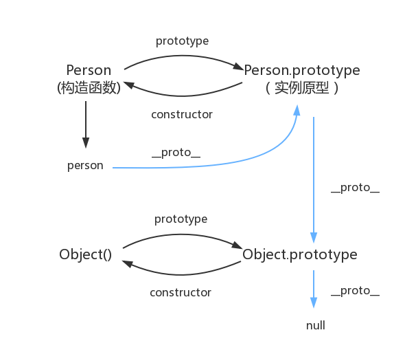
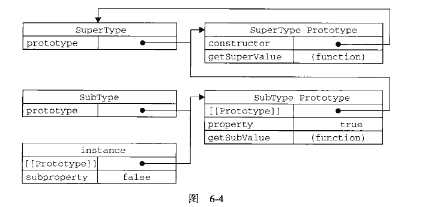
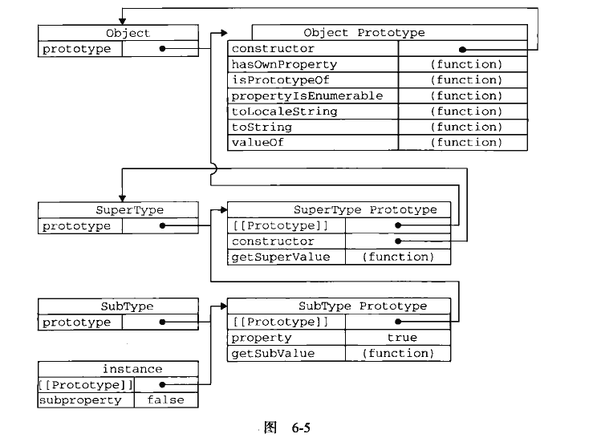

## 原型链
> [从V8角度理解原型链](https://my.oschina.net/u/3048585/blog/4517947)

图中由相互关联的原型组成的链状结构就是原型链，也就是蓝色的这条线。
  
从上图我们可以了解到构造函数（`Person`）、原型（`Person.prototype`）和实例（`person`）之间的关系：  
每个构造函数都有一个原型对象（用`Person.prototype`），原型对象都包含一个指向构造函数的指针（用`Person.prototype.constructor`获取），而实例都包含一个指向原型对象的内部指针（用`person._proto_`）。
1. constructor
```js
function Person() {}
var person = new Person();
console.log(person.constructor === Person); // true
```
当获取 person.constructor 时，其实 person 中并没有 constructor 属性,当不能读取到constructor 属性时，会从 person 的原型也就是 Person.prototype 中读取，正好原型中有该属性。

2. __proto__    
是实例对象指向原型对象的指针，隐式原型，是每个对象都会有的一个属性

来看个例子：
```js
function SuperType() {
    this.property = true;
}
SuperType.prototype.getSuperValue = function() {
    return this.property;
}

function SubType() {
    this.subproperty = false;
}

// 继承了 SuperType
SubType.prototype = new SuperType();

SubType.prototpye.getSubValue = function() {
    return this.subproperty;
}

var instance = new SubType();
console.log(instance.getSuperValue()); // true
```
上面代码我们可以看到，`SubType` 通过创建 `SuperType` 的实例继承了 `SuperType`，于是 `SubType` 从构造函数变成了实例，`SuperType` 的实例变成了 `SubType` 的原型。这样一来，原本存在于 `SuperType` 的实例中的所有属性和方法，现在也存在于 `SubType.prototype`中了。后面的代码还在继承的基础上，给 `SubType` 添加了一个新方法。于是：
提醒：`getSuperValue()`方法仍然还在 `SuperType.prototype`中，但`property`则位于`SubType.prototype`中。这是因为`property`是一个实例属性，而`getSuperValue()`则是一个原型方法。既然`SubType.prototype`现在是`SuperType`的实例，那么`property`当然就位于该实例中了。  
有一点需要注意：  
我们知道所有引用类型默认都继承了 `Object` ，所有函数的默认原型也都是 `Object` 的实例，因此默认原型都会包含一个内部指针，指向 `Object.prototype` 。这也正是所有自定义类型都会继承 `toString()、valueOf()` 等默认方法的根本原因。所以上面例子的原型链中应该还有另外一个继承层次：

于是我们懂了，当原型对象等于另一个类型的实例后，此时的原型对象将包含一个指向另一个原型的指针，相应的，另一个原型中也包含着一个指向另一个构造函数的指针。假如另一个原型又是另一个类型的实例，那么如此递进，就会构成实例与原型的链条，也就是原型链。
### 原型链的问题：
1. 原型中如果存在引用类型的值，会被所有实例共享，如下所示：
```js
function SuperType() {
    this.colors = ['red', 'blue', 'greeb'];
}
function SubType() {}
SubType.prototype = new SuperType();

var instance1 = new SubType();
instance1.colors.push('black');
console.log(instance1.colors) // "red, blue, green, black"

var instance2 = new SubType();
console.log(instance2.colors); // "red, blue, green, black"
```
如果原型的属性被所有的实例共享，就会存在一个实例修改了这个属性后，也会影响到其他实例，这往往会造成一些不必要的麻烦。因此，通常的做法是在构造函数中，而不是在原型中定义属性，如：
```js  
function SuperType() {}
function SubType() {
    this.colors = [];
}
SubType.prototype = new SuperType();

var instance1 = new SubType();
instance1.colors.push('black');
console.log(instance1.colors); // ["black"]

var instance2 = new SubType();
instance2.colors.push('red');
console.log(instance2.colors); // ["red"]
```
2. 在创建子类型的实例时，不能向超类型的构造函数中传递参数。  
实际上，应该说是没有办法在不影响所有对象实例的情况下，给超类型的构造函数传递参数。有鉴于此，再加上由于原型中包含引用类型值所带来的问题，实践中很少会单独使用原型链。为了解决这些问题，可以使用一种叫做 借用构造函数（constructor stealing）的技术（有时候也叫做伪造对象或经典继承），即在子类型构造函数的内部调用超类型构造函数。
```js
function SuperType(name) {
    this.name = name;
}
function SubType(name, age) {
    // 继承了 SuperType ，同时还传递了参数
    SuperType.call(this, name);
    // 实例属性
    this.age = age;
}

var instance1 = new SubType('siyang', 29);
console.log(instance1.name); // "siyang"
console.log(instance1.age); // 29

var instance2 = new SubType('hg', 28);
console.log(instance2.name); // "hg"
console.log(instance2.age); // 28
```
以上代码在 SubType 内部使用 call 实现了对 SuperType 的"继承"，同时每个实例都有自己的实例属性，互不影响；而且创建实例时还可以向超类型 SuperType 传递参数。