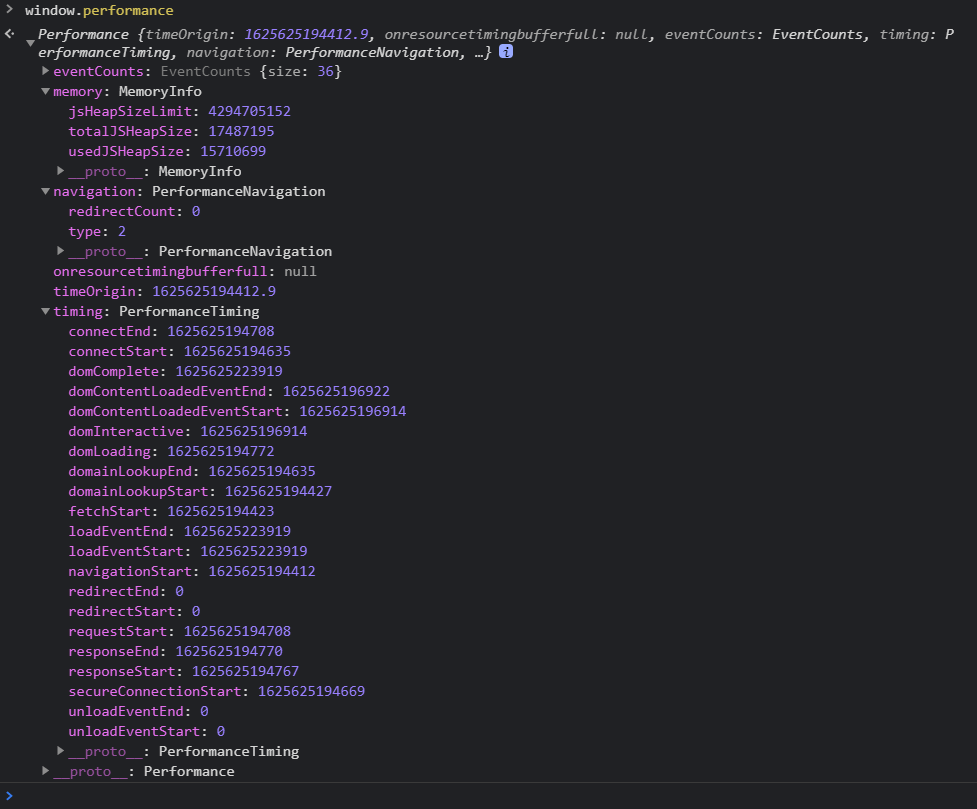

## 性能优化 <!-- omit in toc --> 
    目录
- [性能监控指标](#性能监控指标)
  - [统计 **监控页面性能指标** 的动机](#统计-监控页面性能指标-的动机)
  - [监控指标数据](#监控指标数据)
  - [基于用户体验提炼出的性能指标](#基于用户体验提炼出的性能指标)
- [性能优化方法](#性能优化方法)
  - [属性传递优化](#属性传递优化)
  - [多组件优化](#多组件优化)
  - [Key（使用唯一键迭代）](#key使用唯一键迭代)
  - [其他](#其他)

========

    正文

========
### 性能监控指标
工具：[页面性能检测](https://developers.google.com/speed/pagespeed/insights/)
#### 统计 **监控页面性能指标** 的动机  
便于观察页面渲染各阶段的耗时，找出低效率的板块以优化性能、提高用户体验度
#### 监控指标数据
window.performance API：
由上图我们可知，window.performance有三个属性，如下表：
|performance.属性|描述|
|:--:|:--:|
|[performance.memory](https://developer.mozilla.org/zh-CN/docs/Web/API/Performance/memory)|表示内存的使用情况|
|[performance.navigation](https://developer.mozilla.org/zh-CN/docs/Web/API/PerformanceNavigation)|包含了导航到当前文档的信息，以及各种重定向的次数|
|[performance.timing](https://developer.mozilla.org/zh-CN/docs/Web/API/PerformanceTiming)|包含了在加载和使用当前页面期间发生的各种事件的性能计时信息|

|[performance.timing.属性](https://developer.mozilla.org/zh-CN/docs/Web/API/PerformanceTiming)|描述|表达式|
|:--:|:--:|:--:|
|navigationStart|准备加载页面的时间点，相当于在 URL 输入栏回车或者页面按 F5 刷新的时间点。如果没有上一个文档，则返回值等同于fetchStart属性的值|重定向次数：<br>performance.navigation.redirectCount|
|redirectStart|表示第一个重定向的开始时间点|
|redirectEnd|表示最后一个重定向的结束时间点|重定向耗时:<br> redirectEnd - redirectStart|
|unloadEventStart、unloadEventEnd|分别表示上一个网页 upload 事件开始和完成的时间点。|
|fetchStart|表示浏览器准备好开始请求 HTML 文档的时间点，发生在检查本地缓存之前。|
|domainLookupStart、domainLookupEnd|分别表示域名查询开始和结束的时间点。如果直接使用了缓存，则两者的值都等于 fetchStart|DNS 解析耗时: <br>domainLookupEnd - domainLookupStart
|connectStart、connectEnd|分别表示浏览器与服务器之间的连接开始和建立时的时间点。如果要开始或建立的是持久连接，则返回值等同于fetchStart属性的值|TCP 连接耗时:<br> connectEnd - connectStart|
|secureConnectionStart|如果浏览器与服务器开始安全链接的握手，则表示连接开始时的时间点。如果当前网页不要求安全连接，则返回0|
|requestStart|表示浏览器向服务器发出HTTP请求时（或开始读取本地缓存时）的时间点|
|responseStart、responseEnd|分别表示浏览器收到响应的第一个字节和最后一个字节的时间点|数据传输耗时:<br> responseEnd - responseStart|
|domLoading|表示开始解析 HTML 文档的时间点，对应 Document.readyState 改变为 loading 的时刻|
|domInteractive|表示 HTML 解析完毕的时间点，对应 Document.readyState 改变为 interactive 的时刻，此时 CSS 和 JS 等其他资源还没加载完成|
|domContentLoadedEventStart、domContentLoadedEventEnd|分别表示DOMContentLoaded 事件发生和结束的时间点|DOM Ready 时间: <br>domContentLoadEventEnd - fetchStart|
|domComplete|表示文档和其他所有资源都加载并执行完成的时间点，对应 Document.readyState 改变为 complete 的时刻|
|loadEventStart、loadEventEnd|分别表示 onload 事件触发和结束（页面完全加载完毕）的时间点。|页面完全加载时间: <br>loadEventStart - fetchStart|

看完上面的表格后，结合下面这张图片，我们可以得知
- SSL 安全连接耗时: connectEnd - secureConnectionStart
- 网络请求耗时 (TTFB): responseStart - requestStart
- 
- DOM 解析耗时: domInteractive - responseEnd
- 资源加载耗时: loadEventStart - domContentLoadedEventEnd
- 首包时间: responseStart - domainLookupStart
- 白屏时间: responseEnd - fetchStart
- 首次可交互时间: domInteractive - fetchStart
#### 基于用户体验提炼出的性能指标
这个是Google力推的指标，主要从4个视觉反馈阶段来描述页面性能。
|视觉反馈|页面状态|性能指标|
|--:|--:|--:|
|是否发生？|导航是否成功启动？服务器是否有响应？|首次绘制 (FP)/首次内容绘制 (FCP)|
|是否有用？|是否已渲染可以与用户互动的足够内容？|首次有效绘制 (FMP)/主角元素计时|
|是否可用？|用户可以与页面交互，还是页面仍在忙于加载？|可交互时间 (TTI)|
|是否令人愉快？|交互是否顺畅而自然，没有滞后和卡顿？|耗时较长的任务（在技术上不存在耗时较长的任务）|
- **First Paint (FP):** 是首次绘制，指页面第一次有内容渲染出来的时间。  
通过 `performance.getEntriesByType('paint')`可以获取
- **First contentful paint (FCP):** 是首次有效绘制，指从页面开始加载，到页面指定内容渲染在屏幕上的时间。这里的指定内容是文本、图片/背景图、非白色的 canvas 或 SVG 。  
获取方法同 `FP` 。  
`FP` 和 `FCP` 的区别在于：只要当页面开始有东西渲染（视觉有了变化），这个时间点就是 `FP` ；而只有页面上出现来自 DOM 的内容（例如文本、图片等）时的那个时间点才是 `FCP` 。
由上面的图片可知，`FP` 和 `FCP` 可能是相同的时间，也可能是先 `FP` 后 `FCP`。
- **First Meaningful Paint (FMP):** 是首次有效绘制，指页面的主要内容开始出现在屏幕上的时间点。
- **Time to Interactive (TTI):** 是可交互时间，指从页面开始加载，到内容呈现，初始js加载完成，再到可以立刻响应用户交互的时间。
  
更多：
- **Largest contentful paint (LCP):** 从页面加载开始，到页面上最大的文本块或者图片元素渲染在屏幕上的时间。(实验数据，现场数据)
- **First input delay (FID):** 用户第一个交互行为，比如点击链接、点击按钮等，到浏览器实际响应这次交互的时间。(现场数据)
- **Total blocking time (TBT):** 在FCP和TTI之间的时间，即页面可见到可交互的时间，代表了主线程被阻塞无法响应用户交互。（实验数据）
- **Cumulative layout shift (CLS):** 从页面开始加载，到页面生命周期变为隐藏之间的所有意外的布局变化的累计分数。(实验数据，现场数据)

术语：
- 页面性能统计的起始点：即用户输入网址回车后开始等待的时间。一个是通过navigationStart获取，相当于在 URL 输入栏回车或者页面按 F5 刷新的时间点；另外一个是通过 fetchStart，相当于浏览器准备好使用 HTTP 请求获取文档的时间。
- 白屏：页面开始解析 DOM 树的时间点，这之后页面渲染的第一个元素也会很快出现。  
可以用 `domLoading - fetchStart` 获取
    > 很多人认为白屏时间是页面返回的首字节时间，但这样其实并不精确，因为头部资源还没加载完毕，页面也是白屏。
- 首屏时间：页面 DOM 树已经解析完成并且完整显示第一屏所有内容的时间点。而当首屏中的图片加载完毕的时候，我们认为是首屏结束的时间点。  
可以用 `domContentLoadedEventEnd - fetchStart`，甚至使用`loadEventStart - fetchStart` 获取。
### 性能优化方法
1. 只请求当前需要的资源：异步加载、懒加载、[pollyfill](https://plyfill.io/v3/url-builder)
2. 缩减资源体积：打包压缩（webpack）；gzip；图片格式的优化、[压缩](tinypng.com)、根据屏幕分辨率展示不同分辨率的图片（通常是适配手机端和 PC 端的项目需要用到）、webp（一种图片格式）；尽量控制 cookie 的大小
3. 时序优化：promise.all；ssr、seo；prefetch、prerender、preload；
4. 合理利用缓存：cdn
#### 属性传递优化
当我们在 React 中创建函数时，我们需要使用 bind 关键字将函数绑定到当前上下文。  
绑定可以在构造函数中完成，也可以在我们将函数绑定到 DOM 元素的位置上完成。  
两者之间似乎没有太大差异，但性能表现是不一样的。
```js
import React from "react";

export default class DelayedBinding extends React.Component {
    constructor() {
        this.state = {
            name: "Mayank"
        }
    }
    
    handleButtonClick() {
        alert("Button Clicked: " + this.state.name)
    }
    
    render() {
        return (
            <>
                <input type="button" value="Click" onClick={this.handleButtonClick.bind(this)} />
            </>
        )
    }
}
```
在上面的代码中，我们在 render 函数的绑定期间将函数绑定到按钮上。  
可问题在于，每次调用 render 函数时都会创建并使用绑定到当前上下文的新函数，但在每次渲染时使用已存在的函数效率更高。优化方案如下：
```js
import React from "react";

export default class DelayedBinding extends React.Component {
    constructor() {
        this.state = {
            name: "Mayank"
        }
        this.handleButtonClick = this.handleButtonClick.bind(this)
    }
    
    handleButtonClick() {
        alert("Button Clicked: " + this.state.name)
    }

    render() {
        return (
        <>
            <input type="button" value="Click" onClick={this.handleButtonClick} />
        </>
        )
    }
}
```
最好在构造函数调用期间使用绑定到当前上下文的函数覆盖 handleButtonClick 函数。  
这将减少将函数绑定到当前上下文的开销，无需在每次渲染时重新创建函数，从而提高应用的性能。
#### 多组件优化
在父组件因状态的变化更改，而子组件并没有状态变化时，若子组件随着父组件一起更新，会造成比较大的性能浪费，为减少子组件额外渲染而浪费性能，可使用：
1. 使用 `shouldComponentUpdate` 生命周期事件  
    ```js
    shouldComponentUpdate(nextProps, nextState) {
        //组件是否需要更新，需要返回一个布尔值：返回true则更新，返回flase不更新。
        console.log('shouldComponentUpdate组件是否应该更新，需要返回布尔值',nextProps, nextState)
        return true
    }

    nextProps: 表示下一个props
    nextState: 表示下一个state的值
    shouldComponentUpdate() 的返回值，用于判断 React 组件的输出是否受当前 state 或 props 更改的影响。默认返回值为true，即 state 每次发生变化组件都会重新渲染。当 props 或 state 发生变化时，shouldComponentUpdate() 会在渲染执行之前被调用。
    ```
2. 用 `React.PureComponent` 替换 `React.Component`  
写在前面：React.PureComponent 是一个和 React.Component 几乎相同，唯一不同的是 React.PureComponent 帮助我们完成了 shouldComponentUpdate 的一些较浅的比较

    PureComponent通过`prop`和`state`的**浅比较**来实现shouldComponentUpdate  

    原理：当组件更新时，如果组件的 props 和 state 都没发生改变， render 方法就不会触发，省去 Virtual DOM 的生成和比对过程，达到提升性能的目的。具体就是 React 自动帮我们做了一层浅比较：
    > 所谓浅比较(shallowEqual)，即react源码中的一个函数，然后根据下面的方法进行是不是PureComponent的判断，帮我们做了本来应该我们在shouldComponentUpdate中做的事情  
    ```js
    if (this._compositeType === CompositeTypes.PureClass) {
        shouldUpdate = !shallowEqual(prevProps, nextProps)
        || !shallowEqual(inst.state, nextState);
    }
    ```
    其中，shadowEqual只会"浅"检查组件的props和state，这就意味着嵌套对象和数组是不会被比较的。
    > 浅比较就是只比较第一级，对于基本数据类型，只比较值；对于引用数据类型值，则比较地址是否相同。所以在这种情况下，我们以后用的时候，**对于引用类型值修改状态或修改属性时候，对于它赋值的时候，我们尽可能把之前值拿过来克隆一份，赋给它新的地址就好**。我们想做性能优化的时候就可以在Component里做一个浅比较。

    小结：由于在 `PureComponent` 中使用`shouldComponentUpdate`会有警告，所以不要在`PureComponent`中使用`shouldComponentUpdate`，因为根本没有必要
> [React 的 PureComponent 与 Component 区别](https://blog.csdn.net/weixin_41697143/article/details/104551377)
3. ImmutableJS  
由于PureComponent只是浅比较，对于更加复杂的数据类型，就失去了作用。这时候  `ImmutableJS` 就能派上用场了。

    facebook提供了immutable-js这个库，ImmutableJS提供了不可变的数据，即要让数据改变只能通过创建新数据的方式，而不能直接修改，这很大程度的降低了前后两个数据比较时的复杂度。
    > [immutable.js语法](https://www.jianshu.com/p/0fa8c7456c15)  
    > [immutable.js API](https://blog.csdn.net/m0_37527015/article/details/84338831)  
    > [Redux进阶（Immutable.js）](https://www.cnblogs.com/Darlietoothpaste/p/10156357.html)
#### Key（使用唯一键迭代）
我们先看一个场景
```js
<ul>
    <TodoItem text="one" />
    <TodoItem text="two" />
</ul>
```
假设有上面一个类型的列表，要在最上面加一项，得到下方的结构。
```js
<ul>
    <TodoItem text="zero" />
    <TodoItem text="one" />
    <TodoItem text="two" />
</ul>
```
React组件会从上往下比较，会认为新结构中zero组件是旧结构中one组件的更新；认为新结构中one组件时旧结构中two组件的更新；而新结构中two组件则是新结构，要进行加载。  
要避免类似上述情形的浪费，需要给列表中的每一项制定一个唯一且稳定不变的key值（每个组件的唯一标识），这样，React就可以根据key值去区分同一类型的组件，避免出现上述的情形。
```js
<ul>
{
    todos.map((item)) => (
        <TodoItem key={item.id} text={item.text} />
    )
}
</ul>
```
注意：下面的key的赋值方式便是错误的，因为不符合key值即唯一又稳定不变的要求。这种赋值方式仍然不能避免上面的情形的浪费
```js
<ul>
{
    todos.map((item, index)) => (
        <TodoItem key={index} text={item.text} />
    )
}
</ul>
```
#### 其他 
1. 使用 React.memo 进行组件记忆  
React.memo() 和 PureComponent 很相似，它帮助我们控制何时重新渲染组件。  
不同的是 PureComponent 要依靠 class 才能使用。而 React.memo() 可以和 functional component 一起使用。
    使用方法：
    ```js
    const MySnowyComponent = React.memo(function MyComponent(props) {
        // only renders if props have changed!
    });
    ```
    举个栗子：
    ```js
    import React, { memo, useState } from 'react'

    /*
    // count 每次变化都会渲染 Foo 组件
    function Foo() {
        console.log('Foo 组件重新渲染了')
        return (
            <div>Foo 组件</div>
        )
    }
    */

    // count 变化不会重新渲染 Foo 组件
    const Foo = memo(function() {
        console.log('Foo 组件重新渲染了')
        return (
            <div>Foo 组件</div>
        )
    })

    function App() {
        const [count, setCount] = useState(0)

        return (
            <div>
                <span>{count}</span>
                <button onClick={() => setCount(count+1)}>+1</button>
                <Foo />
            </div>
        );
    }

    export default App;
    ```
    默认情况下其只会对复杂对象做浅层对比，如果你想要控制对比过程，那么请将自定义的比较函数通过第二个参数传入来实现。
    ```js
    import React from "react";

    function Child({seconds}){
        console.log('I am rendering');
        return (
            <div>I am update every {seconds} seconds</div>
        )
    };

    function areEqual(prevProps, nextProps) {
        if(prevProps.seconds===nextProps.seconds){
            return true
        }else {
            return false
        }

    }
    export default React.memo(Child,areEqual)
    ```
2. 懒加载组件
    > 写在前面：[什么是懒加载（通俗易懂版）](https://juejin.cn/post/6847902221539999752)  
    > [什么是懒加载](https://www.jianshu.com/p/4876a4fe7731)
    > 
    假设有两个组件 WelcomeComponent 或 GuestComponents，我们根据用户是否登录而渲染其中一个。
    ```js
    import React, { lazy, Suspense } from "react";

    export default class UserSalutation extends React.Component {
        render() {
            if(this.props.username !== "") {
                const WelcomeComponent = lazy(() => import("./welcomeComponent"));
                return (
                    <div>
                        <Suspense fallback={<div>Loading...</div>}>
                            <WelcomeComponent />
                        </Suspense>
                    </div>
                )
            } else {
                const GuestComponent = lazy(() => import("./guestComponent"));
                return (
                    <div>
                        <Suspense fallback={<div>Loading...</div>}>
                            <GuestComponent />
                        </Suspense>
                    </div>
                )
            }
        }
    }
    ```
3. 使用 React.Fragments 避免额外标记  
react规定组件中必须有一个父元素，如：
    ```js
    return (
        <div>
            <h1>Hello world!</h1>
            <h1>Hello there!</h1>
            <h1>Hello there again!</h1>
        </div>
    )
    ```
    但这样会创建额外的不必要的div，导致整个应用程序内创建许多无用的元素。实际上页面上的元素越多，加载所需的时间就越多。为了减少不必要的加载时间，我们可以使React.Fragment来避免创建不必要的元素，如：
    ```js
    return (
        <React.Fragment>
            <h1>Hello world!</h1>
            <h1>Hello there!</h1>
            <h1>Hello there again!</h1>
        </React.Fragment>
    )
    ```

4. 不要使用内联函数定义  
如果我们使用内联函数，则每次调用“render”函数时都会创建一个新的函数实例。  
当 React 进行虚拟 DOM diffing 时，它每次都会找到一个新的函数实例；因此在渲染阶段它会会绑定新函数并将旧实例扔给垃圾回收。  
因此直接绑定内联函数就需要额外做垃圾回收和绑定到 DOM 的新函数的工作，如：
    ```js
    import React from "react";

    export default class InlineFunctionComponent extends React.Component {
    render() {
        return (
        <div>
            <h1>Welcome Guest</h1>
            <input type="button" onClick={(e) => { this.setState({inputValue: e.target.value}) }} value="Click For Inline Function" />
        </div>
        )
    }
    }
    ```
    上面的函数创建了内联函数。每次调用 render 函数时都会创建一个函数的新实例，render 函数会将该函数的新实例绑定到该按钮。  
    此外最后一个函数实例会被垃圾回收，大大增加了 React 应用的工作量。  
    所以不要用内联函数，而是在组件内部创建一个函数，并将事件绑定到该函数本身。这样每次调用 render 时就不会创建单独的函数实例了，参考组件如下。
    ```js
    import React from "react";

    export default class InlineFunctionComponent extends React.Component {
    
        setNewStateData = (event) => {
            this.setState({
            inputValue: e.target.value
            })
        }
        
        render() {
            return (
            <div>
                <h1>Welcome Guest</h1>
                <input type="button" onClick={this.setNewStateData} value="Click For Inline Function" />
            </div>
            )
        }
    }
    ```
6.  避免使用内联样式属性  
使用内联样式时浏览器需要花费更多时间来处理脚本和渲染，因为它必须映射传递给实际 CSS 属性的所有样式规则。
    ```js
    import React from "react";
    export default class InlineStyledComponents extends React.Component {
    render() {
        return (
        <>
            <b style={{"backgroundColor": "blue"}}>Welcome to Sample Page</b>
        </>
        )
    }
    }
    ```
    在上面创建的组件中，我们将内联样式附加到组件。添加的内联样式是 JavaScript 对象而不是样式标记。  
    样式 backgroundColor 需要转换为等效的 CSS 样式属性，然后才应用样式。这样就需要额外的脚本处理和 JS 执行工作。  
    **更好的办法是在组件里引入外部 CSS 文件**。
6.  优化 React 中的条件渲染  
安装和卸载 React 组件是昂贵的操作。为了提升性能，我们需要减少安装和卸载的操作。  
很多情况下在我们可能会渲染或不渲染特定元素，这时可以用条件渲染。
    ```js
    import React from "react";

    import AdminHeaderComponent from "./AdminHeaderComponent";
    import HeaderComponent from "./HeaderComponent";
    import ContentComponent from "./ContentComponent"

    export default class ConditionalRendering extends React.Component {
        constructor() {
            this.state = {
                name: "Mayank"
            }
        }
        
        render() {
            if(this.state.name == "Mayank") {
                return (
                    <>
                        <AdminHeaderComponent></AdminHeaderComponent>
                        <HeaderComponent></HeaderComponent>
                        <ContentComponent></ContentComponent>
                    </>
                )
            } else {
                return (
                    <>
                        <HeaderComponent></HeaderComponent>
                        <ContentComponent></ContentComponent>
                    </>
                )
            }
        }
    }
    ```
    上面的代码中有一个条件语句，让组件根据指定的条件渲染。如果状态包含名称值 Mayank，则不会渲染 AdminHeaderComponent。  
    条件运算符和 if else 条件似乎没问题，但其实这里面存在大问题：  
    - 每次调用 render 函数，并且值在 Mayank 和另一个值之间切换时，都会执行不同的 if else 语句。
    - diffing 算法会运行一个检查，比较每个位置的元素类型。在 diffing 期间，它看到 AdminHeaderComponent 不可用，并且需要渲染的第一个组件是 HeaderComponent。
    - 于是 React 将观察元素的位置。它看到位置 1 和位置 2 的组件已更改，就打算将组件 HeaderComponent 和 ContentComponent 在位置 1 和位置 2 卸载并重新安装。
    - 其实这是用不着的，因为这些组件没有更改，这是一项昂贵的操作。优化方案如下：
    ```js
    import React from "react";

    import AdminHeaderComponent from "./AdminHeaderComponent";
    import HeaderComponent from "./HeaderComponent";
    import ContentComponent from "./ContentComponent"

    export default class ConditionalRendering extends React.Component {
        constructor() {
            this.state = {
                name: "Mayank"
            }
        }
    
        render() {
            return (
                <>
                    { this.state.name == "Mayank" && <AdminHeaderComponent></AdminHeaderComponent> }
                    <HeaderComponent></HeaderComponent>
                    <ContentComponent></ContentComponent>
                </>
            )
        }
    }
    ```
    在上面的代码中，当 name 不是 Mayank 时，React 在位置 1 处放置 null。  
    - 于是在开始 DOM diffing 时，位置 1 的元素从 AdminHeaderComponent 变为 null，但位置 2 和位置 3 的组件保持不变。
    - 由于元素没变，因此组件不会卸载，减少了不必要的操作。
7. 不要在 render 方法中导出数据  
render()函数作为纯函数，意味着我们应该确保 setState 和查询原生 DOM 元素等任何可以修改应用状态的东西不会被调用。  
更新组件状态的问题在于，当状态更新时会触发另一个 render 循环，后者在内部会再触发一个 render 循环，以此类推。
    ```js
    import React from "react";

    export default class RenderFunctionOptimization extends React.Component {
        constructor() {
            this.state = {
                name: "Mayank"
            }
        }
        render() {
            this.setState({ 
                name: this.state.name + "_" 
            });
            
            return (
                <div>
                    <b>User Name: {this.state.name}</b>
                </div>
            );
        }
    }
    ```
    在上面的代码中，每次调用 render 函数时都会更新状态。状态更新后组件将立即重新渲染。因此更新状态会导致 render 函数的递归调用。  
    render 函数应保持纯净，以确保组件以一致的方式运行和渲染。
8. 为组件创建错误边界  
    > [React官网：错误边界](https://zh-hans.reactjs.org/docs/error-boundaries.html)
9.  组件的不可变数据结构  

10. 事件节流和防抖  
    > [传送门](https://github.com/HCYETY/The-growth-path-of-front-end-engineers/blob/master/%E5%89%8D%E7%AB%AF/js%E5%BA%95%E5%B1%82%E7%9F%A5%E8%AF%86.md#%E9%98%B2%E6%8A%96%E8%8A%82%E6%B5%81)
11. 使用 CDN  
12. 用 CSS 动画代替 JavaScript 动画  
13. 在 Web 服务器上启用 gzip 压缩  
14. 使用 Web Workers 处理 CPU 密集任务  
15. React 组件的服务端渲染  
> [21 个 React 性能优化技巧](https://www.infoq.cn/article/KVE8xtRs-uPphptq5LUz)  
> [React性能优化](https://cloud.tencent.com/developer/article/1009794)  
> [React性能优化总结](https://www.cnblogs.com/little-ab/articles/6971269.html)  
> [React常用性能优化方式整理](https://blog.csdn.net/weixin_41902031/article/details/80353134)