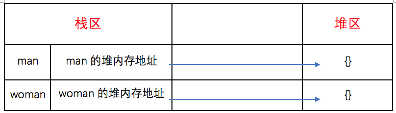
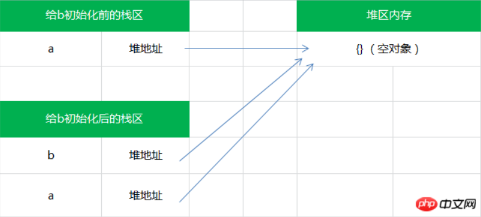

# 数据类型<!-- omit in toc --> 
    目录
- [基本数据类型](#基本数据类型)
- [引用数据类型](#引用数据类型)
- [类型转换](#类型转换)
  - [显式数据类型转化](#显式数据类型转化)
    - [原始值转布尔](#原始值转布尔)
    - [原始值转数字](#原始值转数字)
    - [原始值转字符串](#原始值转字符串)
    - [原始值转对象](#原始值转对象)
    - [对象转布尔值](#对象转布尔值)
    - [对象转字符串和数字](#对象转字符串和数字)
  - [隐式数据类型转化](#隐式数据类型转化)
    - [一元操作符 +](#一元操作符-)
    - [二元操作符 +](#二元操作符-)
    - [== 相等](#-相等)
- [浮点数精度 （0.1 + 0.2 !== 0.3）](#浮点数精度-01--02--03)
  - [浮点数的存储](#浮点数的存储)
  - [浮点数的运算](#浮点数的运算)
  - [其他](#其他)

========

    正文

========
## 基本数据类型
常见的六种基本数据类型是：`Undifined`、`Null`、`Boolean`、`Object`、`Number`和`String`。后来ES6 引入了一种新的原始数据类型 `Symbol`，表示独一无二的值，它是 JavaScript 语言的第七种数据类型。
> Symbol 的使用可参考：[ECMAScript 6 入门 之 Symbol](https://es6.ruanyifeng.com/#docs/symbol)   
1. 基本数据类型的值是不可变的，任何方法都无法改变一个基本类型的值，比如一个字符串：
    ```js
    var name = "change";
    name.substr(); // hang
    console.log(name); // change

    var s = "hello";
    s.toUpperCase(); // HELLO
    console.log(s); // hello
    ```
    通过这两个例子，我们会发现原先定义的变量name的值始终没有发生改变。  
    而调用substr()和toUpperCase()方法后返回的是一个新的字符串，跟原先定义的变量name并没有关系。
    > [JavaScript substr() 方法](https://www.w3school.com.cn/jsref/jsref_substr.asp)          

    或许有人会有以下的疑问：
    ```js
    var name = "change";
    name = "change1";
    console.log(name); // change1
    ```
    - 这样看起来 name 的值“改变了”，其实 `var name = “change”`，这里的基础类型是 `string` ，也就是“change”,这里的“change”是不可以改变的，**name只是指向“change”的一个指针，指针的指向可以改变，所以你可以name = “change1”，代表此时name指向了“change1”**。同理，这里的“change1”同样不可以改变
    - 也就是说这里你认为的改变只是“指针的指向改变”，这里的基础类型指的是“change”，而不是name，需区分清楚

2. 基本数据类型不可以添加属性和方法
    ```js
    var p = "change";
    p.age = 29;
    p.method = function(){console.log(name)};
    console.log(p.age); // undefined
    console.log(p.method); // undefined
    ```
    通过上面的代码，我们知道不能给基本类型添加属性和方法，也再次说明基本类型是不可变的。
3. 基本数据类型的赋值是简单赋值   
如果从一个变量向另一个变量赋值`基本类型`的值，会在变量对象上创建一个新值，然后把该值复制到为新变量分配的位置上
    ```js
    var a = 10;
    var b = a;
    a++;
    console.log(a); // 11
    console.log(b); // 10
    ```
    上面的代码中， a 中保存的值是10。当使用 a 的值来初始化 b 时， b 中也保存了值 10 。但 b 中的 10 和 a 中的 10 是完全独立的。 b 中的值只是 a 中值的一个副本。所以这两个变量可以参与任何操作而不会相互影响。

4. 基本数据类型的比较是值的比较
    ```js
    var a = 1;
    var b = true;
    console.log(a == b); // true
    console.log(a == b); // false

    // 上面 a 和 b 的数据类型不同，但是也可以进行值的比较，这是因为在比较之前，自动进行了数据类型的 隐式转换。   
    ```
    `== `: 只进行值的比较；`===` : 不仅进行值的比较，还要进行数据类型的比较
5. 基本数据类型是存放在栈区的   
假如有以下几个基本类型的变量：
    ```js
    var name = "jozo";
    var city = "guangzhou";
    var age = 22;
    ```
    那么它的存储结构如下所示：
    |栈区A|栈区A|
    |:--:|:--:|
    |name|jozo|
    |city|guangzhou|
    |age|22|

    同一个栈区里包括了变量的标识符和变量的值

## 引用数据类型
除过上面的 6 种基本数据类型外，剩下的就是引用数据类型了，统称为 `Object类型`。细分的话，有：`Object` 类型、`Array` 类型、`Date` 类型、`RegExp` 类型、`Function` 类型 等。
1. 引用类型的值是可以改变的
2. 引用类型可以添加属性和方法
3. 引用类型是同时保存在栈区和堆区中的   
    引用类型的存储需要在内存的栈区和堆区共同完成，栈区保存变量标识符和指向堆内存的地址  
    假如有以下两个对象：
    ```js
    let man = {}
    let woman = {}
    console.log(man === woman) // 输出：false
    ```
    则这两个对象在内存中保存的情况如下图：
    
4. 引用类型的赋值是对象引用
    ```js
    var a = {};
    var b = a;

    a.name = "change";
    console.log(a.name); // change
    console.log(b.name); // change

    b.age = 29;
    console.log(a.age); // 29
    console.log(b.age); // 29
    ```
    当 a 向 b 赋值引用类型的值时，同样也会`将储存在 a 中的对象的值复制一份，并放到为 b 分配的空间中`。**此时引用类型保存在 b 中的是对象在堆内存中的地址**。所以，与基本数据类型的简单赋值不同，**这个值的副本实际上是一个指针，而这个指针指向存储在堆内存的一个对象**。那么**赋值操作后，两个变量都保存了同一个对象地址，而这两个地址指向了同一个对象**。因此，改变其中任何一个变量，都会互相影响。
    他们的关系如下图：
    
    因此，引用类型的赋值其实是对象保存在栈区地址指针的赋值，所以两个变量指向同一个对象，任何的操作都会互相影响。

5. 引用类型的比较是引用的比较
    ```js
    var person1 = {};
    var person2 = {};
    console.log(person1 == person2); // false
    ```
    Q：为什么两个对象看起来一摸一样，但是却不相等呢？   
    A：因为引用类型的比较是引用的比较，换句话说，就是`比较两个对象保存在栈区的指向堆内存的地址是否相同`，此时，虽然 p1 和 p2 看起来都是一个”{}”，但是他们保存在栈区中的指向堆内存的地址却是不同的，所以两个对象不相等

## 类型转换
### 显式数据类型转化
ES6 前，JavaScript 共有六种数据类型：`Undefined`、`Null`、`Boolean`、`Number`、`String`、`Object`。
#### 原始值转布尔   
我们使用 `Boolean函数` 将类型转换成布尔类型，在 JavaScript 中，只有 6 种值可以被转换成 false，其他都会被转换成 true。
```js
// 当 Boolean 函数不传任何参数时，会返回 false。 
console.log(Boolean()) // false
console.log(Boolean(false)) // false 
console.log(Boolean(undefined)) // false 
console.log(Boolean(null)) // false 
console.log(Boolean(+0)) // false 
console.log(Boolean(-0)) // false 
console.log(Boolean(NaN)) // false 
console.log(Boolean("")) // false
```
#### 原始值转数字   
我们可以使用 `Number函数` 将类型转换成数字类型。如果 Number 函数**不传参数，返回 +0**；如果**有参数，隐式调用 ToNumber(value)**，ToNumber 则直接给了一个对应的结果表，表如下。但如果**参数无法被转换为数字，则返回 NaN**。
|参数类型|结果|
|:--:|:--:|
|Undefined|NaN|
|Null|+0|
|Boolean|如果参数是true，返回1；参数为false，返回+0|
|Number|返回与之相等的值|
|String|这段比较复杂，看例子|
```js
// 不传参
console.log(Number()) // +0 
// 传参
- Undefined
console.log(Number(undefined)) // NaN 
- Null
console.log(Number(null)) // +0 
- Boolean
console.log(Number(true)) // 1 
console.log(Number(false)) // +0 
- String
console.log(Number("123")) // 123 
console.log(Number("-123")) // -123 
console.log(Number("1.2")) // 1.2 
console.log(Number("000123")) // 123 
console.log(Number("-000123")) // -123 
console.log(Number("0x11")) // 17 
console.log(Number("")) // 0 
console.log(Number(" ")) // 0 
console.log(Number("123 123")) // NaN 
console.log(Number("foo")) // NaN 
console.log(Number("100a")) // NaN
```
如果通过 Number 转换函数**传入一个字符串，它会试图将其转换成一个整数或浮点数，而且会忽略所有前导的 0**；如果**有一个字符不是数字，结果都会返回 NaN**。鉴于这种严格的判断，我们一般还会使用更加灵活的 `parseInt` 和 `parseFloat` 进行转换。
- parseInt 只解析整数。如果字符串前缀是 "0x" 或者"0X"，会将其解释为十六进制数。
    ```js
    console.log(parseInt("0xFF")) // 255 
    console.log(parseInt("0.1")) // 0
    ```
- parseFloat 则可以解析整数和浮点数。
    ```js
    console.log(parseFloat("3.14 abc")) // 3.14 
    console.log(parseFloat(".1")) // 0.1 
    ```
- parseInt 和 parseFloat 都会**跳过任意数量的前导空格**，尽可能解析更多数值字符，并忽略后面的内容。如果**第一个非空格字符是非法的数字直接量，将最终返回 NaN**：
    ```js
    console.log(parseInt("3 abc")) // 3 
    console.log(parseInt("-12.34")) // -12 
    ```
#### 原始值转字符串   
我们使用 `String函数` 将类型转换成字符串类型。如果 String 函数**不传参数，返回空字符串**，如果**有参数，隐式调用 ToString(value)**。而 ToString 也给了一个对应的结果表，表如图：
|参数类型|结果|
|:--:|:--:|
|Undefined|"undefined"|
|Null|"null"|
|Bolean|如果参数是true，返回true。参数为false，返回false|
|Number|又是比较复杂，可以看例子|
|String|返回与之相等的值|
```js
// 不传参
console.log(String()) // 空字符串 
// 传参
- Undefined
console.log(String(undefined)) // undefined 
- Null
console.log(String(null)) // null 
- Boolean
console.log(String(true)) // true 
console.log(String(false)) // false 
- Number
console.log(String(0)) // 0 
console.log(String(-0)) // 0 
console.log(String(NaN)) // NaN 
console.log(String(Infinity)) // Infinity 
console.log(String(-Infinity)) // -Infinity 
console.log(String(1)) // 1
```
#### 原始值转对象   
原始值通过调用 `String()`、`Number()` 或者 `Boolean()` 构造函数，转换为它们各自的包装对象，（`null` 和 `undefined` 属于例外，当将它们用在期望是一个对象的地方都会造成一个类型错误 (TypeError) 异常，而不会执行正常的转换）。
```js
var b = new Number(a);  
console.log(typeof b); // object
```
#### 对象转布尔值   
所有对象(包括数组和函数)都转换为 true，对于包装对象也是这样。
```js
console.log(Boolean(new Boolean(false))) // true
```
#### 对象转字符串和数字   
对象到字符串 和 对象到数字 的转换都是通过调用待转换对象的一个方法来完成的。而 JavaScript 对象有两个不同的方法来执行转换，一个是 `toString`，一个是 `valueOf`。注意这个跟上面所说的 ToString 和 ToNumber 是不同的，这两个方法是真实暴露出来的方法。
- 当调用对象的 toString 方法时，其实调用的是 Object.prototype 上的 toString 方法。
    - 然而 JavaScript 下的很多类根据各自的特点，定义了更多版本的 toString 方法。例如：
    - 数组的 toString 方法将每个数组元素转换成一个字符串，并在元素之间添加逗号后合并成结果字符串。
        ```js
        console.log([].toString()) // "" 
        console.log([0].toString()) // 0
        console.log([1, 2, 3].toString()) // 1,2,3 
        ```
    - 函数的 toString 方法返回函数本身
        ```js
        console.log(({}).toString()) // [object Object]
        console.log((function(){var a = 1;}).toString()) // function (){var a = 1;} 
        ```
    - 日期的 toString 方法返回一个可读的日期和时间字符串。
        ```js
        var date = new Date(2010, 0, 1);
        console.log(date.toString()) // Fri Jan 01 2010 00:00:00 GMT+0800 (CST)
        ```
    - RegExp 的 toString 方法返回一个表示正则表达式直接量的字符串。
        ```js
        console.log((/\d+/g).toString()) // /\d+/g
        ```
- 而另一个转换对象的函数是 valueOf，表示对象的原始值。默认的 valueOf 方法返回这个对象本身，数组、函数、正则简单的继承了这个默认方法，也会返回对象本身。日期是一个例外，它会返回它的一个内容表示: 1970 年 1 月 1 日以来的毫秒数。
    ```js
    var date = new Date(2017, 4, 21);
    console.log(date.valueOf()) // 1495296000000
    ```
1. 对象转字符串   
对象到字符串是如何转换的，其实就是 ToString 方法的对应表，只是这次我们加上 Object 的转换规则：   
    |参数类型|结果|
    |:--:|:--|
    |Object|1.primValue = ToPrimitive(input, String)<br>2.返回ToString(primValue)|

    所谓的 ToPrimitive 方法，其实就是输入一个值，然后返回一个一定是基本类型的值。   
    - 语法：ToPrimitive(input[, PreferredType])
        - 第一个参数是 input，表示要处理的输入值。
            - 如果传入的 input 是 Undefined、Null、Boolean、Number、String 类型，直接返回该值。
        - 第二个参数是 PreferredType，非必填，表示希望转换成的类型，有两个值可以选，Number 或者 String。
            - 当不传入 PreferredType 时，如果 input 是日期类型，相当于传入 String，否则，都相当于传入 Number。


    - 如果是 ToPrimitive(obj, Number)，处理步骤如下：   
        - 如果 obj 为 基本类型，直接返回
        - 否则，调用 valueOf 方法，如果返回一个原始值，则 JavaScript 将其返回。
        - 否则，调用 toString 方法，如果返回一个原始值，则 JavaScript 将其返回。
        - 否则，JavaScript 抛出一个类型错误异常。

    - 如果是 ToPrimitive(obj, String)，处理步骤如下：   
        - 如果 obj为 基本类型，直接返回
        - 否则，调用 toString 方法，如果返回一个原始值，则 JavaScript 将其返回。
        - 否则，调用 valueOf 方法，如果返回一个原始值，则 JavaScript 将其返回。
        - 否则，JavaScript 抛出一个类型错误异常。

    初次总结：当我们用 String 方法转化一个值的时候，如果是基本类型，就参照 “原始值转字符” 这一节的对应表，如果不是基本类型，我们会将调用一个 ToPrimitive 方法，将其转为基本类型，然后再参照“原始值转字符” 这一节的对应表进行转换。

    最终总结：对象转字符串(就是 Number() 函数)可以概括为：
    - 如果对象具有 toString 方法，则调用这个方法。如果他返回一个原始值，JavaScript 将这个值转换为字符串，并返回这个字符串结果。
    - 如果对象没有 toString 方法，或者这个方法并不返回一个原始值，那么 JavaScript 会调用 valueOf 方法。如果存在这个方法，则 JavaScript 调用它。如果返回值是原始值，JavaScript 将这个值转换为字符串，并返回这个字符串的结果。
    - 否则，JavaScript 无法从 toString 或者 valueOf 获得一个原始值，这时它将抛出一个类型错误异常。
2. 对象转数字   
其实，从对象到数字的转换也是一样：
    |参数类型|结果|
    |:--:|:--| 
    |Object|1.primValue = ToPrimitive(input, Number)<br>2.返回ToNumber(primValue)| 

    **虽然转换成基本值都会使用 ToPrimitive 方法，但传参有不同，最后的处理也有不同 -> 转字符串调用的是 ToString，转数字调用 ToNumber。**

    - 对象转数字的过程中，JavaScript 做了同样的事情，只是它会首先尝试 valueOf 方法。   
        - 如果对象具有 valueOf 方法，且返回一个原始值，则 JavaScript 将这个原始值转换为数字并返回这个数字。
        - 否则，如果对象具有 toString 方法，且返回一个原始值，则 JavaScript 将其转换并返回。
        - 否则，JavaScript 抛出一个类型错误异常。
    ```js
    console.log(Number({})) // NaN
    console.log(Number({a : 1})) // NaN
    console.log(Number([])) // 0
    console.log(Number([0])) // 0
    console.log(Number([1, 2, 3])) // NaN
    console.log(Number(function(){var a = 1;})) // NaN
    console.log(Number(/\d+/g)) // NaN
    console.log(Number(new Date(2010, 0, 1))) // 1262275200000
    console.log(Number(new Error('a'))) // NaN
    ```
    注意，在以上代码块中，[] 和 [0] 都返回了 0，而 [1, 2, 3] 却返回了一个 NaN。我们分析一下原因：
    - 当我们 Number([]) 的时候，先调用 [] 的 valueOf 方法，此时返回 []，因为返回了一个对象而不是原始值，所以又调用了 toString 方法，此时返回一个空字符串，接下来调用 ToNumber 这个规范上的方法，参照对应表，转换为 0, 所以最后的结果为 0。
    - 而当我们 Number([1, 2, 3]) 的时候，先调用 [1, 2, 3] 的 valueOf 方法，此时返回 [1, 2, 3]，再调用 toString 方法，此时返回 1,2,3，接下来调用 ToNumber，参照对应表，因为无法转换为数字，所以最后的结果为 NaN。

### 隐式数据类型转化
#### 一元操作符 +
当 + 运算符作为一元操作符的时候，会调用 ToNumber 处理该值，既然是调用 ToNumber 方法，当输入的值是对象的时候，先调用 ToPrimitive(input, Number) 方法，例子：
```js
console.log(+[]);
    // [] 调用 valueOf 方法，返回一个空数组；
    // 因为不是原始值，继续调用 toString 方法，返回 ""；
    // 得到返回值后，然后再调用 ToNumber 方法，"" 对应的返回值是 0，所以最终返回 0。
console.log(+['1']); // 1 
console.log(+['1', '2', '3']); // NaN 
console.log(+{}); // NaN
```

#### 二元操作符 +
当计算 value1 + value2时：
```js
lprim = ToPrimitive(value1)
rprim = ToPrimitive(value2)
```
- 如果 lprim 是字符串或者 rprim 是字符串，那么返回 ToString(lprim) 和 ToString(rprim)的拼接结果   
- 返回 ToNumber(lprim) 和 ToNumber(rprim)的运算结果

1.Null 与数字
```js
console.log(null + 1);
```
- lprim = ToPrimitive(null) 因为null是基本类型，直接返回，所以 lprim = null
- rprim = ToPrimitive(1) 因为 1 是基本类型，直接返回，所以 rprim = 1
- lprim 和 rprim 都不是字符串
- 返回 ToNumber(null) 和 ToNumber(1) 的运算结果：ToNumber(null) 的结果为0，ToNumber(1) 的结果为 1。所以，null + 1 相当于 0 + 1，最终的结果为数字 1。

2.数组与数组
```js
console.log([] + []);
```
- lprim = ToPrimitive([])，[]是数组，相当于ToPrimitive([], Number)，先调用valueOf方法，返回对象本身，因为不是原始值，调用toString方法，返回空字符串""
- rprim类似。
- lprim和rprim都是字符串，执行拼接操作：[] + []相当于 "" + ""，最终的结果是空字符串""。

3.数组与对象
```js
// 两者结果一致 
console.log([] + {});   
console.log({} + []);
```
- lprim = ToPrimitive([])，lprim = ""
- rprim = ToPrimitive({})，相当于调用 ToPrimitive({}, Number)，先调用 valueOf 方法，返回对象本身，因为不是原始值，调用 toString 方法，返回 "[object Object]"
- lprim 和 rprim 都是字符串，执行拼接操作：[] + {} 相当于 "" + "[object Object]"，最终的结果是 "[object Object]"。
```js
console.log(1 + true); // 2 
console.log({} + {}); // "[object Object][object Object]" 
console.log(new Date(2017, 04, 21) + 1) // "Sun May 21 2017 00:00:00 GMT+0800 (CST)1"
```

#### == 相等
1. null和undefined
```js
console.log(null == undefined);
    规则2）x是null并且y是undefined，返回true
    规则3）x是undefined并且y是null，返回true
    // 所以例子的结果自然为 true。
```

2. 字符串与数字
```js
console.log('1' == 1);
    规则4）x是数字，y是字符串，判断x == ToNumber(y)
    规则5）x是字符串，y是数字，判断ToNumber(x) == y
    // 都先转换成数字后再进行比较，所以例子的结果为true。
```

3. 布尔值和其他类型
```js
console.log(true == '2')
    规则6）x是布尔值，判断ToNumber(x) == y
    规则7）y是布尔值，判断x ==ToNumber(y)
    // 当一方出现布尔值的时候，就会对这一方的值进行ToNumber处理，也就是说true会被转化成1，true == '2' 就相当于 1 == '2' 就相当于 1 == 2，结果自然是 false。
        // 所以当一方是布尔值的时候，会对布尔值进行转换，因为这种特性，所以尽量少使用 xx == true 和 xx == false 的写法。
```

4. 对象与非对象
```js
console.log( 42 == ['42'])
    规则8）x是字符串或者数字，y是对象，判断x == ToPrimitive(y)
    规则9）x是对象，y不是字符串或者数字，判断ToPrimitive(x) == y
    // 以这个例子为例，会使用 ToPrimitive 处理 ['42']，调用valueOf，返回对象本身，再调用 toString，返回 '42'，所以42 == ['42'] 相当于 42 == '42' 相当于42 == 42，结果为 true。
```

5.其他：一概返回 false
再多举几个例子进行分析：
```js
console.log(false == undefined)
    // false == undefined 相当于 0 == undefined 不符合上面的情形，执行最后一步 返回 false

console.log(false == [])
    // false == [] 相当于 0 == [] 相当于 0 == '' 相当于 0 == 0，结果返回 true

console.log([] == ![])
    // 首先会执行 ![] 操作，转换成 false，相当于 [] == false 相当于 [] == 0 相当于 '' == 0 相当于 0 == 0，结果返回 true
```

最后再举一些会让人踩坑的例子：
```js
console.log(false == "0")
console.log(false == 0)
console.log(false == "")

console.log("" == 0)
console.log("" == [])

console.log([] == 0)

console.log("" == [null])
console.log(0 == "\n")
console.log([] == 0)

// 以上均返回 true
```

## 浮点数精度 （0.1 + 0.2 !== 0.3）
### 浮点数的存储
**一个浮点数 (Value) 可以这样表示：Value = sign * exponent * fraction**
- 比如 -1020，用科学计数法表示就是:-1 * 10^3 * 1.02
    - sign 就是 -1，exponent 就是 10^3，fraction 就是 1.02
- 对于二进制也是一样，以 0.1 的二进制 0.00011001100110011…… 这个数来说，可以表示为：1 * 2^-4 * 1.1001100110011……
    - 其中 sign 就是 1，exponent 就是 2^-4，fraction 就是 1.1001100110011……

**而当只做二进制科学计数法的表示时，这个 Value 的表示可以再具体一点变成：V = (-1)^S * (1 + Fraction) * 2^E。**
- (-1)^S 表示符号位，当 S = 0，V 为正数；当 S = 1，V 为负数。
- 再看 (1 + Fraction)，这是因为所有的浮点数都可以表示为 1.xxxx * 2^xxx 的形式，前面的一定是 1.xxx，那干脆我们就不存储这个 1 了，直接存后面的 xxxxx 好了，这也就是 Fraction 的部分。
- 最后再看 2^E。如果是 1020.75，对应二进制数就是 1111111100.11，对应二进制科学计数法就是 1 * 1.11111110011 * 2^9，E 的值就是 9；而如果是 0.1 ，对应二进制是 1 * 1.1001100110011…… * 2^-4， E 的值就是 -4。也就是说，E 既可能是负数，又可能是正数。

**IEEE754 给出了标准：用 1 位存储 S（0 表示正数，1 表示负数），用 11 位存储 E + bias，用 52 位存储 Fraction。**

### 浮点数的运算
**一般由以下五个步骤完成：对阶、尾数运算、规格化、舍入处理、溢出判断。**
- 首先是对阶，所谓对阶，就是把阶码调整为相同。
    - 比如 0.1 是 1.1001100110011…… * 2^-4，阶码是 -4，
    - 而 0.2 就是 1.10011001100110...* 2^-3，阶码是 -3；
    - 两个阶码不同，所以先调整为相同的阶码再进行计算，调整原则是小阶对大阶，也就是 0.1 的 -4 调整为 -3，对应变成 0.11001100110011…… * 2^-3

- 接下来是尾数计算：
    - &nbsp;&nbsp;0.1100110011001100110011001100110011001100110011001101    +1.1001100110011001100110011001100110011001100110011010—————————————————————————————— 10.0110011001100110011001100110011001100110011001100111   
    - 我们得到结果为：10.0110011001100110011001100110011001100110011001100111 * 2^-3
- 将这个结果处理一下，即结果规格化：
    - 变成 1.0011001100110011001100110011001100110011001100110011(1) * 2^-2，括号里的 1 意思是说计算后这个 1 超出了范围，所以要被舍弃了。

-  再然后是舍入，四舍五入对应到二进制中，就是 0 舍 1 入。
    - 因为我们要把括号里的 1 丢了，所以这里会进一，结果变成1.0011001100110011001100110011001100110011001100110100 * 2^-2

- 本来还有一个溢出判断，因为这里不涉及，就不讲了。

所以最终的结果存成 64 位就是0 01111111101 0011001100110011001100110011001100110011001100110100，   
将它转换为10进制数就得到 0.30000000000000004440892098500626。   
因为两次存储时的精度丢失加上一次运算时的精度丢失，最终导致了 0.1 + 0.2 !== 0.3

### 其他
```js
// 十进制转二进制 
parseFloat(0.1).toString(2); 
=> "0.0001100110011001100110011001100110011001100110011001101" 

// 二进制转十进制 
parseInt(1100100,2) 
=> 100 

// 以指定的精度返回该数值对象的字符串表示 
(0.1 + 0.2).toPrecision(21) 
=> "0.300000000000000044409" 
(0.3).toPrecision(21) 
=> "0.299999999999999988898"
```