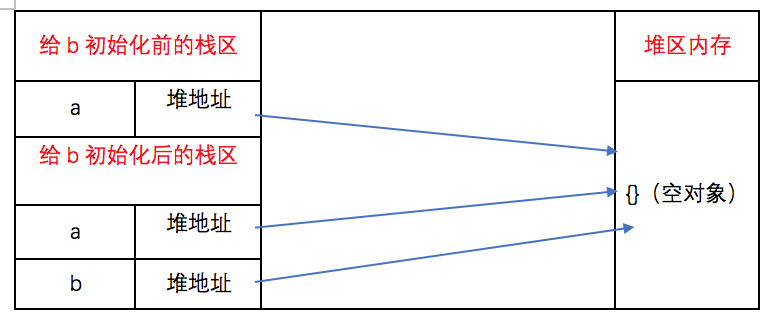

    目录
- [基本数据类型](#基本数据类型)
- [引用类型](#引用类型)
- [类型转换](#类型转换)
  - [显式数据类型转化](#显式数据类型转化)
    - [原始值转布尔](#原始值转布尔)
    - [原始值转数字](#原始值转数字)
    - [原始值转字符串](#原始值转字符串)
    - [原始值转对象](#原始值转对象)
    - [对象转布尔值](#对象转布尔值)
    - [对象转字符串和数字](#对象转字符串和数字)
  - [隐式数据类型转化](#隐式数据类型转化)
    - [一元操作符 +](#一元操作符-)
    - [二元操作符 +](#二元操作符-)
    - [== 相等](#-相等)
- [浮点数精度 （0.1 + 0.2 !== 0.3）](#浮点数精度-01--02--03)
  - [浮点数的存储](#浮点数的存储)
  - [浮点数的运算](#浮点数的运算)
  - [其他](#其他)
- [var let const 区别使用](#var-let-const-区别使用)
  - [var](#var)
  - [let](#let)
  - [const](#const)
  - [变量提升](#变量提升)
- [执行上下文、词法作用域](#执行上下文词法作用域)
  - [执行上下文的三个重要属性：](#执行上下文的三个重要属性)
  - [执行上下文栈和执行上下文的具体变化过程](#执行上下文栈和执行上下文的具体变化过程)
- [原型链、作用域](#原型链作用域)
  - [作用域](#作用域)
  - [原型链](#原型链)
  - [原型链的问题：](#原型链的问题)
  - [实践：实现一个 instanceof 函数](#实践实现一个-instanceof-函数)
- [闭包、IIFE](#闭包iife)
  - [闭包是指有权访问另一个函数作用域中的变量的函数。](#闭包是指有权访问另一个函数作用域中的变量的函数)
  - [一道刷题必刷，面试必考的闭包题：](#一道刷题必刷面试必考的闭包题)
  - [IIFE](#iife)
  - [实践：函数柯里化](#实践函数柯里化)
- [继承](#继承)
  - [原型链继承](#原型链继承)
  - [借用构造函数(经典继承)](#借用构造函数经典继承)
  - [组合继承（原型链继承和经典继承）](#组合继承原型链继承和经典继承)
  - [原型式继承](#原型式继承)
  - [寄生式继承](#寄生式继承)
  - [寄生组合式继承（引用类型最理想的继承范式）](#寄生组合式继承引用类型最理想的继承范式)
- [new 操作符](#new-操作符)
- [this 指向](#this-指向)
- [深浅拷贝](#深浅拷贝)
  - [浅拷贝](#浅拷贝)
  - [深拷贝](#深拷贝)
- [事件循环](#事件循环)
- [V8 垃圾回收机制](#v8-垃圾回收机制)
  - [认识V8](#认识v8)
  - [什么是垃圾](#什么是垃圾)
  - [V8垃圾回收策略](#v8垃圾回收策略)
  - [GC](#gc)
- [防抖节流](#防抖节流)
  
========

     正文

========
> 先推荐一个好的学习资料：[冴羽的博客](https://github.com/mqyqingfeng/Blog)
## 基本数据类型
常见的五种基本数据类型是：`Undifined`、`Null`、`Boolean`、`Number`和`String`。后来ES6 引入了一种新的原始数据类型 `Symbol`，表示独一无二的值，它是 JavaScript 语言的第七种数据类型。
> Symbol 的使用可参考：[ECMAScript 6 入门 之 Symbol](https://es6.ruanyifeng.com/#docs/symbol)   
1. 基本数据类型的值是不可变的，任何方法都无法改变一个基本类型的值，比如一个字符串：
    ```js
    var name = "change";
    name.substr(); // hang
    console.log(name); // change

    var s = "hello";
    s.toUpperCase(); // HELLO
    console.log(s); // hello

    // 通过这两个例子，我们会发现原先定义的变量name的值始终没有发生改变
    // 而调用substr()和toUpperCase()方法后返回的是一个新的字符串，跟原先定义的变量name并没有关系
    ```
    > [JavaScript substr() 方法](https://www.w3school.com.cn/jsref/jsref_substr.asp)          

    或许有人会有以下的疑问：
    ```js
    var name = "change";
    name = "change1";
    console.log(name); // change1
    ```
    - 这样看起来 name 的值“改变了”，其实 `var name = “change”`，这里的基础类型是 `string` ，也就是“change”,这里的“change”是不可以改变的，**name只是指向“change”的一个指针，指针的指向可以改变，所以你可以name = “change1”，代表此时name指向了“change1”**。同理，这里的“change1”同样不可以改变
    - 也就是说这里你认为的改变只是“指针的指向改变”，这里的基础类型指的是“change”，而不是name，需区分清楚

2. 基本数据类型不可以添加属性和方法
    ```js
    var p = "change";
    p.age = 29;
    p.method = function(){console.log(name)};
    console.log(p.age); // undefined
    console.log(p.method); // undefined

    // 通过上面的代码，我们知道不能给基本类型添加属性和方法，也再次说明基本类型是不可变的
    ```
3. 基本数据类型的赋值是简单赋值   
如果从一个变量向另一个变量赋值`基本类型`的值，会在变量对象上创建一个新值，然后把该值复制到为新变量分配的位置上
    ```js
    var a = 10;
    var b = a;
    a++;
    console.log(a); // 11
    console.log(b); // 10
    ```
    上面的代码中， a 中保存的值是10。当使用 a 的值来初始化 b 时， b 中也保存了值 10 。但 b 中的 10 和 a 中的 10 是完全独立的。 b 中的值只是 a 中值的一个副本。所以这两个变量可以参与任何操作而不会相互影响。

4. 基本数据类型的比较是值的比较
    ```js
    var a = 1;
    var b = true;
    console.log(a == b); // true
    console.log(a == b); // false

    // 上面 a 和 b 的数据类型不同，但是也可以进行值的比较，这是因为在比较之前，自动进行了数据类型的 隐式转换。   
    ```
    `== `: 只进行值的比较；`===` : 不仅进行值的比较，还要进行数据类型的比较
5. 基本数据类型是存放在栈区的   
假如有以下几个基本类型的变量：
    ```js
    var name = "jozo";
    var city = "guangzhou";
    var age = 22;
    ```
    那么它的存储结构如下所示：
    |栈区A|栈区A|
    |:--:|:--:|
    |name|jozo|
    |city|guangzhou|
    |age|22|

    同一个栈区里包括了变量的标识符和变量的值

---

## 引用类型
除过上面的 6 种基本数据类型外，剩下的就是引用类型了，统称为 `Object` `类型。细分的话，有：Object` 类型、`Array` 类型、`Date` 类型、`RegExp` 类型、`Function` 类型 等。
1. 引用类型的值是可以改变的
2. 引用类型可以添加属性和方法
3. 引用类型的赋值是对象引用
    ```js
    var a = {};
    var b = a;

    a.name = "change";
    console.log(a.name); // change
    console.log(b.name); // change

    b.age = 29;
    console.log(a.age); // 29
    console.log(b.age); // 29
    ```
    当 a 向 b 赋值引用类型的值时，同样也会将储存在 a 中的对象的值复制一份，并放到为 b 分配的空间中。**此时引用类型保存在 b 中的是对象在堆内存中的地址**。所以，与基本数据类型的简单赋值不同，**这个值的副本实际上是一个指针，而这个指针指向存储在堆内存的一个对象**。那么**赋值操作后，两个变量都保存了同一个对象地址，而这两个地址指向了同一个对象**。因此，改变其中任何一个变量，都会互相影响。
    他们的关系如下图：
    
    因此，引用类型的赋值其实是对象保存在栈区地址指针的赋值，所以两个变量指向同一个对象，任何的操作都会互相影响。

1. 引用类型的比较是引用的比较
    ```js
    var person1 = {};
    var person2 = {};
    console.log(person1 == person2); // false
    ```
    Q：为什么两个对象看起来一摸一样，但是却不相等呢？   
    A：因为引用类型的比较是引用的比较，换句话说，就是`比较两个对象保存在栈区的指向堆内存的地址是否相同`，此时，虽然 p1 和 p2 看起来都是一个”{}”，但是他们保存在栈区中的指向堆内存的地址却是不同的，所以两个对象不相等

5. 引用类型是同时保存在栈区和堆区中的   
引用类型的存储需要在内存的栈区和堆区共同完成，栈区保存变量标识符和指向堆内存的地址
假如有以下几个对象：
    ```js
    var person1 = {name:"change1"};
    var person2 = {name:"change2"};
    var person3 = {name:"change3"};
    ```
    则这三个对象在内存中保存的情况如下图：
    

---

## 类型转换
### 显式数据类型转化
ES6 前，JavaScript 共有六种数据类型：`Undefined`、`Null`、`Boolean`、`Number`、`String`、`Object`。
#### 原始值转布尔   
我们使用 `Boolean函数` 将类型转换成布尔类型，在 JavaScript 中，只有 6 种值可以被转换成 false，其他都会被转换成 true。
```js
// 当 Boolean 函数不传任何参数时，会返回 false。 
console.log(Boolean()) // false
console.log(Boolean(false)) // false 
console.log(Boolean(undefined)) // false 
console.log(Boolean(null)) // false 
console.log(Boolean(+0)) // false 
console.log(Boolean(-0)) // false 
console.log(Boolean(NaN)) // false 
console.log(Boolean("")) // false
```
#### 原始值转数字   
我们可以使用 `Number函数` 将类型转换成数字类型。如果 Number 函数**不传参数，返回 +0**；如果**有参数，隐式调用 ToNumber(value)**，ToNumber 则直接给了一个对应的结果表，表如下。但如果**参数无法被转换为数字，则返回 NaN**。
|参数类型|结果|
|:--:|:--:|
|Undefined|NaN|
|Null|+0|
|Boolean|如果参数是true，返回1；参数为false，返回+0|
|Number|返回与之相等的值|
|String|这段比较复杂，看例子|
```js
// 不传参
console.log(Number()) // +0 
// 传参
- Undefined
console.log(Number(undefined)) // NaN 
- Null
console.log(Number(null)) // +0 
- Boolean
console.log(Number(true)) // 1 
console.log(Number(false)) // +0 
- String
console.log(Number("123")) // 123 
console.log(Number("-123")) // -123 
console.log(Number("1.2")) // 1.2 
console.log(Number("000123")) // 123 
console.log(Number("-000123")) // -123 
console.log(Number("0x11")) // 17 
console.log(Number("")) // 0 
console.log(Number(" ")) // 0 
console.log(Number("123 123")) // NaN 
console.log(Number("foo")) // NaN 
console.log(Number("100a")) // NaN
```
如果通过 Number 转换函数**传入一个字符串，它会试图将其转换成一个整数或浮点数，而且会忽略所有前导的 0**；如果**有一个字符不是数字，结果都会返回 NaN**。鉴于这种严格的判断，我们一般还会使用更加灵活的 `parseInt` 和 `parseFloat` 进行转换。
- parseInt 只解析整数。如果字符串前缀是 "0x" 或者"0X"，会将其解释为十六进制数。
    ```js
    console.log(parseInt("0xFF")) // 255 
    console.log(parseInt("0.1")) // 0
    ```
- parseFloat 则可以解析整数和浮点数。
    ```js
    console.log(parseFloat("3.14 abc")) // 3.14 
    console.log(parseFloat(".1")) // 0.1 
    ```
- parseInt 和 parseFloat 都会**跳过任意数量的前导空格**，尽可能解析更多数值字符，并忽略后面的内容。如果**第一个非空格字符是非法的数字直接量，将最终返回 NaN**：
    ```js
    console.log(parseInt("3 abc")) // 3 
    console.log(parseInt("-12.34")) // -12 
    ```
#### 原始值转字符串   
我们使用 `String函数` 将类型转换成字符串类型。如果 String 函数**不传参数，返回空字符串**，如果**有参数，隐式调用 ToString(value)**。而 ToString 也给了一个对应的结果表，表如图：
|参数类型|结果|
|:--:|:--:|
|Undefined|"undefined"|
|Null|"null"|
|Bolean|如果参数是true，返回true。参数为false，返回false|
|Number|又是比较复杂，可以看例子|
|String|返回与之相等的值|
```js
// 不传参
console.log(String()) // 空字符串 
// 传参
- Undefined
console.log(String(undefined)) // undefined 
- Null
console.log(String(null)) // null 
- Boolean
console.log(String(true)) // true 
console.log(String(false)) // false 
- Number
console.log(String(0)) // 0 
console.log(String(-0)) // 0 
console.log(String(NaN)) // NaN 
console.log(String(Infinity)) // Infinity 
console.log(String(-Infinity)) // -Infinity 
console.log(String(1)) // 1
```
#### 原始值转对象   
原始值通过调用 `String()`、`Number()` 或者 `Boolean()` 构造函数，转换为它们各自的包装对象，（`null` 和 `undefined` 属于例外，当将它们用在期望是一个对象的地方都会造成一个类型错误 (TypeError) 异常，而不会执行正常的转换）。
```js
var b = new Number(a);  
console.log(typeof b); // object
```
#### 对象转布尔值   
所有对象(包括数组和函数)都转换为 true，对于包装对象也是这样。
```js
console.log(Boolean(new Boolean(false))) // true
```
#### 对象转字符串和数字   
对象到字符串 和 对象到数字 的转换都是通过调用待转换对象的一个方法来完成的。而 JavaScript 对象有两个不同的方法来执行转换，一个是 `toString`，一个是 `valueOf`。注意这个跟上面所说的 ToString 和 ToNumber 是不同的，这两个方法是真实暴露出来的方法。
- 当调用对象的 toString 方法时，其实调用的是 Object.prototype 上的 toString 方法。
    - 然而 JavaScript 下的很多类根据各自的特点，定义了更多版本的 toString 方法。例如：
    - 数组的 toString 方法将每个数组元素转换成一个字符串，并在元素之间添加逗号后合并成结果字符串。
        ```js
        console.log([].toString()) // "" 
        console.log([0].toString()) // 0
        console.log([1, 2, 3].toString()) // 1,2,3 
        ```
    - 函数的 toString 方法返回函数本身
        ```js
        console.log(({}).toString()) // [object Object]
        console.log((function(){var a = 1;}).toString()) // function (){var a = 1;} 
        ```
    - 日期的 toString 方法返回一个可读的日期和时间字符串。
        ```js
        var date = new Date(2010, 0, 1);
        console.log(date.toString()) // Fri Jan 01 2010 00:00:00 GMT+0800 (CST)
        ```
    - RegExp 的 toString 方法返回一个表示正则表达式直接量的字符串。
        ```js
        console.log((/\d+/g).toString()) // /\d+/g
        ```
- 而另一个转换对象的函数是 valueOf，表示对象的原始值。默认的 valueOf 方法返回这个对象本身，数组、函数、正则简单的继承了这个默认方法，也会返回对象本身。日期是一个例外，它会返回它的一个内容表示: 1970 年 1 月 1 日以来的毫秒数。
    ```js
    var date = new Date(2017, 4, 21);
    console.log(date.valueOf()) // 1495296000000
    ```
1. 对象转字符串   
对象到字符串是如何转换的，其实就是 ToString 方法的对应表，只是这次我们加上 Object 的转换规则：   
    |参数类型|结果|
    |:--:|:--|
    |Object|1.primValue = ToPrimitive(input, String)<br>2.返回ToString(primValue)|

    所谓的 ToPrimitive 方法，其实就是输入一个值，然后返回一个一定是基本类型的值。   
    - 语法：ToPrimitive(input[, PreferredType])
        - 第一个参数是 input，表示要处理的输入值。
            - 如果传入的 input 是 Undefined、Null、Boolean、Number、String 类型，直接返回该值。
        - 第二个参数是 PreferredType，非必填，表示希望转换成的类型，有两个值可以选，Number 或者 String。
            - 当不传入 PreferredType 时，如果 input 是日期类型，相当于传入 String，否则，都相当于传入 Number。


    - 如果是 ToPrimitive(obj, Number)，处理步骤如下：   
        - 如果 obj 为 基本类型，直接返回
        - 否则，调用 valueOf 方法，如果返回一个原始值，则 JavaScript 将其返回。
        - 否则，调用 toString 方法，如果返回一个原始值，则 JavaScript 将其返回。
        - 否则，JavaScript 抛出一个类型错误异常。

    - 如果是 ToPrimitive(obj, String)，处理步骤如下：   
        - 如果 obj为 基本类型，直接返回
        - 否则，调用 toString 方法，如果返回一个原始值，则 JavaScript 将其返回。
        - 否则，调用 valueOf 方法，如果返回一个原始值，则 JavaScript 将其返回。
        - 否则，JavaScript 抛出一个类型错误异常。

    初次总结：当我们用 String 方法转化一个值的时候，如果是基本类型，就参照 “原始值转字符” 这一节的对应表，如果不是基本类型，我们会将调用一个 ToPrimitive 方法，将其转为基本类型，然后再参照“原始值转字符” 这一节的对应表进行转换。

    最终总结：对象转字符串(就是 Number() 函数)可以概括为：
    - 如果对象具有 toString 方法，则调用这个方法。如果他返回一个原始值，JavaScript 将这个值转换为字符串，并返回这个字符串结果。
    - 如果对象没有 toString 方法，或者这个方法并不返回一个原始值，那么 JavaScript 会调用 valueOf 方法。如果存在这个方法，则 JavaScript 调用它。如果返回值是原始值，JavaScript 将这个值转换为字符串，并返回这个字符串的结果。
    - 否则，JavaScript 无法从 toString 或者 valueOf 获得一个原始值，这时它将抛出一个类型错误异常。
2. 对象转数字   
其实，从对象到数字的转换也是一样：
    |参数类型|结果|
    |:--:|:--| 
    |Object|1.primValue = ToPrimitive(input, Number)<br>2.返回ToNumber(primValue)| 

    **虽然转换成基本值都会使用 ToPrimitive 方法，但传参有不同，最后的处理也有不同 -> 转字符串调用的是 ToString，转数字调用 ToNumber。**

    - 对象转数字的过程中，JavaScript 做了同样的事情，只是它会首先尝试 valueOf 方法。   
        - 如果对象具有 valueOf 方法，且返回一个原始值，则 JavaScript 将这个原始值转换为数字并返回这个数字。
        - 否则，如果对象具有 toString 方法，且返回一个原始值，则 JavaScript 将其转换并返回。
        - 否则，JavaScript 抛出一个类型错误异常。
    ```js
    console.log(Number({})) // NaN
    console.log(Number({a : 1})) // NaN
    console.log(Number([])) // 0
    console.log(Number([0])) // 0
    console.log(Number([1, 2, 3])) // NaN
    console.log(Number(function(){var a = 1;})) // NaN
    console.log(Number(/\d+/g)) // NaN
    console.log(Number(new Date(2010, 0, 1))) // 1262275200000
    console.log(Number(new Error('a'))) // NaN
    ```
    注意，在以上代码块中，[] 和 [0] 都返回了 0，而 [1, 2, 3] 却返回了一个 NaN。我们分析一下原因：
    - 当我们 Number([]) 的时候，先调用 [] 的 valueOf 方法，此时返回 []，因为返回了一个对象而不是原始值，所以又调用了 toString 方法，此时返回一个空字符串，接下来调用 ToNumber 这个规范上的方法，参照对应表，转换为 0, 所以最后的结果为 0。
    - 而当我们 Number([1, 2, 3]) 的时候，先调用 [1, 2, 3] 的 valueOf 方法，此时返回 [1, 2, 3]，再调用 toString 方法，此时返回 1,2,3，接下来调用 ToNumber，参照对应表，因为无法转换为数字，所以最后的结果为 NaN。

### 隐式数据类型转化
#### 一元操作符 +
当 + 运算符作为一元操作符的时候，会调用 ToNumber 处理该值，既然是调用 ToNumber 方法，当输入的值是对象的时候，先调用 ToPrimitive(input, Number) 方法，例子：
```js
console.log(+[]);
    // [] 调用 valueOf 方法，返回一个空数组；
    // 因为不是原始值，继续调用 toString 方法，返回 ""；
    // 得到返回值后，然后再调用 ToNumber 方法，"" 对应的返回值是 0，所以最终返回 0。
console.log(+['1']); // 1 
console.log(+['1', '2', '3']); // NaN 
console.log(+{}); // NaN
```

#### 二元操作符 +
当计算 value1 + value2时：
```js
lprim = ToPrimitive(value1)
rprim = ToPrimitive(value2)
```
- 如果 lprim 是字符串或者 rprim 是字符串，那么返回 ToString(lprim) 和 ToString(rprim)的拼接结果   
- 返回 ToNumber(lprim) 和 ToNumber(rprim)的运算结果

1.Null 与数字
```js
console.log(null + 1);
```
- lprim = ToPrimitive(null) 因为null是基本类型，直接返回，所以 lprim = null
- rprim = ToPrimitive(1) 因为 1 是基本类型，直接返回，所以 rprim = 1
- lprim 和 rprim 都不是字符串
- 返回 ToNumber(null) 和 ToNumber(1) 的运算结果：ToNumber(null) 的结果为0，ToNumber(1) 的结果为 1。所以，null + 1 相当于 0 + 1，最终的结果为数字 1。

2.数组与数组
```js
console.log([] + []);
```
- lprim = ToPrimitive([])，[]是数组，相当于ToPrimitive([], Number)，先调用valueOf方法，返回对象本身，因为不是原始值，调用toString方法，返回空字符串""
- rprim类似。
- lprim和rprim都是字符串，执行拼接操作：[] + []相当于 "" + ""，最终的结果是空字符串""。

3.数组与对象
```js
// 两者结果一致 
console.log([] + {});   
console.log({} + []);
```
- lprim = ToPrimitive([])，lprim = ""
- rprim = ToPrimitive({})，相当于调用 ToPrimitive({}, Number)，先调用 valueOf 方法，返回对象本身，因为不是原始值，调用 toString 方法，返回 "[object Object]"
- lprim 和 rprim 都是字符串，执行拼接操作：[] + {} 相当于 "" + "[object Object]"，最终的结果是 "[object Object]"。
```js
console.log(1 + true); // 2 
console.log({} + {}); // "[object Object][object Object]" 
console.log(new Date(2017, 04, 21) + 1) // "Sun May 21 2017 00:00:00 GMT+0800 (CST)1"
```

#### == 相等
1. null和undefined
```js
console.log(null == undefined);
    规则2）x是null并且y是undefined，返回true
    规则3）x是undefined并且y是null，返回true
    // 所以例子的结果自然为 true。
```

2. 字符串与数字
```js
console.log('1' == 1);
    规则4）x是数字，y是字符串，判断x == ToNumber(y)
    规则5）x是字符串，y是数字，判断ToNumber(x) == y
    // 都先转换成数字后再进行比较，所以例子的结果为true。
```

3. 布尔值和其他类型
```js
console.log(true == '2')
    规则6）x是布尔值，判断ToNumber(x) == y
    规则7）y是布尔值，判断x ==ToNumber(y)
    // 当一方出现布尔值的时候，就会对这一方的值进行ToNumber处理，也就是说true会被转化成1，true == '2' 就相当于 1 == '2' 就相当于 1 == 2，结果自然是 false。
        // 所以当一方是布尔值的时候，会对布尔值进行转换，因为这种特性，所以尽量少使用 xx == true 和 xx == false 的写法。
```

4. 对象与非对象
```js
console.log( 42 == ['42'])
    规则8）x是字符串或者数字，y是对象，判断x == ToPrimitive(y)
    规则9）x是对象，y不是字符串或者数字，判断ToPrimitive(x) == y
    // 以这个例子为例，会使用 ToPrimitive 处理 ['42']，调用valueOf，返回对象本身，再调用 toString，返回 '42'，所以42 == ['42'] 相当于 42 == '42' 相当于42 == 42，结果为 true。
```

5.其他：一概返回 false
再多举几个例子进行分析：
```js
console.log(false == undefined)
    // false == undefined 相当于 0 == undefined 不符合上面的情形，执行最后一步 返回 false

console.log(false == [])
    // false == [] 相当于 0 == [] 相当于 0 == '' 相当于 0 == 0，结果返回 true

console.log([] == ![])
    // 首先会执行 ![] 操作，转换成 false，相当于 [] == false 相当于 [] == 0 相当于 '' == 0 相当于 0 == 0，结果返回 true
```

最后再举一些会让人踩坑的例子：
```js
console.log(false == "0")
console.log(false == 0)
console.log(false == "")

console.log("" == 0)
console.log("" == [])

console.log([] == 0)

console.log("" == [null])
console.log(0 == "\n")
console.log([] == 0)

// 以上均返回 true
```

---

## 浮点数精度 （0.1 + 0.2 !== 0.3）
### 浮点数的存储
**一个浮点数 (Value) 可以这样表示：Value = sign * exponent * fraction**
- 比如 -1020，用科学计数法表示就是:-1 * 10^3 * 1.02
    - sign 就是 -1，exponent 就是 10^3，fraction 就是 1.02
- 对于二进制也是一样，以 0.1 的二进制 0.00011001100110011…… 这个数来说，可以表示为：1 * 2^-4 * 1.1001100110011……
    - 其中 sign 就是 1，exponent 就是 2^-4，fraction 就是 1.1001100110011……

**而当只做二进制科学计数法的表示时，这个 Value 的表示可以再具体一点变成：V = (-1)^S * (1 + Fraction) * 2^E。**
- (-1)^S 表示符号位，当 S = 0，V 为正数；当 S = 1，V 为负数。
- 再看 (1 + Fraction)，这是因为所有的浮点数都可以表示为 1.xxxx * 2^xxx 的形式，前面的一定是 1.xxx，那干脆我们就不存储这个 1 了，直接存后面的 xxxxx 好了，这也就是 Fraction 的部分。
- 最后再看 2^E。如果是 1020.75，对应二进制数就是 1111111100.11，对应二进制科学计数法就是 1 * 1.11111110011 * 2^9，E 的值就是 9；而如果是 0.1 ，对应二进制是 1 * 1.1001100110011…… * 2^-4， E 的值就是 -4。也就是说，E 既可能是负数，又可能是正数。

**IEEE754 给出了标准：用 1 位存储 S（0 表示正数，1 表示负数），用 11 位存储 E + bias，用 52 位存储 Fraction。**

### 浮点数的运算
**一般由以下五个步骤完成：对阶、尾数运算、规格化、舍入处理、溢出判断。**
- 首先是对阶，所谓对阶，就是把阶码调整为相同。
    - 比如 0.1 是 1.1001100110011…… * 2^-4，阶码是 -4，
    - 而 0.2 就是 1.10011001100110...* 2^-3，阶码是 -3；
    - 两个阶码不同，所以先调整为相同的阶码再进行计算，调整原则是小阶对大阶，也就是 0.1 的 -4 调整为 -3，对应变成 0.11001100110011…… * 2^-3

- 接下来是尾数计算：
    - &nbsp;&nbsp;0.1100110011001100110011001100110011001100110011001101    +1.1001100110011001100110011001100110011001100110011010—————————————————————————————— 10.0110011001100110011001100110011001100110011001100111   
    - 我们得到结果为：10.0110011001100110011001100110011001100110011001100111 * 2^-3
- 将这个结果处理一下，即结果规格化：
    - 变成 1.0011001100110011001100110011001100110011001100110011(1) * 2^-2，括号里的 1 意思是说计算后这个 1 超出了范围，所以要被舍弃了。

-  再然后是舍入，四舍五入对应到二进制中，就是 0 舍 1 入。
    - 因为我们要把括号里的 1 丢了，所以这里会进一，结果变成1.0011001100110011001100110011001100110011001100110100 * 2^-2

- 本来还有一个溢出判断，因为这里不涉及，就不讲了。

所以最终的结果存成 64 位就是0 01111111101 0011001100110011001100110011001100110011001100110100，   
将它转换为10进制数就得到 0.30000000000000004440892098500626。   
因为两次存储时的精度丢失加上一次运算时的精度丢失，最终导致了 0.1 + 0.2 !== 0.3

### 其他
```js
// 十进制转二进制 
parseFloat(0.1).toString(2); 
=> "0.0001100110011001100110011001100110011001100110011001101" 

// 二进制转十进制 
parseInt(1100100,2) 
=> 100 

// 以指定的精度返回该数值对象的字符串表示 
(0.1 + 0.2).toPrecision(21) 
=> "0.300000000000000044409" 
(0.3).toPrecision(21) 
=> "0.299999999999999988898"
```

---

## var let const 区别使用
### var 
**用于声明变量 ,变量声明的同时，可以赋值也可不赋值。**
- 注意1：
    - 变量名可以包含字母，数字，下划线和美元符号。
    - 变量名必须以字母开头
    - 变量名也可以以$和_开头（但一般不这么用）
    - 变量名是大小写敏感的（y和Y是不同的变量）
    - 保留字（如JavaScript关键字）不能作为变量名使用
- 注意2：var会发生“变量提升”现象。

### let
**它的用法类似于var，但是所声明的变量，只在let命令所在的代码块内有效。**
- 注意1：let不像var那样会发生“变量提升”现象。
- 注意2：只在声明所在的块级作用域内有效。
- 注意3：let不允许在相同作用域内，重复声明同一个变量。
    ```js
    // 报错
    function() {
        let a = 10;
        var a = 1;
    }
    // 报错
    function() {
        let a = 10;
        let a = 1;
    }
    
    // 报错
    function func(arg) {
        let arg; 
    }
    // 不报错
    function func(arg) {
        {
            let arg; 
        }
    }
    ```     
    因此，不能在函数内部重新声明参数。

### const
**声明一个只读的常量。一旦声明，常量的值就不能改变；且声明变量时，就必须立即初始化，不能留到以后赋值。**
- 注意1：const的作用域与let命令相同：只在声明所在的块级作用域内有效。
- 注意2：const命令声明的常量也是不提升，同样存在暂时性死区，只能在声明的位置后面使用。
- 注意3：const声明的常量，也与let一样不可重复声明。
- 注意4：对于复合类型的变量，变量名不指向数据，而是指向数据所在的地址。**const命令只是保证变量名指向的地址不变，并不保证该地址的数据不变**，所以将一个对象声明为常量必须非常小心。   
    栗子1：
    ```js
    const foo = {};
    foo.prop = 123;

    foo.prop // 123

    foo = {}; // TypeError："foo" is read-only

    // 上面代码中，常量foo储存的是一个地址，这个地址指向一个对象。不可变的只是这个地址，即不能把foo指向另一个地址，但对象本身是可变的，所以依然可以为其添加新属性。
    ```
    栗子2：
    ```js
    const a = [];
    a.push('Hello'); // 可执行
    a.length = 0;    // 可执行
    a = ['Dave'];    // 报错
    
    // 上面代码中，常量a是一个数组，这个数组本身是可写的，但是如果将另一个数组赋值给a，就会报错。
    ```

### 变量提升
把变量声明提升到当前执行环境的最顶端
```js
console.log(foo); // 输出undefined
console.log(bar); // 报错ReferenceError

var foo = 2;
let bar = 2;

// 上面代码中，由于var发生了“变量提升”现象，将foo的声明提升到了“console.log(foo)”前面，即脚本开始运行时，变量foo已经存在了，但是没有值，所以会输出undefined。
// 变量bar用let命令声明，不会发生变量提升。这表示在声明它之前，变量bar是不存在的，这时如果用到它，就会抛出一个错误。
```

---  

## 执行上下文、词法作用域
### 执行上下文的三个重要属性：
1. **变量对象(Variable object，VO)**：是与执行上下文相关的数据作用域，存储了在上下文中定义的变量和函数声明。   

    **因为不同执行上下文下的变量对象稍有不同，所以来理一下全局上下文下的变量对象和函数上下文下的变量对象。**
    - 全局上下文中的变量对象就是全局对象！

        - 可以用 this 引用，在客户端 JavaScript 中，全局对象就是 Window 对象。
        ```js
        console.log(this);
        ```
        - 全局对象是由 Object 构造函数实例化的一个对象。
        ```js
        console.log(this instanceof Object);
        ```
        - 预定义了一大堆函数和属性。
        ```js                   
        // 都能生效
        console.log(Math.random());
        console.log(this.Math.random());
        ```
        - 作为全局变量的宿主。
        ```js                  
        var a = 1;
        console.log(this.a);
        ```
        - 客户端 JavaScript 中，全局对象有 window 属性指向自身。
        ```js                   
        var a = 1;
        console.log(window.a);

        this.window.b = 2;
        console.log(this.b);
        ```
    - **在函数上下文中，用活动对象来表示变量对象。**      
        - 活动对象(activation object, AO)和变量对象其实是一个东西，只是变量对象是规范上的或者说是引擎实现上的，不可在 JavaScript 环境中访问，只有到当进入一个执行上下文中，这个执行上下文的变量对象才会被激活，而只有被激活的变量对象，也就是活动对象上的各种属性才能被访问。
        - 活动对象是在进入函数上下文时刻被创建的，它通过函数的 arguments 属性初始化。arguments 属性值是 Arguments 对象。

    **顺带看下执行过程：执行上下文的代码会分成两个阶段进行处理：分析和执行，我们也可以分别叫做：**
    - 1.进入执行上下文（当进入执行上下文时，这时候还没有执行代码）
        - 变量对象会包括：
            - 1）函数的所有形参 (如果是函数上下文)
                - 由名称和对应值组成的一个变量对象的属性被创建
                - 没有实参，属性值设为 undefined

            - 2）函数声明
                - 由名称和对应值（函数对象(function-object)）组成一个变量对象的属性被创建
                - 如果变量对象已经存在相同名称的属性，则**完全替换**这个属性

            - 3）变量声明
                - 由名称和对应值（undefined）组成一个变量对象的属性被创建；
                - 如果变量名称跟已经声明的形式参数或函数相同，则变量声明**不会干扰**已经存在的这类属性
            
        举个栗子：
        ```js
        function foo(a) {
            var b = 2;
            function c() {};
            var d = function() {};

            b = 3;
        }
        foo(1);

        // 在进入执行上下文后，这时候的AO是：
        AO = {
            arguments:{
                0:1,
                length:1
            },
            a:1,
            b:undefined,
            c:reference to function c() {},
            d:undefined
        }
        ```           
        注意：在进入执行上下文时，**首先会处理函数声明，其次会处理变量声明**，如果变量名称跟已经声明的形式参数或函数相同，则变量声明不会干扰已经存在的这类属性。如下：
        ```js
        console.log(foo); // 1
        function foo() {
            console.log("foo"); // undefined
        }
        var foo = 1;

        // 因为先处理函数声明，虽然变量名称相同，但不会覆盖函数。既然先处理函数，就执行函数内部的内容。
        ```
    - 2.代码执行（在代码执行阶段，会顺序执行代码，根据代码，修改变量对象的值）
        ```js                
        // 还是上面的栗子，当代码执行完之后，这时候的AO是：
        AO = {
            arguments:{
                0:1,
                length:1
            },
            a:1,
            b:3,
            c:reference to function c() {},
            d:reference to FunctionExpression "d"
        }
        ```
    总结上述所说：
    - 全局上下文的变量对象初始化是全局对象
    - 函数上下文的变量对象初始化只包括 Arguments 对象
    - 在进入执行上下文时会给变量对象添加形参、函数声明、变量声明等初始的属性值
    - 在代码执行阶段，会再次修改变量对象的属性值

2. **作用域链**   
总结一下函数执行上下文中作用域链和变量对象的创建过程：
    ```js
    var scope = "global scope";
    function checkscope() {
        var scope2 = 'local scope';
        return scope2;
    }
    checkscope();
    ```
- ①由于先处理函数声明，于是checkscope 函数被创建，保存作用域链到 内部属性[[scope]]
    ```js
    checkscope.[[scope]] = [
        globalContext.VO
    ];
    ```
    > **当执行到一个函数的时候，就会进行准备工作，这里的“准备工作”，就叫做"执行上下文(execution context)"。**   

    > Q：接下来问题来了，我们写的函数多了去了，如何管理创建的那么多执行上下文呢？   
    A1：所以 JavaScript 引擎创建了`执行上下文栈（Execution context stack，ECS）`来管理执行上下文。   
    A2：当执行一个函数的时候，就会创建一个执行上下文，并且压入执行上下文栈，当函数执行完毕的时候，就会将函数的执行上下文从栈中弹出  
    A3：试想当 JavaScript 开始要解释执行代码的时候，最先遇到的就是全局代码，所以初始化的时候首先就会向执行上下文栈压入一个全局执行上下文，我们用 globalContext 表示它，并且只有当整个应用程序结束的时候，ECStack 才会被清空，所以程序结束之前， ECStack 最底部永远有个 globalContext
    
- ②执行 checkscope 函数，创建 checkscope 函数执行上下文，checkscope 函数执行上下文被压入执行上下文栈
    ```js
    ECStack = [
        checkscopeContext,
        globalContext
    ];
    ```

- ③checkscope 函数并不立刻执行，开始做准备工作，第一步：复制函数[[scope]]属性创建作用域链
    ```js
    checkscopeContext = {
        Scope:checkscope.[[scope]],
    }
    ```
    > Q1：checkscope函数被创建时保存到[[scope]]的作用域链， 和 checkscope执行前的准备工作中复制函数[[scope]]属性创建的作用域链有什么不同？   
    A1：checkscope函数创建的时候，保存的是根据词法所生成的作用域链。checkscope执行的时候，会复制这个作用域链，作为自己作用域链的初始化，然后根据环境生成变量对象，然后将这个变量对象，添加到这个复制的作用域链，这才完整的构建了自己的作用域链。  

    > Q2：为什么会有两个作用域链？    
    A2：因为在函数创建的时候并不能确定最终的作用域的样子。而为什么会采用复制的方式而不是直接修改呢？应该是因为函数会被调用很多次吧。

- ④第二步：用 arguments 创建活动对象，随后初始化活动对象，加入形参、函数声明、变量声明
    ```js
    checkscopeContext = {
        AO: {
            arguments:{
                length:0
            },
            scope2:undefined
        },
        Scope:checkscope.[[scope]],
    }
    ```
- ⑤第三步：将活动对象压入checkscope 作用域顶端
    ```js
    checkscopeContext = {
        AO: {
            arguments:{
                length:0
            },
            scope2:undefined
        },
        Scope:[AO, [[Scope]]]
    }
    ```
- ⑥准备工作做完，开始执行函数，随着函数的执行，修改 AO 的属性值
    ```js
    checkscopeContext = {
        AO: {
            arguments:{
                length:0
            },
            scope2:'local scope'
        },
        Scope:[AO, [[Scope]]]
    }
    ```
- ⑦查找到 scope2 的值，返回后函数执行完毕，函数上下文从执行上下文栈中弹出
    ```js
    ECStack = [
        globalContext
    ];
    ```

3. this   

Reference 类型与 this 的指向有着密切的关联，在深入 this 的学习前，我们有必要了解一下 Reference。   
Reference 的构成，有三个组成部分，分别是：
- base value
    - base value 就是属性所在的对象或者就是 EnvironmentRecord，它的值只可能是 `undefined`， an `Object`， a `Boolean`， a `String`， a `Number`， an `environment record` 其中的一种。
- referenced name（属性的名称）
- strict reference
- 
栗子1：
```js
var foo = 1;

// 对应的 Reference 是：
var fooReference = {
    base:EnvironmentRecord,
    name:'foo',
    strict:false
};
```
栗子2：
```js
var foo = {
    bar:function() {
        return this;
    }
};
foo.bar(); // foo

// bar 对应的 Reference 是：
var BarReference = {
    base:foo,
    propertyName:'bar',
    strict:false
};
```
规范中提供了获取 Reference 组成部分的方法，比如 GetBase 和 IsPropertyReference。
- GetBase：返回 reference 的 base value。
- IsPropertyReference：如果 base value 是一个对象，就返回true。
- GetValue：从 Reference 类型获取对应值，返回对象属性真正的值。但是要注意：调用 GetValue，返回的将是具体的值，而不再是一个 Reference（重点敲黑板）。
    ```js
    var foo = 1;
    var fooReference = {
        base:EnvironmentRecord,
        name:'foo',
        strict:false
    };
    GetValue(fooReference) // 1
    ```
如何确定this的值：
- 1.计算 MemberExpression 的结果赋值给 ref
    > Q：什么是 MemberExpression？  
    A1：PrimaryExpression // 原始表达式   
    A2：FunctionExpression // 函数定义表达式  
    A3：MemberExpression [ Expression ] // 属性访问表达式  
    A4：MemberExpression. IdentifierName // 属性访问表达式  
    A5：new MemberExpression Arguments // 对象创建表达式
    - 例子：
        ```js
        function foo() {
            console.log(this)
        }
        foo(); // MemberExpression 是 foo

        function foo() {
            return function() {
                console.log(this)
            }
        }
        foo()(); // MemberExpression 是 foo()

        var foo = {
            bar:function() {
                return this;
            }
        }
        foo.bar(); // MemberExpression 是 foo.bar

        // 所以简单理解 MemberExpression 其实就是()左边的部分。
        ```

- 2.判断 ref 是不是一个 Reference 类型   
关键就在于看规范是如何处理各种 MemberExpression，返回的结果是不是一个Reference类型。
    - 2.1 判断 MemberExpression 是不是 Reference类型，需要根据规范来确定
    - 2.2 如果 ref 是 Reference，并且 IsPropertyReference(ref) 是 true, 那么 this 的值为 GetBase(ref)
    - 2.3 如果 ref 是 Reference，并且 base value 值是 Environment Record, 那么this的值为 ImplicitThisValue(ref)
    - 2.4 如果 ref 不是 Reference，那么 this 的值为 undefined

    ```js
    var value = 1;
    var foo = {
        value:2,
        bar:function() {
            return this.value;
        }
    }

    // 示例1
    console.log( foo.bar() ); // 2
    // 示例2
    console.log( (foo.bar)() ); // 2
    // 示例3
    console.log( (foo.bar == foo.bar)() ); // 1
    // 示例4
    console.log( (false || foo.bar)() ); // 1
    // 示例5
    console.log( (foo.bar, foo.bar)() ); // 1
    ```
    - foo.bar()   
    在示例 1 中，MemberExpression 计算的结果是 foo.bar，那么 foo.bar 是不是一个 Reference 呢？
        - **查看规范 11.2.1 Property Accessors，这里展示了一个计算的过程，什么都不管了，就看最后一步：Return a value of type Reference whose base value is baseValue and whose referenced name is propertyNameString, and whose strict mode flag is strict。**   
        - 我们得知该表达式返回了一个 Reference 类型！
        - 根据之前的内容，我们知道该值为：

        ```js
        var Reference = {
            base:foo,
            name:'bar',
            strict:false
        };
        ```                   
        - 接下来按照 2.1 的判断流程走：该值是 Reference 类型，那么 IsPropertyReference(ref) 的结果是多少呢？
            - 前面我们已经铺垫了 IsPropertyReference 方法，如果 base value 是一个对象，结果返回 true。
            - base value 为 foo，是一个对象，所以 IsPropertyReference(ref) 结果为 true。
            - 这个时候我们就可以确定 this 的值了：this = GetBase(ref)，
            - GetBase 也已经铺垫了，获得 base value 值，这个例子中就是foo，所以 this 的值就是 foo ，示例1的结果就是 2！

    - (foo.bar)()   
        - 示例 2 中，foo.bar被 () 包住，**查看规范 11.1.6 The Grouping Operator直接看结果部分：Return the result of evaluating Expression. This may be of type Reference.NOTE This algorithm does not apply GetValue to the result of evaluating Expression.**
        - 实际上 () 并没有对 MemberExpression 进行计算，所以其实跟示例 1 的结果是一样的。

    - (foo.bar = foo.bar)()   
        - 在示例 3 中，有赋值操作符，**查看规范 11.13.1 Simple Assignment ( = ):计算的第三步：Let rval be GetValue(rref).**
        - 因为使用了 GetValue，所以返回的值不是 Reference 类型，
        - 按照之前讲的判断逻辑：如果 ref 不是Reference，那么 this 的值为 undefined
        - this 为 undefined，非严格模式下，this 的值为 undefined 的时候，其值会被隐式转换为全局对象。
            - 注意：所有例子都是在非严格模式下的结果。而严格模式下因为 this 返回 undefined，所以示例 3 会报错。

    - (false || foo.bar)()
        - 在示例 4 中，逻辑与算法，**查看规范 11.11 Binary Logical Operators：计算第二步：Let lval be GetValue(lref).**
        - 因为使用了 GetValue，所以返回的不是 Reference 类型，this 为 undefined

    - (foo.bar, foo.bar)()
        - 在示例 5 中，逗号操作符，**查看规范11.14 Comma Operator ( , )，计算第二步：Call GetValue(lref).**
        - 因为使用了 GetValue，所以返回的不是 Reference 类型，this 为 undefined

### 执行上下文栈和执行上下文的具体变化过程
例子：
```js
var scope = "global scope";
function checkscope() {
    var scope = "local scope";
    function f() {
        return scope;
    }
    return f();
}
checkscope();
```
1. 执行全局代码，创建全局执行上下文，全局上下文被压入执行上下文栈
```js
ECStack = [
    globalContext
];
```
2. 全局上下文初始化
```js
globalContext = {
    VO:[global],
    Scope:[globalContext.VO],
    this:globalContext.VO
}
```
- 初始化的同时，checkscope 函数被创建，保存作用域链到函数的内部属性[[scope]]
```js      
checkscope.[[scope]] = [
    globalContext.VO
];
```
3. 执行 checkscope 函数，创建 checkscope 函数执行上下文，checkscope 函数执行上下文被压入执行上下文栈
```js        
ECStack = [
    checkscopeContext,
    globalContext
];
```
4. checkscope 函数执行上下文初始化：
- 1）复制函数 [[scope]] 属性创建作用域链，
- 2）用 arguments 创建活动对象，
- 3）初始化活动对象，即加入形参、函数声明、变量声明，
- 4）将活动对象压入 checkscope 作用域链顶端。
- 同时 f 函数被创建，保存作用域链到 f 函数的内部属性[[scope]]
```js       
checkscopeContext = {
    AO:{
        arguments:{
            length:0
        },
        scope:undefined,
        f:reference to function f() {}
    },
    Scope:[AO, globalContext.VO],
    this:undefined
}
```
5. 执行 f 函数，创建 f 函数执行上下文，f 函数执行上下文被压入执行上下文栈
```js       
ECStack = [
    fContext,
    checkscopeContext,
    globalContext
];
```
6. f 函数执行上下文初始化, 以下跟第 4 步相同：
- 1）复制函数 [[scope]] 属性创建作用域链
- 2）用 arguments 创建活动对象
- 3）初始化活动对象，即加入形参、函数声明、变量声明
- 4）将活动对象压入 f 作用域链顶端
```js        
fContext = {
    AO:{
        arguments:{
            length:0
        }
    },
    Scope:[AO, checkscopeContext.AO, globalContext.VO],
    this:undefined
}
```
7. f 函数执行，沿着作用域链查找 scope 值，返回 scope 值
8. f 函数执行完毕，f 函数上下文从执行上下文栈中弹出
```js        
ECStack = [
    checkscopeContext,
    globalContext
];
```
9. checkscope 函数执行完毕，checkscope 执行上下文从执行上下文栈中弹出
```js 
ECStack = {
    globalContext
};
```

---

## 原型链、作用域
### 作用域
JavaScript 采用的是词法作用域（也就是静态作用域），函数的作用域在函数定义的时候就决定了；而与词法作用域相对的是动态作用域，函数的作用域是在函数调用的时候才决定的。
```js
var value = 1;
function foo() {
    console.log(value);
}
function bar() {
    var value = 2;
    foo();
}
bar();

// 结果是？？？
```
- 假设JavaScript采用静态作用域，让我们分析下执行过程：
    - 执行 foo 函数，先从 foo 函数内部查找是否有局部变量 value，如果没有，就根据书写的位置，查找上面一层的代码，也就是 value 等于 1，所以结果会打印 1。
- 假设JavaScript采用动态作用域，让我们分析下执行过程：
    - 执行 foo 函数，依然是从 foo 函数内部查找是否有局部变量 value。如果没有，就从调用函数的作用域，也就是 bar 函数内部查找 value 变量，所以结果会打印 2。
- 由于JavaScript采用的是静态作用域，所以这个例子的结果是 1。
### 原型链
图中由相互关联的原型组成的链状结构就是原型链，也就是蓝色的这条线。
  
1. constructor
```js
function Person() {}
var person = new Person();
console.log(person.constructor === Person); // true

// 当获取 person.constructor 时，其实 person 中并没有 constructor 属性,当不能读取到constructor 属性时，会从 person 的原型也就是 Person.prototype 中读取，正好原型中有该属性
// 所以：person.constructor === Person.prototype.constructor
```
2. __proto__   
其次是 __proto__ ，绝大部分浏览器都支持这个非标准的方法访问原型，然而它并不存在于 Person.prototype 中，实际上，它是来自于 Object.prototype ，与其说是一个属性，不如说是一个 getter/setter，当使用 obj.__proto__ 时，可以理解成返回了 Object.getPrototypeOf(obj)。

3. 真的是继承吗？   
继承意味着复制操作，然而 JavaScript 默认并不会复制对象的属性，相反，JavaScript 只是在两个对象之间创建一个关联，这样，一个对象就可以通过委托访问另一个对象的属性和函数，所以与其叫继承，委托的说法反而更准确些。

### 原型链的问题：
1. 原型中如果存在引用类型的值，会被所有实例共享，如下所示：
```js
function SuperType() {
    this.colors = ['red', 'blue', 'greeb'];
}
function SubType() {}
SubType.prototype = new SuperType();

var instance1 = new SubType();
instance1.colors.push('black');
console.log(instance1.colors) // "red, blue, green, black"

var instance2 = new SubType();
console.log(instance2.colors); // "red, blue, green, black"
```
如果原型的属性被所有的实例共享，就会存在一个实例修改了这个属性后，也会影响到其他实例，这往往会造成一些不必要的麻烦。因此，通常的做法是在构造函数中，而不是在原型中定义属性，如：
```js  
function SuperType() {}
function SubType() {
    this.colors = [];
}
SubType.prototype = new SuperType();

var instance1 = new SubType();
instance1.colors.push('black');
console.log(instance1.colors); // ["black"]

var instance2 = new SubType();
instance2.colors.push('red');
console.log(instance2.colors); // ["red"]
```
2. 在创建子类型的实例时，不能向超类型的构造函数中传递参数。
- 实际上，应该说是没有办法在不影响所有对象实例的情况下，给超类型的构造函数传递参数。有鉴于此，再加上由于原型中包含引用类型值所带来的问题，实践中很少会单独使用原型链。为了解决这些问题，可以使用一种叫做 借用构造函数（constructor stealing）的技术（有时候也叫做伪造对象或经典继承）。这种技术的基本思想相当简单，即在子类型构造函数的内部调用超类型构造函数。
```js
function SuperType(name) {
    this.name = name;
}
function SubType(name, age) {
    // 继承了 SuperType ，同时还传递了参数
    SuperType.call(this, name);
    // 实例属性
    this.age = age;
}

var instance1 = new SubType('siyang', 29);
console.log(instance1.name); // "siyang"
console.log(instance1.age); // 29

var instance2 = new SubType('hg', 28);
console.log(instance2.name); // "hg"
console.log(instance2.age); // 28
```
以上代码在 SubType 内部使用 call 实现了对 SuperType 的"继承"，同时每个实例都有自己的实例属性，互不影响；而且创建实例时还可以向超类型 SuperType 传递参数。
### 实践：实现一个 instanceof 函数
1. 语法：a instanceof b
- a：某个实例对象；b：某个构造函数
- instanceof 运算符用于检测 b.prototype 是否存在于参数 a的原型链上。
- instanceof函数用来判断一个对象是否为一个对象的实例。
2. 代码实现：（getPrototypeOf：获取某个实例对象的原型）
```js
function Person() { // 构造函数
    this.name = "siyang";
}
let p = new Person(); // 实例
console.log(p.name); // siyang

function myInstanceof(a, b) {
    let proto = Object.getPrototypeOf(a);
    while(true) {
        if(proto === b.prototype) return true;
        if(!proto) return false;
        proto = Object.getPrototypeOf(proto);
    }
}
console.log(myInstanceof(p, Object)); // true
console.log(myInstanceof(p, Array)); // false
```

---

## 闭包、IIFE
### 闭包是指有权访问另一个函数作用域中的变量的函数。
**创建闭包的常见方式：就是在一个函数内部创建另一个函数。**
```js
var scope = "global scope";
function checkscope() {
    var scope = "local scope";
    function f() {
        return scope;
    }
    return f;
}

var foo = checkscope();
foo();
```
首先要分析一下这段代码中执行上下文栈和执行上下文的变化情况。
1. 进入全局代码，创建全局执行上下文，全局执行上下文压入执行上下文栈
2. 全局执行上下文初始化
3. 执行 checkscope 函数，创建 checkscope 函数执行上下文，checkscope 执行上下文被压入执行上下文栈
4. checkscope 执行上下文初始化，创建变量对象、作用域链、this等
5. checkscope 函数执行完毕，checkscope 执行上下文从执行上下文栈中弹出
6. 执行 f 函数，创建 f 函数执行上下文，f 执行上下文被压入执行上下文栈
7. f 执行上下文初始化，创建变量对象、作用域链、this等
8. f 函数执行完毕，f 函数上下文从执行上下文栈中弹出

思考一个问题：当 f 函数执行的时候，checkscope 函数上下文已经被销毁了啊(即从执行上下文栈中被弹出)，怎么还会读取到 checkscope 作用域下的 scope 值呢？
- 当我们了解了具体的执行过程后，我们知道 f 执行上下文维护了一个作用域链：
```js
fContext = {
    Scope:[AO, checkscopeContext.AO, globalContext.VO]
}
```
- 就是因为这个作用域链，f 函数依然可以读取到 checkscopeContext.AO 的值，说明当 f 函数引用了 checkscopeContext.AO 中的值的时候，即使 checkscopeContext 被销毁了，但是 JavaScript 依然会让 checkscopeContext.AO 活在内存中，f 函数依然可以通过 f 函数的作用域链找到它，正是因为 JavaScript 做到了这一点，从而实现了闭包这个概念。


### 一道刷题必刷，面试必考的闭包题：
```js
var data = [];
for(var i = 0; i < 3; i++) {
    data[i] = function() {
        console.log(i);
    };
}

data[0](); // 3
data[1](); // 3
data[2](); // 3
```
我们来分析一下为什么答案全为 3 ？
- 当执行到 data[0] 函数之前，此时全局上下文的 VO 为：
```js
globalContext = {
    VO:{
        data:[...],
        i:3
    }
}
```
- 当执行 data[0] 函数的时候，data[0] 函数的作用域链为：
```js
data[0]Context = {
    Scope:[AO, globalContext.VO]
}
```
- data[0]Context 的 AO 并没有 i 值，所以会从 globalContext.VO 中查找，i 为 3，所以打印的结果就是 3。
- data[1] 和 data[2] 是一样的道理。

**将上面的题改成闭包看看：**
```js
var data = [];
for(var i = 0; i < 3; i++) {
    data[i] = (function(i) {
        return function() {
            console.log(i);
        }
    })(i);
}

data[0]();
data[1]();
data[2]();
```
- 当执行到 data[0] 函数之前，此时全局上下文的 VO 为：（跟没改之前一模一样）
```js
globalContext = {
    VO:{
        data:[...],
        i:3
    }
}
```
- 当执行 data[0] 函数的时候，data[0] 函数的作用域链发生了改变：
```js
data[0]Context = {
    Scope:[AO, 匿名函数Context.AO, globalContext.VO]
}
```
- 匿名函数执行上下文的AO为：
```js
匿名函数Context = {
    AO:{
        arguments:{
            0:0,
            length:1
        },
        i:0
    }
}
```
- data[0]Context 的 AO 并没有 i 值，所以会沿着作用域链从匿名函数 Context.AO 中查找，这时候就会找 i 为 0，找到了就不会往 globalContext.VO 中查找了，即使 globalContext.VO 也有 i 的值(值为3)，所以打印的结果就是0。
- data[1] 和 data[2] 是一样的道理。

以下代码块中，c 会报错，并不会读取到bar 执行上下文中变量对象c
```js
var fn = null;
function foo() {
    var a = 2;
    function innerFoo() {
        console.log(c);
        console.log(a);
    }
    fn = innerFoo;
}
function bar() {
    var c = 100;
    fn();
}

foo();
bar();
```
- 虽然fn()，即innerFoo()是在bar里面执行的，但是innerFoo函数的时候他的作用域scope里面分别是[AO,fooContext.AO, globalContext.AO]，并没有包括barContext.AO在里面，所以根本就没有声明c这个变量，所以会显示is not define

### IIFE
当函数变成立即执行的函数表达式时，表达式中的变量不能从外部访问
```js
(function() {
    var name = "Barry";
})();
// 无法从外部访问变量 name
name // 抛出错误："Uncaught ReferenceError:name is not defined"
```
将 IIFE 分配给一个变量，不是存储 IIFE 本身，而是存储 IIFE 执行后返回的结果。
```js
var result = (function() {
    var name = "Barry";
    return name;
})();
// IIFE 执行后返回的结果：
result; // "Barry"
```

### 实践：函数柯里化
- 接收函数作为参数的函数，都可以叫做高阶函数。柯里化，其实就是高阶函数的一种特殊用法。
- 柯里化（Currying），是一种将使用多个参数的一个函数转换成一系列使用一个参数的函数的技术。如：
```js
// 普通的 add 函数
function add(x, y) {
    return x + y
}

// Currying 后
function curryingAdd(x) {
    return function(y) {
        return x + y
    }
}

add(1, 2);         // 3
curryingAdd(1)(2); // 3
```
- 作用：简化代码结构，提高系统的维护性，一个方法，只有一个参数，强制了功能的单一性，很自然就做到了功能内聚，降低耦合。
- 代码实现：
```js
function add() {
    // 第一次执行时，定义一个数组专门用来存储所有的参数
    var args = Array.prototype.slice.call(arguments);

    // 在内部声明一个函数，利用闭包的特性保存args并收集所有的参数值
    var _adder = function() {
        args.push(...arguments);
        return _adder;
    }

    // 利用隐式转换的特性，当最后执行时隐式转换，并计算最终的值返回
    _adder.toString = function() {
        return args.reduce(function(a, b) {
            return a + b;
        });
    }

    return _adder;
}
var a = add(1)(2)(3)(4);   // f 10
var b = add(1, 2, 3, 4);   // f 10
var c = add(1, 2)(3, 4);   // f 10
var d = add(1, 2, 3)(4);   // f 10

// 可以利用隐式转换的特性参与计算
console.log(a + 10); // 20
console.log(b + 20); // 30
console.log(c + 30); // 40
console.log(d + 40); // 50

// `    
console.log(a(10) + 100);  // 120
console.log(b(10) + 100);  // 120
console.log(c(10) + 100);  // 120
console.log(d(10) + 100);  // 120
```

---

## 继承
### 原型链继承
- 模拟实现：
```js
function Parent() {
    this.name = 'siyang';
}
Parent.prototype.getName = function() {
    console.log(this.name);
}
function child() {}
child.prototype = new Parent();
var son = new child();
son.getName(); // siyang
```
### 借用构造函数(经典继承)
- 优点：
  - 避免了引用类型的属性被所有实例共享：关键在于this指向（call）
  - 可以在 Child 中向 Parent 传参
    ```js
    function Parent(name) {
        this.name = name;
    }
    function Child(name) {
        Parent.call(this, name);
    }

    var child1 = new Child('kevin');
    console.log(child1.name); // kevin
    var child2 = new Child('daisy');
    console.log(child2.name); // daisy
    ```
- 缺点：每次创建对象都会创建一遍方法
- 模拟实现：
```js
function Parent() {
    this.name = ['siyang'];
}
function child() {
    Parent.call(this);
}
var son = new child();
son.name.push('hcy');
console.log(son.name); // ["siyagn", "hcy"]
```
### 组合继承（原型链继承和经典继承）
- 优点：融合原型链继承和构造函数的优点，是 JavaScript 中最常用的继承模式。
- 缺点：会调用两次父构造函数。一次是设置子类型实例的原型的时候：child.prototype = new Parent();另一次在创建子类型实例的时候：var son = new child('hcy','20')。
- 模拟实现：
```js
function Parent(name) {
    this.name = name;
    this.color = ['blue'];
}
function child(name, age) {
    Parent.call(this, name);
    this.age = age;
}
child.prototype = new Parent();

var son = new child('hcy','20');
son.color.push('red');
console.log(son.name); // hcy
console.log(son.age); // 20
console.log(son.color); // ["blue", "red"]

var sister = new child('hg');
console.log(sister.color); // ["blue"]
```
### 原型式继承
```js
function createObj(o) {
    function F() {};
    F.prototype = o;
    return new F();
}
```
- 创建了一个新对象
- 缺点：包含引用类型的属性值始终都会共享相应的值，这点跟原型链继承一样
```js
var person = {
    name:'kevin',
    friends:['daisy', 'kelly']
}
var person1 = createObj(person);
var person2 = createObj(person);

person1.name = 'person1';
console.log(person2.name); // kevin

person1.friends.push('taylor');
console.log(person2.friends); // ['daisy', 'kelly', 'taylor']
```
- 注意：修改person1.name的值，person2.name的值并未发生改变，并不是因为person1和person2有独立的 name 值，而是因为person1.name = 'person1'是给person1添加了 name 值，并非修改了原型上的 name 值。
- 模拟实现：
```js
function Parent(o) {
    // 创建一个临时性的构造函数
    function F() {}
    // 将传入的对象作为这个构造函数的原型
    F.prototype = o;
    // 返回这个临时类型的一个新实例
    return new F();
}
var person = {
    name: "hcy",
    friends: ["et", "siyang"]
}
var another = Parent(person);
console.log(another.name); // hcy
another.friends.push('hg');

var son = Parent(person);
console.log(son.friends); // ["et", "siyang", "hg"]
son.name = 'zbc';

var sister = Parent(person);
console.log(sister.name); // hcy
```
### 寄生式继承
创建一个仅用于封装继承过程的函数，该函数在内部以某种形式来做增强对象，最后返回对象。
```js
function createObj(o) {
    var clone = Object.create(o);
    clone.sayName = function() {
        console.log('hi');
    }
    return clone;
}
```
- 将create函数返回的结果赋值给clone，然后给clone添加了sayName方法
- 缺点：跟借用构造函数模式一样，每次创建对象都会创建一遍方法。
模拟实现：
```js
function Parent(o) {
    function F() {}
    F.prototype = o;
    return new F();
}
function createAnother(original) {
    var clone = Parent(original);
    clone.sayHi = function() {
        alert("Hello World!");
    };
    return clone;
}
var person = {
    name:'siyang',
    friends:['hcy']
}
var another = createAnother(person);
another.sayHi(); // Hello World!
```
### 寄生组合式继承（引用类型最理想的继承范式）
即通过借用构造函数来继承属性，通过原型链的混成形式来继承方法。   
本质上：使用寄生式继承来继承超类型的原型，然后再将结果指定给子类型的原型。

栗子：
先放一个组合继承的代码
```js
function Parent(name) {
    this.name = name;
    this.colors = ['red', 'blue', 'green'];
}
Parent.prototype.getName = function() {
    console.log(this.name)
}

function Child(name, age) {
    Parent.call(this, name);
    this.age = age;
}
Child.prototype = new Parent();

var child1 = new Child('kevin', '18');
console.log(child1);
```
改造目标：不使用 Child.prototype = new Parent() ，而是间接的让 Child.prototype 访问到 Parent.prototype
```js
function Parent(name) {
    this.name = name;
    this.colors = ['red', 'blue', 'green'];
}
Parent.prototype.getName = function() {
    console.log(this.name)
}

function Child(name, age) {
    Parent.call(this, name);
    this.age = age;
}

// 关键的三步
var F = function() {};
F.prototype = Parent.prototype;
Child.prototype = new F();

var child1 = new Child('kevin', '18');
console.log(child1);
```
于是封装：
```js
function object(o) {
    function F() {};
    F.prototype = o;
    return new F();
}

function prototype(child, parent) {
    var prototype = object(parent.prototye);
    prototype.constructor = child;
    child.prototpe = prototype;
}

// 当我们使用的时候：
prototype(Child, Parent);
```
优点：只调用了一次 Parent 构造函数，并且因此避免了在 Parent.prototype 上面创建不必要的、多余的属性。同时，原型链还能保持不变；因此，还能够正常使用 instanceof 和 isPrototypeOf。

- 模拟实现：
```js
function obj(o) {
    function F() {}
    F.prototype = o;
    return new F();
}
function inheritPrototype(child, Parent) {
    // 创建超类型原型的一个副本
    var _prototype = obj(Parent.prototype);
    // 为创建的副本添加constructor属性，弥补因重写原型而失去的默认的constructor属性
    _prototype.constructor = child;
    // 将新创建的对象（即副本）赋值给子类型的原型
    child.prototype = _prototype;
}

function Parent(name) {
    this.name = name;
    this.colors = ["blue", "red"];
}
Parent.prototype.sayName = function() {
    console.log(this.name);
};
function child(name, age) {
    Parent.call(this, name);
    this.age = age;
}
inheritPrototype(child, Parent);
child.prototype.sayAge = function() {
    console.log(this.age);
};
var sister = new child('siyang', '20');
sister.sayAge(); // 20
sister.sayName(); // siyang
sister.colors.push('yellow');
console.log(sister.colors); //  ["blue", "red", "yellow"]
```

---

## new 操作符
- new 运算符创建一个用户定义的对象类型的实例或具有构造函数的内置对象类型之一
- new的功能
```js
function Otaku(name, age) {
    this.name = name;
    this.age = age;
    this.habit = 'Games';
}

Otaku.prototype.strength = 60;
Otaku.prototype.sayYourNmae = function() {
    console.log('I am ' + this.name);
}

var person = new Otaku('Kevin', '18');

console.log(person.name); // Kevin
console.log(person.habit); // Games
console.log(person.strength); // 60
person.sayYourName(); // I am Kevin
```
从这个例子中，我们可以看到，实例 person 可以：
- 访问到 Otaku 构造函数里的属性
- 访问到 Otaku.prototype 中的属性
  
实践：模拟实现 new 函数
```js
function create_new() {
    // 要实现的功能：
    // 1.返回一个新对象
    // 2.访问到 person 构造函数里的属性
    // 3.访问到 person.prototype 中的属性

    // 1.从Object.prototype上克隆一个对象
    let obj = new Object();
    // 2.取得外部传入的构造器
    let constructor = [].shift.call(arguments);
    // 3.指向正确的原型
    let F = function() {};
    F.prototype = constructor.prototype;
    obj = new F();
    // 2.借用外部传入的构造器给obj设置属性
    let res = constructor.apply(obj, arguments);
        // obj：这个对象将代替constructor类里this对象
        // arguments：这个是数组，它将作为参数传给constructor
    return typeof ret === 'object' ? res : obj; // 确保构造器总是返回一个对象

}

function person(name, age) {
    this.name = name;
    this.age = age;
    this.idol = 'hcy';
}
person.prototype.color = 'red';
person.prototype.sayHi = function() {
    console.log("Hello " + this.name);
}
let child = create_new(person, 'siyang', '19');
console.log(child.name); // siyang
console.log(child.age); // 19
console.log(child.idol); // hcy
console.log(child.color); // red
child.sayHi(); // Hello siyang
```

---

## this 指向
实践：模拟实现 apply、call、bind 函数
apply
```js
// apply函数模拟思路
Function.prototype.simulate_apply = function(context, arr) {
    var context = context || window;
    context.fn = this;
    var result;
    if(!arr) {
        result = context.fn();
    } else {
        var args = [];
        for(let i=0; i<arr.length; i++) {
            args.push('arr['+i+']');
        }
        result = eval('context.fn('+args+')');
    }
    delete context.fn;
    return result;
}
var foo = {
    value:2
}
function bar(name, age) {
    console.log(this.value);
    return {
        value:this.value,
        name:name,
        age:age
    }
}
console.log(bar.simulate_apply(foo, ['hcy', '20']));
```
call
```js
// call函数模拟思路
Function.prototype.simulate_call = function(context) {
    // 6.假如this参数为null，视为指向window
    context = context || window;
    // 1.改变this的指向
    context.fn = this;
    // 4.用数组存放不定长的参数
    var args = [];
    for(let i=1; i<arguments.length; i++) {
        args.push('arguments['+i+']');
    }
    // 2.执行函数 + 5.把参数数组放到要执行的函数的参数里
    var result = eval('context.fn('+args+')');
    // 3.删除函数
    delete context.fn;
    // 7.函数是可以有返回值的
    return result;
}
var foo = {
    value:1
};
function bar(name, age) {
    console.log(this.value);
    return{
        value:this.value,
        name:name,
        age:age
    }
}
console.log(bar.simulate_call(foo, 'siyang', '19'));
```
bind
- bind() 方法会创建一个新函数。当这个新函数被调用时，bind() 的第一个参数将作为它运行时的 this，之后的一序列参数将会在传递的实参前传入作为它的参数。(来自于 MDN )
- bind 函数的三个特点：
    - 返回一个函数
    - 可以传入参数
    - 一个绑定函数也能使用new操作符创建对象：这种行为就像把原函数当成构造器。提供的 this值被忽略，同时调用时的参数被提供给模拟函数。
```js
// bind函数模拟思路
Function.prototype.simulate_bind = function(context) {
    if (typeof this !== "function") {
        throw new Error("Function.prototype.bind - what is trying to be bound is not callable");
    }
    var _this = this;
    // 获取 simulate_bind函数 从第二个参数到最后一个参数，转换成一个正式数组
    var args = Array.prototype.slice.call(arguments, 1);

    var fNOP = function () {};

    // bind函数特点之一：返回一个函数
    var fBound = function() {
        // 这个时候的arguments是指bind返回的函数传入的参数
        var bindArgs = Array.prototype.slice.call(arguments);
        // 之所以return，是考虑到绑定函数可能是有返回值的
        return _this.apply(this instanceof fNOP ? this : context, args.concat(bindArgs));
    }
    
    fNOP.prototype = this.prototype;
    fBound.prototype = new fNOP();
    return fBound;
}

var foo = {
    value:1
};
function bar(name, age) {
    console.log(this.value);
    console.log(name); 
    console.log(age); 
}
var bindFoo = bar.simulate_bind(foo, 'siyang');
bindFoo('19');
```

---

## 深浅拷贝
### 浅拷贝
如果数组元素是基本类型，就会拷贝一份，互不影响；而如果是对象或者数组，就会只拷贝对象和数组的引用，这样我们无论在新旧数组进行了修改，两者都会发生变化。（一种复制引用的拷贝方法） 
### 深拷贝
指完全的拷贝一个对象，即使嵌套了对象，两者也相互分离，修改一个对象的属性，也不会影响另一个。
- 实现深拷贝需要考虑几个因素：
    - 传入的对象是使用对象字面量{}创建的对象还是由构造函数生成的对象
    - 如果对象是由构造函数创建出来的，那么是否要拷贝原型链上的属性
    - 如果要拷贝原型链上的属性，那么如果原型链上存在多个同名的属性，保留哪个
    - 处理循环引用的问题
- 实践：实现一个深拷贝函数
```js
// 原生js中递归函数拷贝
function deepCopy(obj) {
    // 定义一个变量接收新对象
    var newObj = null;

    if(obj instanceof Array) {
        newObj = [];
        // 复制法一
        for(let index in obj) {
            var prop = obj[index]; 
            if (prop == obj) {
                continue;
            }
            // callee, 该属性是一个指针，指向拥有这个 arguments 对象的函数,相当于deepCopy(),即递归调用自身;有利于降低代码的耦合度（如果更换函数名，也可正常递归，不受其他代码影响）
            newObj.push(arguments.callee(obj[index]));
            // newObj.push(deepCopy(obj[index]));
        }
        // 复制法二
        // obj.forEach(item => {
        //     newObj = arguments.callee(item);
        // });
    } else if(obj instanceof Object) {
        newObj = {};
        for(let index in obj) {
            newObj[index] = arguments.callee(obj[index]);
            // newObj[index] = deepCopy(obj[index]);
        }
    } else {
        newObj = obj;
    }            

    return newObj;

    // 该函数存在的问题：
    // 同名的属性会发生覆盖现象

    // 如果对象是由构造函数创建出来的，那么是否要拷贝原型链上的属性
    // 传入的对象是使用对象字面量{}创建的对象还是由构造函数生成的对象
}

let obj={
    abc:'123',
    def:[{a:1,b:2,c:3},{q:8,w:9}],
    qwe:{e: 4, f: 5}
};
let news = deepCopy(obj);   
console.log(news);
/* 复制法一console：                       复制法二console：  
{abc: "123" ,                             {abc: "123",
def: Array(2),                             def: {q: 8, w: 9},
    0: {a: 1, b: 2, c: 3}                  qwe: {e: 4, f: 5}}
    1: {q: 8, w: 9}
qwe: {e: 4, f: 5}}
*/

// // 实现jQuery中的extend函数进行拷贝
// function deepCopy(obj) {
//     if (obj && obj instanceof Object) {
//         var result = obj.constructor === Array ? [] : {};
//         for(let i in obj) {
//             // 避免相互引用造成死循环
//             var prop = obj[i]; 
//             if (prop == obj) {
//                 continue;
//             }
//             // hasOwnProperty(propertyName)方法 是用来检测属性是否为对象的自有属性，如果是，返回true，否者false; 参数propertyName指要检测的属性名；
//             if (obj.hasOwnProperty(i)) {
//                 result[i] = typeof obj[i] === 'object' ? deepCopy(obj[i]) : obj[i];
//             }
//         }
//     } else {
//         var result = obj;
//     }
    
//     return result;
// }

// let obj={
//     abc:'123',
//     def:[{a:1,b:2,c:3},{q:8,w:9}],
//     qwe:{e: 4, f: 5}
// };
// let news = deepCopy(obj);
// console.log(news);
```

---

## 事件循环
> [阮一峰的网络日志：JavaScript 运行机制详解：再谈Event Loop](http://www.ruanyifeng.com/blog/2014/10/event-loop.html?from=from_parent_mindnote)  
> [从Event Loop谈JS的运行机制](https://segmentfault.com/a/1190000014018604)  
> [前端基础进阶（十四）：深入核心，详解事件循环机制](https://www.jianshu.com/p/12b9f73c5a4f)  
> [详解JavaScript中的Event Loop（事件循环）机制](https://zhuanlan.zhihu.com/p/33058983)

---

## V8 垃圾回收机制
### 认识V8
V8 —— 是 Google 发布的主流的开源 JavaScript 引擎，采用 C++ 编写。采用即时编译，直接翻译成机器语言，并且使用了如内联缓存（inline caching）等方法来提高性能。有了这些功能，JavaScript程序在V8引擎下的运行速度媲美二进制程序。

V8内存设限：64bit操作系统上不超过1.5G，32bit操作系统上不超过800M 这么设限为了浏览器使用内存足够，内部还有垃圾运行机制，时间也在用户感知的合理范围

目前V8垃圾回收采用增量标记算法需要50ms，采用非增量标记算法需要1s

这里先停一下，康康这篇文章再往下会更好：[前端面试：谈谈 JS 垃圾回收机制](https://segmentfault.com/a/1190000018605776)
### 什么是垃圾
一般来说没有被引用的对象就是垃圾，就是要被清除。 有个例外如果几个对象引用形成一个环，互相引用，但根访问不到它们，这几个对象也是垃圾，也要被清除。

### V8垃圾回收策略
程序的使用过程中，可以分为 `原始类型数据` 和 `对象类型数据` 。

原始数据都是由程序语言自身控制的，这里的回收还是指主要存活在堆区的对象数据，这个过程是离不开内存操作的，V8也是对内存做了上限，那在这种情况下是如何对垃圾进行回收的?
- 采用分代回收的思想
- 内存分为新生代存储区、老生代存储区
- 针对不同代采用不同的GC算法
### GC
相关概念：
- GC：垃圾回收机制的简写，垃圾回收期完成具体的工作.可以找到内存中的垃圾、并释放和回收空间
- GC垃圾：程序中 不再需要使用的，程序中不能再访问的 对象
- GC算法：是GC工作时查找和回收所遵循的规则
常见GC算法：
- 引用计数
    - 核心思想：
        - 设置引用数，判断当前引用数是否为0来决定是不是垃圾对象，如果是0就GC就进行工作，进行回收。
    - 实现原理：
        - 引用计数器
        - 引用关系改变时修改引用数字
        - 引用数字为0时立即回收
    - 实例：
        - 当函数调用过后，`num1`和`num2`在外部不能使用，引用数为 0，会被回收;
        - `num3`是挂载在window上的，所以不会被回收;
        - 下面的`user1`、`user2`、`user3`被`nameList`引用，所以引用数不为 0 不会被回收 ;
        ```js
        const user1 = {age:11}
        const user2 = {age:12}
        const user3 = {age:13}
        const nameList = [user1.age, user2.age, user.age]

        function fn() {
            const num1 = 1;
            const num2 = 2;
            num3 = 3;
        }

        fn();
        ```
    - 优缺点：
        |引用计数算法|内容|
        |:--:|:--:|
        |优点|1.发现垃圾时立即回收<br>2.最大限度减少程序暂停，让空间不会有被占满的时候|
        |缺点|1.无法回收循环引用的对象<br>2.资源消耗开销大（对所有对象进行数值的监控和修改，本身就会占用时间和资源）|
        - 举一栗子说明上面缺点中无法回收循环应用对象的情况：
            ```js
            function fn() {
                const obj1 = {} 
                const obj2 = {}
                obj1.name = obj2 
                obj2.name = obj1
                return 'hello world' 
            }

            fn();
            // obj1 和 obj2，因为互相有引用，所以计数器并不为0，fn调用之后依旧无法回收这两个对象
            ```
- 标记清除
    - 核心思想：分 **标记** 和 **清除** 两个阶段完成
    - 实现原理：
        - 第一阶段：遍历所有对象找活动对象（可达对象）标记（层次用递归进行操作）
            > “可达性” 值就是那些以某种方式可访问或可用的值，它们被保证存储在内存中。
            - 1. 有一组基本的固有可达值，由于显而易见的原因无法删除。例如:
                - 本地函数的局部变量和参数
                - 当前嵌套调用链上的其他函数的- 变量和参数
                - 全局变量
                - 还有一些其他的，内部的
                            这些值称为根。

            - 2. 如果引用或引用链可以从根访问任何其他值，则认为该值是可访问的
                - 例如，如果局部变量中有对象，并且该对象具有引用另一个对象的属性，则该对象被视为可达性， 它引用的那些也是可以访问的。
        - 第二阶段：遍历所有对象，清除没有标记的对象，并抹掉第一个阶段标的标记
            - 注意: js中的标记是标记所有的变量，清除掉被标记为离开状态的变量；而老生代中的标记使标记存活的变量，清除没有被标记的变量。
        - 回收相应空间，将回收的空间加到空闲链表中，方便后面的程序申请空间使用
    - 优缺点：
        |标记清除算法|内容|
        |:--:|:--:|
        |优点|相对于引用计数算法来说，解决对象循环引用的问题，局部作用于里面的内容无法被标记，所以即使有引用还是会被清除掉|
        |缺点|1.空间链表地址不连续（空间碎片化），不能进行空间最大化使用<br>2.不会立即回收垃圾对象，清除的时候程序是停止工作的|
        - 下面是空间链表地址不连续的图示，可以更好的帮我们理解：
            - 左边释放了2个字的空间，后边释放了1个字的空间，虽然看起来是释放了3个字的空间，但是地址是不连续的。如果要申请一个1.5字的空间，使用左边空间浪费了0.5，时候右边又不够，会造成无法最大化使用。
        - 虽然使用标记清除会有空间碎片化的问题，但是标记清除提升的速度是很快的。
- 标记整理
    - 核心思想：在 标记 和 清除 中间，添加了内存空间的 整理
    - 实现原理：（标记整理可以看做是标记清除的 增强）
        - 标记阶段：与标记清除一致
        - 整理阶段：清除钱先执行整理，移动对象位置，在地址上产生连续
        - 最后留出了整个的空闲空间
            
            
            
        - 清除阶段：与标记清除一致

    - 优缺点：
        |标记整理算法|内容|
        |:--:|:--:|
        |优点|相较标记清除算法减少了碎片化空间|
        |缺点|不会立即回收垃圾对象，清除的时候程序是停止工作的|
- 空间复制
    - 新生代区域垃圾回收使用空间换时间
    - 主要采用复制算法，要有空闲空间存在，当然新生代本身空间小，分出来的复制的空间更小，所以浪费这点空间换取时间的效率是微不足道的
    - 老生代区域垃圾回收不适合复制算法，老生代空间大一分为二，会造成一半的空间浪费，存放数据多复制时间长。
- 分代回收 (一定会用)
    - 新生代对象回收
        > 新生代 —— 就是指存活时间较短的对象，例如：一个局部作用域中，只要函数执行完毕之后变量就会回收。
        - 主要使用算法：采用赋值算法 + 标记整理算法
        - 回收过程
            - 新生代内存区分为两个等大小空间，使用空间为From，空闲空间为To
            - 如果需要申请空间使用，回收步骤如下：
              - 1、首先会将所有活动对象存储于From空间，这个过程中To是空闲状态。   
              - 2、当From空间使用到一定程度之后就会触发GC操作，这个时候会进行标记整理对活动对象进行标记并移动位置将使用空间变得连续。 
                
              - 3、将活动对象拷贝至To空间，拷贝完成之后活动空间就有了备份，这个时候就可以考虑回收操作了。
              - 4、 把From空间完成释放，回收完成。
                  
              - 5、对From和To名称进行调换，继续重复之前的操作。
                
        - 这种算法的缺点是：只能使用堆内存的一半。
        - 总结：使用From -> 触发GC标记整理 -> 拷贝到To -> 回收From -> 名称互换重复之前
    - 晋升
        - 定义：拷贝的过程中某个对象的指代在老生代空间，就可能出现晋升。 晋升就是将新生代对象移动至老生代。
        - 什么时候触发晋升操作?
            - 一轮GC之后还存活的新生代对象需要晋升
            - 在拷贝过程中，To空间的使用率超过25%，将这次的活动对象都移动至老生代空间
                - Q：为什么设置25%这个阈值
                - A：当这次回收完成后，这个To空间会变为From空间，接下来的内存分配将在这个空间中进行。如果占比过高，会影响后续的内存分配。
    - 老生代对象回收
        > 老生代 —— 就是指存活时间较长的对象，例如：全局对象，闭包变量数据。
        - 主要使用算法：主要采用标记清除 （首要） 、标记整理、增量标记算法
    - V8内存空间一分为二，分为新生代存储区和老生代存储区，如图：
        - 左边小空间用于存储新生代对象
            - 64bit操作系统上不超过32M
            - 32bit操作系统上不超过16M
        - 右边较大空间用于存储老生代对象
            - 64bit操作系统上不超过1.6G
            - 32bit操作系统上不超过700M
- 标记增量 (提高效率用)
    - 将一整段的垃圾回收操作标记拆分成多个小段完成回收，主要是为了实现程序和垃圾回收的交替完成，这样进行 效率优化 带来的时间消耗更加的合理。
    - 优化垃圾回收：看图可以将垃圾回收分成两个部分，一个是程序的执行，一个是垃圾的回收。当垃圾回收的时候其实会阻塞程序的执行，所以中间会有空档期。
        
> [提升](http://newhtml.net/v8-garbage-collection/)

---

## 防抖节流
在前端开发中会遇到一些频繁的事件触发，比如：window 的 resize、scroll；mousedown、mousemove；keyup、keydown。为了解决这个问题，一般有两种解决方案：1.`debounce` 防抖；2.`throttle` 节流。

函数节流（throttle）与 函数防抖（debounce）都是为了限制函数的执行频次，以优化函数触发频率过高导致的响应速度跟不上触发频率，出现延迟，假死或卡顿的现象。
1. 防抖的原理：事件持续触发，但只有等事件停止触发后 n 秒才执行函数。防抖重在清零 clearTimeout(timer)。
- 防抖的应用场景
    - 搜索框输入查询，如果用户一直在输入中，没有必要不停地调用去请求服务端接口，等用户停止输入的时候，再调用，设置一个合适的时间间隔，有效减轻服务端压力。
    - 表单验证
    - 按钮提交事件。
    - 浏览器窗口缩放，resize事件(如窗口停止改变大小之后重新计算布局)等。
    - 登录、发短信等按钮避免用户点击太快，以致于发送了多次请求。
    - 文本编辑器实时保存，当无任何更改操作一秒后进行保存。
2. 节流的原理：持续触发事件，每隔n秒，只执行一次事件。节流重在开关锁 timer = null。
- 节流的应用场景
    - 按钮点击事件
    - 拖拽事件
    - onScoll
    - 计算鼠标移动的距离(mousemove)
- 函数节流的实现
    - 时间戳：只要触发，就用 Date 获取现在的时间，与上一次的时间比较。
        ```js
        function rottle(func, wait) {
            var context, args;
            var previous = 0;

            return function() {
                var now = +new Date();
                context = arguments;
                if(now - previous > wait) {
                    func.apply(context, args);
                    previous = now;
                }
            }
        }
        ```
        如果时间差大于了规定的等待时间，就可以执行一次；目标函数执行以后，就更新 previous 值，确保它是“上一次”的时间。否则就等下一次触发时继续比较。
    - 定时器
        - 当触发事件的时候，我们设置一个定时器，再触发事件的时候，如果定时器存在，就不执行，直到定时器执行，然后执行函数，清空定时器，这样就可以设置下个定时器。
        ```js
        function throttle(func, wait) {
            var timeout;
            var previous = 0;

            return function() {
                context = this;
                args = arguments;
                if(!timeout) {
                    timeout = setTimeout(function() {
                        timeout = null;
                        func.apply(context, args)
                    }, wait)
                }
            }
        }
        ```
    - 比较两个方法：
        - 时间戳事件会立刻执行，定时器事件会在 n 秒后第一次执行
        - 时间戳事件停止触发后没有办法再执行事件，定时器事件停止触发后依然会再执行一次事件
3. 区别
- 函数防抖的情况下，函数将一直推迟执行，造成不会被执行的效果；
- 函数节流的情况下，函数将每个 n 秒执行一次。
4. 实践：模拟实现防抖和节流函数
实现防抖函数
```js
function debounce(fn, wait, immediate) {
    let time, result;

    let debounced = function() {
        // 将 this 指向正确的对象
        let _this = this;
        // 提供事件对象 event
        let args = arguments;

        // 以新的事件的时间为准，更新时间，n秒后才执行
        if(time) {
            clearTimeout(time);
        }
        // 增加新需求：我不希望非要等到事件停止触发后才执行，我希望立刻执行函数，然后等到停止触发 n 秒后，才可以重新触发执行。
        // 立刻执行
        if(immediate) {
            let flag = !time;
            if(flag) {
                result = fn.apply(_this, args);
            }
            time = setTimeout(function() {
                time = null;
            }, wait)
        } else {
            time = setTimeout(function() {
                fn.apply(_this, args);
            }, wait);
        }
        // getUserAction 函数可能是有返回值的，所以要返回函数的执行结果
        return result;
    };

    // 另一个需求：希望有一个按钮，点击后，取消防抖，这样再去触发的时候，就可以又立刻执行
    debounced.cancel = function() {
        clearTimeout(time);
        time = null;
    };

    return debounced;
}
                
var count = 1;
var container = document.getElementById("container");
function getUserAction() {
    container.innerHTML = count++;
};
var setUserAction = debounce(getUserAction, 1000, true);
container.onmousemove = setUserAction;
document.getElementById("button").addEventListener('click', function() {
    setUserAction.cancel();
})
```
实现节流函数：时间戳和定时器的结合（可实现 有头有尾、有头无尾、无头有尾 三种形式）
```js
function throttle(fn, wait, options) {
    let _this, args;
    let time, previous = 0;
    if(!options) {
        options = {};
    }

    let throttled = function() {
        _this = this;
        args = arguments;
        let now = new Date().getTime();
        // 无头有尾的准备工作
        if(!previous && options.leading===false) {
            previous = now;
        }
        let remaining = wait - (now - previous);
        // 有头的代码：即时间戳
        // 如果没有剩余的时间了或者你改了系统时间
        if(remaining<=0 || remaining>wait) {
            if(time) {
                clearTimeout(time);
                time = null;  // 设置为null，让定时器可以启动
            }
            previous = now;  // 及时更新时间戳
            fn.apply(_this, args);
            // if(!time) context = args = null;
        } 
        // 有尾的代码：即定时器
        else if(!time && options.trailing!==false) {
            time = setTimeout(() => {
                previous = 0;
                time = null;
                fn.apply(_this, args);
                // if(!time) context = args = null;
            }, remaining);
        }
    };

    throttled.cancel = function() {
        clearTimeout(time);
        time = null;
        previous = 0;
    }

    return throttled;
}

var count = 1;
var container = document.getElementById("container");
function getUserAction() {
    container.innerHTML = count++;
};
// leading:false 表示禁用第一次执行
// trailing:false 表示禁用停止触发的回调
var setUserAction = throttle(getUserAction, 1000, {leading:false});
container.onmousemove = setUserAction;
document.getElementById("button").addEventListener('click', function() {
    setUserAction.cancel();
})
```