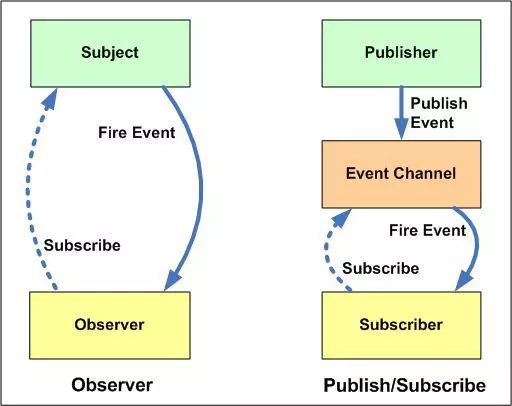

    目录
- [react-hook](#react-hook)
  - [React 默认提供的四个最常用的钩子。](#react-默认提供的四个最常用的钩子)
  - [其他 hooks](#其他-hooks)
  - [自定义 Hook](#自定义-hook)
- [性能优化](#性能优化)
  - [性能监控指标](#性能监控指标)
  - [性能优化方法](#性能优化方法)
    - [属性传递优化](#属性传递优化)
    - [多组件优化](#多组件优化)
    - [Key（使用唯一键迭代）](#key使用唯一键迭代)
    - [其他](#其他)
- [设计模式](#设计模式)
  - [发布订阅模式](#发布订阅模式)
- [虚拟 DOM 算法](#虚拟-dom-算法)

=====

    正文

=====
## react-hook
Q：什么是Hook？   
A：Hook 是一些可以让你在函数组件里“钩入” React state 及生命周期等特性的函数。

> [react-hooks如何使用？](https://juejin.cn/post/6864438643727433741)    
> [一文吃透react-hooks原理](https://juejin.cn/post/6944863057000529933)  

react-hooks是react新增的钩子API，它可以让你在不编写 class 的情况下使用 state 以及其他的 React 特性。目的是**增加代码的可复用性，逻辑性，弥补无状态组件没有生命周期，没有数据管理状态state的缺陷**。

Hook 本质就是 JavaScript 函数，但是在使用它时需遵循两条规则：
- 只在最顶层使用 Hook
    - 不要在**循环**，**条件**或**嵌套函数**中调用 Hook， 确保总是在你的 React 函数的最顶层以及任何 return 之前调用他们。
- 只在 React 函数中调用 Hook
    - 不要在普通的 JavaScript 函数中调用 Hook。你可以：
        - 在 React 的**函数组件**中调用 Hook
            - 注意：Hook 不能在 class 组件中使用，但这使得你不使用 class 也能使用 React
        - 在自定义 Hook 中调用其他 Hook 
> 具体原因参考 react官网：[Hook 规则](https://react.docschina.org/docs/hooks-rules.html)

### React 默认提供的四个最常用的钩子。
1. useState()：状态钩子  
在一个组件中多次使用 State Hook
```js
const [state, setState] = useState(initialState);
```
- 语法：该函数返回一个数组，数组的第一个成员是一个变量（state），指向状态的当前值。第二个成员是一个函数（更新 state 的函数），用来更新状态，约定是set前缀加上状态的变量名。
    - 在初始渲染期间，返回的状态 (state) 与传入的第一个参数 (initialState) 值相同。
    - setState 函数用于更新 state。它接收一个新的 state 值并将组件的一次重新渲染加入队列。
    - 在后续的重新渲染中，useState 返回的第一个值将始终是更新后最新的 state。
- 这个函数运用了数组解构，上面的代码相当于
```js
var stateVariable = useState(initialState); // 返回一个有两个元素的数组
var state = stateVariable[0]; // 数组里的第一个值
var setState = stateVariable[1]; // 数组里的第二个值
```

2. useContext()：共享状态钩子
```js
const value = useContext(MyContext);
```
- 语法：接收一个 context **对象**（`React.createContext` 的返回值）并返回该 context 的当前值。当前的 context 值由上层组件中距离当前组件最近的 `<MyContext.Provider>` 的 `value` prop 决定。
- 实现过程：当组件上层最近的 `<MyContext.Provider>` 更新时，该 Hook 会触发重渲染，并使用最新传递给 `MyContext` provider 的 context `value` 值。即使祖先使用 React.memo 或 shouldComponentUpdate，也会在组件本身使用 `useContext` 时重新渲染。
> `useContext(MyContext)` 只是让你能够读取 `context` 的值以及订阅 `context` 的变化。你仍然需要在上层组件树中使用 `<MyContext.Provider>` 来为下层组件提供 `context`。
- 步骤：
    - ①使用 React Context API，需在组件外部建立一个 Context
    ```js
    const AppContext = React.createContext({});
    ```
    - ②用 `<MyContext.Provider>` 封装
    ```js
    <AppContext.Provider value={ {键:'值'} }>
        <div className="App">
            <组件1/>
            <组件2/>
        </div>
    </AppContext.Provider>
    ```
    上面代码中， `AppContext.Provider` 提供了一个 `Context` 对象，这个对象可以被子组件共享。
    - ③分别在子组件中获取该对象的值
    ```js
    // 组件1、2都是同样的操作：
    const { 步骤②中 `value` 的键 } = useContext(AppContext);
    ```
- 用途：在组件之间共享状态

3. useReducer()：action 钩子
```js
const [state, dispatch] = useReducer(reducer, initialState);
```
- 语法：它接受状态的初始值和 Reducer 函数作为参数，返回一个数组。数组的第一个成员是状态的当前值，第二个成员是发送 action 的dispatch函数。
- 用途：在某些场景下，useReducer 会比 useState 更适用，例如 state 逻辑较复杂且包含多个子值，或者下一个 state 依赖于之前的 state 等。并且，使用 useReducer 还能给那些会触发深更新的组件做性能优化，因为你可以向子组件传递 dispatch 而不是回调函数。

下面是一个来自官网上栗子：
```js
const initialState = {count: 0};

function reducer(state, action) {
  switch (action.type) {
    case 'increment':
      return {count: state.count + 1};
    case 'decrement':
      return {count: state.count - 1};
    default:
      throw new Error();
  }
}

function Counter() {
  const [state, dispatch] = useReducer(reducer, initialState);
  return (
    <>
      Count: {state.count}
      <button onClick={() => dispatch({type: 'decrement'})}>-</button>
      <button onClick={() => dispatch({type: 'increment'})}>+</button>
    </>
  );
}
```
- 有两种不同初始化 useReducer state 的方式，你可以根据使用场景选择其中的一种。
    - 指定初始 state
        - 将初始 state 作为第二个参数传入 useReducer 是最简单的方法：
            ```js
            const [state, dispatch] = useReducer(
                reducer,
                {count: initialCount}
            );
            ```
    - 惰性初始化
        - 需要将 init 函数作为 useReducer 的第三个参数传入，这样初始 state 将被设置为 init(initialArg)
            ```js
            function init(initialCount) {       // <--
                return {count: initialCount};   // <--
            }                                   // <--

            function reducer(state, action) {
                switch (action.type) {
                    case 'increment':
                        return {count: state.count + 1};
                    case 'decrement':
                        return {count: state.count - 1};
                    case 'reset':                    // <--
                        return init(action.payload); // <--
                    default:
                        throw new Error();
                }
            }

            function Counter({initialCount}) {
                const [state, dispatch] = useReducer(reducer, initialCount, init);  // <--
                return (
                    <>
                        Count: {state.count}
                        <button onClick={() => dispatch({type: 'reset', payload: initialCount})}> // <--
                            Reset
                        </button>
                        <button onClick={() => dispatch({type: 'decrement'})}>-</button>
                        <button onClick={() => dispatch({type: 'increment'})}>+</button>
                    </>
                );
            }
            ```

> 由于 Hooks 可以提供共享状态和 Reducer 函数，所以它在这些方面可以取代 Redux。但是，它没法提供中间件（middleware）和时间旅行（time travel），如果你需要这两个功能，还是要用 Redux。

4. useEffect()：副作用钩子   

Effect Hook 可以让你在函数组件中执行副作用操作   
副作用：与业务主逻辑关联不大而且在特定的时间或事件中执行
> 提示:   
如果你熟悉 React class 的生命周期函数，你可以把 useEffect Hook 看做 componentDidMount，componentDidUpdate 和 componentWillUnmount 这三个函数的组合。

```js
useEffect(()  =>  {
  // Async Action
}, [dependencies])
```
- 该函数接受两个参数。第一个参数是一个函数，异步操作的代码放在里面。第二个参数是一个数组，用于给出 Effect 的依赖项，只要这个数组发生变化，useEffect()就会执行。第二个参数**可以省略**，这时**每次组件渲染时**，就会执行useEffect()。
    - 赋值给 useEffect 的函数会在组件渲染到屏幕之后执行。
    - 默认情况下，effect 将在每轮渲染结束后执行，但你可以选择让它 在只有某些值改变的时候 才执行。
- 在 React 组件中有两种常见副作用操作：需要清除的和不需要清除的。
    - 清除 effect   
    通常，组件卸载时需要清除 effect 创建的诸如订阅或计时器 ID 等资源。要实现这一点，useEffect 函数需返回一个清除函数（如果你的 effect 返回一个函数，React 将会在执行清除操作时调用它，这是 effect 可选的清除机制）。以下就是一个创建订阅的例子：
        ```js
        useEffect(() => {
            const subscription = props.source.subscribe();
            return () => {
                // 清除订阅
                subscription.unsubscribe();
            };
        });
        ```
        - Q：React 何时清除 effect？    
          A：为防止内存泄漏，React 会在组件卸载的时候执行清除操作。另外，如果组件多次渲染（通常如此），则**在执行下一个 effect 之前，上一个 effect 就已被清除**。
    - 不清除 effect   
    有时候，我们只想在 React 更新 DOM 之后运行一些额外的代码。比如发送网络请求，手动变更 DOM，记录日志，这些都是常见的无需清除的操作。因为我们在执行完这些操作之后，就可以忽略他们了。
        - 如果不需要清除副作用，就可以不用返回函数
- 用途：向服务器请求数据，设置订阅，手动更改 React 组件中的 DOM 等都属于副作用。
> 参考链接 ->   
> [阮一峰的网络日志：React Hooks 入门教程](https://www.ruanyifeng.com/blog/2019/09/react-hooks.html)   
> [官网：使用 Effect Hook](https://react.docschina.org/docs/hooks-effect.html)   
> [官网：Hook API 索引](https://react.docschina.org/docs/hooks-reference.html)

### 其他 hooks
1. useMemo
```js
const memoizedValue = useMemo(() => computeExpensiveValue(a, b), [a, b]);
```
- 语法：把“创建”函数和依赖项数组作为参数传入 useMemo，它仅会在某个依赖项改变时才重新计算 memoized 值。如果没有提供依赖项数组，useMemo 在每次渲染时都会计算新的值。
- 注意：传入 useMemo 的函数会在渲染期间执行。不能在这个函数内部执行与渲染无关的操作，诸如副作用这类的操作属于 useEffect 的适用范畴，而不是 useMemo。
- 使用场景：我们知道无状态组件的更新是从头到尾的更新，如果你想要从新渲染一部分视图，而不是整个组件，那么用useMemo是最佳方案，避免了不需要的更新，和不必要的上下文的执行
- 优点：
  - 可以减少不必要的循环，减少不必要的渲染
  - 可以减少子组件的渲染次数
  - 让函数在某个依赖项改变的时候才运行，避免不必要的开销（这里要注意⚠️⚠️⚠️的是如果被useMemo包裹起来的上下文,形成一个独立的闭包，会缓存之前的state值,如果没有加相关的更新条件，是获取不到更新之后的state的值的，如下边⬇️）
    ```js
    const DemoUseMemo=()=>{
    const [ number ,setNumber ] = useState(0)
    const newLog = useMemo(()=>{
        const log =()=>{
            /* 点击span之后 打印出来的number 不是实时更新的number值 */
            console.log(number)
        }
        return log /* [] 没有 number */  
        
    },[])
    return <div>
        <div onClick={()=>newLog()} >打印</div>
        <span onClick={ ()=> setNumber( number + 1 )  } >增加</span>
    </div>
    }
    ```
2. useCallback
```js
const memoizedCallback = useCallback(
  () => {
    doSomething(a, b);
  },
  [a, b],
);
```
返回一个 memoized 回调函数。
- 语法：把内联回调函数及依赖项数组作为参数传入 useCallback，它将返回该回调函数的 memoized 版本，该回调函数仅在某个依赖项改变时才会更新。
- 使用场景：当你把回调函数传递给经过优化的并使用引用相等性去避免非必要渲染（例如 shouldComponentUpdate）的子组件时，它将非常有用。
- `useCallback(fn, deps)` 相当于 `useMemo(() => fn, deps)`。
3. useRef
```js
const refContainer = useRef(initialValue); 
```
- 语法：useRef 返回一个可变的 ref 对象，其 .current 属性被初始化为传入的参数（initialValue）。返回的 ref 对象在组件的整个生命周期内保持不变。
4. useLayoutEffect
- `useLayoutEffect` 代码可能会阻塞浏览器的绘制
- useEffect 执行顺序 组件更新挂载完成 -> 浏览器dom 绘制完成 -> 执行useEffect回调 。
- useLayoutEffect 执行顺序 组件更新挂载完成 -> 执行useLayoutEffect回调-> 浏览器dom 绘制完成
- 如果我们在 `useEffect` 重新请求数据，渲染视图过程中，肯定会造成画面闪动的效果。而如果用 `useLayoutEffect` ，回调函数的代码就会阻塞浏览器绘制，所以肯定会引起画面卡顿等效果，那么具体要用 `useLayoutEffect` 还是 `useEffect` ，要看实际项目的情况，大部分的情况 `useEffect` 都可以满足的。
```js
const DemoUseLayoutEffect = () => {
    const target = useRef()
    useLayoutEffect(() => {
        /*我们需要在dom绘制之前，移动dom到制定位置*/
        const { x ,y } = getPositon() /* 获取要移动的 x,y坐标 */
        animate(target.current,{ x,y })
    }, []);
    return (
        <div >
            <span ref={ target } className="animate"></span>
        </div>
    )
}
```

**更多 hooks 可参考官网学习：**[Hook API 索引](https://react.docschina.org/docs/hooks-reference.html)

### 自定义 Hook
当两个函数组件需要共享相同的逻辑时，我们可以将其提取成第三个函数。

自定义 Hook 是一个函数，其名称必须以 “use” 开头（否则，由于无法判断某个函数是否包含对其内部 Hook 的调用，React 将无法自动检查你的 Hook 是否违反了），函数内部可以调用其他的 Hook。
> [自定义 Hook](https://react.docschina.org/docs/hooks-custom.html)

1. 在无状态组件每一次函数上下文执行的时候，react用什么方式记录了hooks的状态？
2. 多个react-hooks用什么来记录每一个hooks的顺序的 ？ 换个问法！为什么不能条件语句中，声明hooks? hooks声明为什么在组件的最顶部？
3. function函数组件中的useState，和 class类组件 setState有什么区别？
4. react 是怎么捕获到hooks的执行上下文，是在函数组件内部的？
5. useEffect,useMemo 中，为什么useRef不需要依赖注入，就能访问到最新的改变值？
6. useMemo是怎么对值做缓存的？如何应用它优化性能？
7. 为什么两次传入useState的值相同，函数组件不更新?
> [官网：Hooks FAQ](https://react.docschina.org/docs/hooks-faq.html#how-to-read-an-often-changing-value-from-usecallback)

## 性能优化
### 性能监控指标
> [前端监控性能指标](https://blog.csdn.net/guduyibeizi/article/details/105263127)
### 性能优化方法
#### 属性传递优化
当我们在 React 中创建函数时，我们需要使用 bind 关键字将函数绑定到当前上下文。  
绑定可以在构造函数中完成，也可以在我们将函数绑定到 DOM 元素的位置上完成。  
两者之间似乎没有太大差异，但性能表现是不一样的。
```js
import React from "react";

export default class DelayedBinding extends React.Component {
    constructor() {
        this.state = {
            name: "Mayank"
        }
    }
    
    handleButtonClick() {
        alert("Button Clicked: " + this.state.name)
    }
    
    render() {
        return (
            <>
                <input type="button" value="Click" onClick={this.handleButtonClick.bind(this)} />
            </>
        )
    }
}
```
在上面的代码中，我们在 render 函数的绑定期间将函数绑定到按钮上。  
可问题在于，每次调用 render 函数时都会创建并使用绑定到当前上下文的新函数，但在每次渲染时使用已存在的函数效率更高。优化方案如下：
```js
import React from "react";

export default class DelayedBinding extends React.Component {
    constructor() {
        this.state = {
            name: "Mayank"
        }
        this.handleButtonClick = this.handleButtonClick.bind(this)
    }
    
    handleButtonClick() {
        alert("Button Clicked: " + this.state.name)
    }

    render() {
        return (
        <>
            <input type="button" value="Click" onClick={this.handleButtonClick} />
        </>
        )
    }
}
```
最好在构造函数调用期间使用绑定到当前上下文的函数覆盖 handleButtonClick 函数。  
这将减少将函数绑定到当前上下文的开销，无需在每次渲染时重新创建函数，从而提高应用的性能。
#### 多组件优化
在父组件因状态的变化更改，而子组件并没有状态变化时，若子组件随着父组件一起更新，会造成比较大的性能浪费，为减少子组件额外渲染而浪费性能，可使用：
1. 使用 `shouldComponentUpdate` 生命周期事件  
    ```js
    shouldComponentUpdate(nextProps, nextState) {
        //组件是否需要更新，需要返回一个布尔值：返回true则更新，返回flase不更新。
        console.log('shouldComponentUpdate组件是否应该更新，需要返回布尔值',nextProps, nextState)
        return true
    }

    nextProps: 表示下一个props
    nextState: 表示下一个state的值
    shouldComponentUpdate() 的返回值，用于判断 React 组件的输出是否受当前 state 或 props 更改的影响。默认返回值为true，即 state 每次发生变化组件都会重新渲染。当 props 或 state 发生变化时，shouldComponentUpdate() 会在渲染执行之前被调用。
    ```
2. 用 `React.PureComponent` 替换 `React.Component`  
写在前面：React.PureComponent 是一个和 React.Component 几乎相同，唯一不同的是 React.PureComponent 帮助我们完成了 shouldComponentUpdate 的一些较浅的比较

    PureComponent通过`prop`和`state`的**浅比较**来实现shouldComponentUpdate  

    原理：当组件更新时，如果组件的 props 和 state 都没发生改变， render 方法就不会触发，省去 Virtual DOM 的生成和比对过程，达到提升性能的目的。具体就是 React 自动帮我们做了一层浅比较：
    > 所谓浅比较(shallowEqual)，即react源码中的一个函数，然后根据下面的方法进行是不是PureComponent的判断，帮我们做了本来应该我们在shouldComponentUpdate中做的事情  
    ```js
    if (this._compositeType === CompositeTypes.PureClass) {
        shouldUpdate = !shallowEqual(prevProps, nextProps)
        || !shallowEqual(inst.state, nextState);
    }
    ```
    其中，shadowEqual只会"浅"检查组件的props和state，这就意味着嵌套对象和数组是不会被比较的。
    > 浅比较就是只比较第一级，对于基本数据类型，只比较值；对于引用数据类型值，则比较地址是否相同。所以在这种情况下，我们以后用的时候，**对于引用类型值修改状态或修改属性时候，对于它赋值的时候，我们尽可能把之前值拿过来克隆一份，赋给它新的地址就好**。我们想做性能优化的时候就可以在Component里做一个浅比较。

    小结：由于在 `PureComponent` 中使用`shouldComponentUpdate`会有警告，所以不要在`PureComponent`中使用`shouldComponentUpdate`，因为根本没有必要
> [React 的 PureComponent 与 Component 区别](https://blog.csdn.net/weixin_41697143/article/details/104551377)
3. ImmutableJS  
由于PureComponent只是浅比较，对于更加复杂的数据类型，就失去了作用。这时候  `ImmutableJS` 就能派上用场了。

    facebook提供了immutable-js这个库，ImmutableJS提供了不可变的数据，即要让数据改变只能通过创建新数据的方式，而不能直接修改，这很大程度的降低了前后两个数据比较时的复杂度。
    > [immutable.js语法](https://www.jianshu.com/p/0fa8c7456c15)  
    > [immutable.js API](https://blog.csdn.net/m0_37527015/article/details/84338831)  
    > [Redux进阶（Immutable.js）](https://www.cnblogs.com/Darlietoothpaste/p/10156357.html)
#### Key（使用唯一键迭代）
我们先看一个场景
```js
<ul>
    <TodoItem text="one" />
    <TodoItem text="two" />
</ul>
```
假设有上面一个类型的列表，要在最上面加一项，得到下方的结构。
```js
<ul>
    <TodoItem text="zero" />
    <TodoItem text="one" />
    <TodoItem text="two" />
</ul>
```
React组件会从上往下比较，会认为新结构中zero组件是旧结构中one组件的更新；认为新结构中one组件时旧结构中two组件的更新；而新结构中two组件则是新结构，要进行加载。  
要避免类似上述情形的浪费，需要给列表中的每一项制定一个唯一且稳定不变的key值（每个组件的唯一标识），这样，React就可以根据key值去区分同一类型的组件，避免出现上述的情形。
```js
<ul>
{
    todos.map((item)) => (
        <TodoItem key={item.id} text={item.text} />
    )
}
</ul>
```
注意：下面的key的赋值方式便是错误的，因为不符合key值即唯一又稳定不变的要求。这种赋值方式仍然不能避免上面的情形的浪费
```js
<ul>
{
    todos.map((item, index)) => (
        <TodoItem key={index} text={item.text} />
    )
}
</ul>
```
#### 其他 
1. 使用 React.memo 进行组件记忆  
React.memo() 和 PureComponent 很相似，它帮助我们控制何时重新渲染组件。  
不同的是 PureComponent 要依靠 class 才能使用。而 React.memo() 可以和 functional component 一起使用。
    使用方法：
    ```js
    const MySnowyComponent = React.memo(function MyComponent(props) {
        // only renders if props have changed!
    });
    ```
    举个栗子：
    ```js
    import React, { memo, useState } from 'react'

    /*
    // count 每次变化都会渲染 Foo 组件
    function Foo() {
        console.log('Foo 组件重新渲染了')
        return (
            <div>Foo 组件</div>
        )
    }
    */

    // count 变化不会重新渲染 Foo 组件
    const Foo = memo(function() {
        console.log('Foo 组件重新渲染了')
        return (
            <div>Foo 组件</div>
        )
    })

    function App() {
        const [count, setCount] = useState(0)

        return (
            <div>
                <span>{count}</span>
                <button onClick={() => setCount(count+1)}>+1</button>
                <Foo />
            </div>
        );
    }

    export default App;
    ```
    默认情况下其只会对复杂对象做浅层对比，如果你想要控制对比过程，那么请将自定义的比较函数通过第二个参数传入来实现。
    ```js
    import React from "react";

    function Child({seconds}){
        console.log('I am rendering');
        return (
            <div>I am update every {seconds} seconds</div>
        )
    };

    function areEqual(prevProps, nextProps) {
        if(prevProps.seconds===nextProps.seconds){
            return true
        }else {
            return false
        }

    }
    export default React.memo(Child,areEqual)
    ```
2. 懒加载组件
    > 写在前面：[什么是懒加载（通俗易懂版）](https://juejin.cn/post/6847902221539999752)  
    > [什么是懒加载](https://www.jianshu.com/p/4876a4fe7731)
    > 
    假设有两个组件 WelcomeComponent 或 GuestComponents，我们根据用户是否登录而渲染其中一个。
    ```js
    import React, { lazy, Suspense } from "react";

    export default class UserSalutation extends React.Component {
        render() {
            if(this.props.username !== "") {
                const WelcomeComponent = lazy(() => import("./welcomeComponent"));
                return (
                    <div>
                        <Suspense fallback={<div>Loading...</div>}>
                            <WelcomeComponent />
                        </Suspense>
                    </div>
                )
            } else {
                const GuestComponent = lazy(() => import("./guestComponent"));
                return (
                    <div>
                        <Suspense fallback={<div>Loading...</div>}>
                            <GuestComponent />
                        </Suspense>
                    </div>
                )
            }
        }
    }
    ```
3. 使用 React.Fragments 避免额外标记  
react规定组件中必须有一个父元素，如：
    ```js
    return (
        <div>
            <h1>Hello world!</h1>
            <h1>Hello there!</h1>
            <h1>Hello there again!</h1>
        </div>
    )
    ```
    但这样会创建额外的不必要的div，导致整个应用程序内创建许多无用的元素。实际上页面上的元素越多，加载所需的时间就越多。为了减少不必要的加载时间，我们可以使React.Fragment来避免创建不必要的元素，如：
    ```js
    return (
        <React.Fragment>
            <h1>Hello world!</h1>
            <h1>Hello there!</h1>
            <h1>Hello there again!</h1>
        </React.Fragment>
    )
    ```

4. 不要使用内联函数定义  
如果我们使用内联函数，则每次调用“render”函数时都会创建一个新的函数实例。  
当 React 进行虚拟 DOM diffing 时，它每次都会找到一个新的函数实例；因此在渲染阶段它会会绑定新函数并将旧实例扔给垃圾回收。  
因此直接绑定内联函数就需要额外做垃圾回收和绑定到 DOM 的新函数的工作，如：
    ```js
    import React from "react";

    export default class InlineFunctionComponent extends React.Component {
    render() {
        return (
        <div>
            <h1>Welcome Guest</h1>
            <input type="button" onClick={(e) => { this.setState({inputValue: e.target.value}) }} value="Click For Inline Function" />
        </div>
        )
    }
    }
    ```
    上面的函数创建了内联函数。每次调用 render 函数时都会创建一个函数的新实例，render 函数会将该函数的新实例绑定到该按钮。  
    此外最后一个函数实例会被垃圾回收，大大增加了 React 应用的工作量。  
    所以不要用内联函数，而是在组件内部创建一个函数，并将事件绑定到该函数本身。这样每次调用 render 时就不会创建单独的函数实例了，参考组件如下。
    ```js
    import React from "react";

    export default class InlineFunctionComponent extends React.Component {
    
        setNewStateData = (event) => {
            this.setState({
            inputValue: e.target.value
            })
        }
        
        render() {
            return (
            <div>
                <h1>Welcome Guest</h1>
                <input type="button" onClick={this.setNewStateData} value="Click For Inline Function" />
            </div>
            )
        }
    }
    ```
6.  避免使用内联样式属性  
使用内联样式时浏览器需要花费更多时间来处理脚本和渲染，因为它必须映射传递给实际 CSS 属性的所有样式规则。
    ```js
    import React from "react";
    export default class InlineStyledComponents extends React.Component {
    render() {
        return (
        <>
            <b style={{"backgroundColor": "blue"}}>Welcome to Sample Page</b>
        </>
        )
    }
    }
    ```
    在上面创建的组件中，我们将内联样式附加到组件。添加的内联样式是 JavaScript 对象而不是样式标记。  
    样式 backgroundColor 需要转换为等效的 CSS 样式属性，然后才应用样式。这样就需要额外的脚本处理和 JS 执行工作。  
    **更好的办法是在组件里引入外部 CSS 文件**。
6.  优化 React 中的条件渲染  
安装和卸载 React 组件是昂贵的操作。为了提升性能，我们需要减少安装和卸载的操作。  
很多情况下在我们可能会渲染或不渲染特定元素，这时可以用条件渲染。
    ```js
    import React from "react";

    import AdminHeaderComponent from "./AdminHeaderComponent";
    import HeaderComponent from "./HeaderComponent";
    import ContentComponent from "./ContentComponent"

    export default class ConditionalRendering extends React.Component {
        constructor() {
            this.state = {
                name: "Mayank"
            }
        }
        
        render() {
            if(this.state.name == "Mayank") {
                return (
                    <>
                        <AdminHeaderComponent></AdminHeaderComponent>
                        <HeaderComponent></HeaderComponent>
                        <ContentComponent></ContentComponent>
                    </>
                )
            } else {
                return (
                    <>
                        <HeaderComponent></HeaderComponent>
                        <ContentComponent></ContentComponent>
                    </>
                )
            }
        }
    }
    ```
    上面的代码中有一个条件语句，让组件根据指定的条件渲染。如果状态包含名称值 Mayank，则不会渲染 AdminHeaderComponent。  
    条件运算符和 if else 条件似乎没问题，但其实这里面存在大问题：  
    - 每次调用 render 函数，并且值在 Mayank 和另一个值之间切换时，都会执行不同的 if else 语句。
    - diffing 算法会运行一个检查，比较每个位置的元素类型。在 diffing 期间，它看到 AdminHeaderComponent 不可用，并且需要渲染的第一个组件是 HeaderComponent。
    - 于是 React 将观察元素的位置。它看到位置 1 和位置 2 的组件已更改，就打算将组件 HeaderComponent 和 ContentComponent 在位置 1 和位置 2 卸载并重新安装。
    - 其实这是用不着的，因为这些组件没有更改，这是一项昂贵的操作。优化方案如下：
    ```js
    import React from "react";

    import AdminHeaderComponent from "./AdminHeaderComponent";
    import HeaderComponent from "./HeaderComponent";
    import ContentComponent from "./ContentComponent"

    export default class ConditionalRendering extends React.Component {
        constructor() {
            this.state = {
                name: "Mayank"
            }
        }
    
        render() {
            return (
                <>
                    { this.state.name == "Mayank" && <AdminHeaderComponent></AdminHeaderComponent> }
                    <HeaderComponent></HeaderComponent>
                    <ContentComponent></ContentComponent>
                </>
            )
        }
    }
    ```
    在上面的代码中，当 name 不是 Mayank 时，React 在位置 1 处放置 null。  
    - 于是在开始 DOM diffing 时，位置 1 的元素从 AdminHeaderComponent 变为 null，但位置 2 和位置 3 的组件保持不变。
    - 由于元素没变，因此组件不会卸载，减少了不必要的操作。
7. 不要在 render 方法中导出数据  
render()函数作为纯函数，意味着我们应该确保 setState 和查询原生 DOM 元素等任何可以修改应用状态的东西不会被调用。  
更新组件状态的问题在于，当状态更新时会触发另一个 render 循环，后者在内部会再触发一个 render 循环，以此类推。
    ```js
    import React from "react";

    export default class RenderFunctionOptimization extends React.Component {
        constructor() {
            this.state = {
                name: "Mayank"
            }
        }
        render() {
            this.setState({ 
                name: this.state.name + "_" 
            });
            
            return (
                <div>
                    <b>User Name: {this.state.name}</b>
                </div>
            );
        }
    }
    ```
    在上面的代码中，每次调用 render 函数时都会更新状态。状态更新后组件将立即重新渲染。因此更新状态会导致 render 函数的递归调用。  
    render 函数应保持纯净，以确保组件以一致的方式运行和渲染。
8. 为组件创建错误边界  
    > [React官网：错误边界](https://zh-hans.reactjs.org/docs/error-boundaries.html)
9.  组件的不可变数据结构  

10. 事件节流和防抖  
    > [传送门](https://github.com/HCYETY/The-growth-path-of-front-end-engineers/blob/master/%E5%89%8D%E7%AB%AF/js%E5%BA%95%E5%B1%82%E7%9F%A5%E8%AF%86.md#%E9%98%B2%E6%8A%96%E8%8A%82%E6%B5%81)
11. 使用 CDN  
12. 用 CSS 动画代替 JavaScript 动画  
13. 在 Web 服务器上启用 gzip 压缩  
14. 使用 Web Workers 处理 CPU 密集任务  
15. React 组件的服务端渲染  
> [21 个 React 性能优化技巧](https://www.infoq.cn/article/KVE8xtRs-uPphptq5LUz)  
> [React性能优化](https://cloud.tencent.com/developer/article/1009794)  
> [React性能优化总结](https://www.cnblogs.com/little-ab/articles/6971269.html)  
> [React常用性能优化方式整理](https://blog.csdn.net/weixin_41902031/article/details/80353134)

## 设计模式
### 发布订阅模式
1. 定义  
发布-订阅模式其实是一种对象间一对多的依赖关系，当一个对象的状态发送改变时，所有依赖于它的对象都将得到状态改变的通知。
> 订阅者（Subscriber）把自己想订阅的事件注册（Subscribe）到调度中心（Event Channel），当发布者（Publisher）发布该事件（Publish Event）到调度中心，也就是该事件触发时，由调度中心统一调度（Fire Event）订阅者注册到调度中心的处理代码。

举个栗子：
> 比如我们很喜欢看某个公众号号的文章，但是我们不知道什么时候发布新文章，要不定时的去翻阅。这时候，我们可以关注该公众号，当有文章推送时，会有消息及时通知我们文章更新了。

在上面的栗子中，公众号属于发布者，用户属于订阅者。用户将订阅公众号的事件注册到调度中心，公众号作为发布者，当有新文章发布时，公众号发布该事件到调度中心，调度中心会及时发消息告知用户。

2. 实现发布-订阅模式
- 实现思路
    - 创建一个对象
    - 在该对象上创建一个缓存列表（调度中心）
    - on 方法用来把函数 fn 都加到缓存列表中（订阅者注册事件到调度中心）
    - emit 方法取到 arguments 里第一个当做 event，根据 event 值去执行对应缓存列表中的函数（发布者发布事件到调度中心，调度中心处理代码）
    - off 方法可以根据 event 值取消订阅（取消订阅）
    - once 方法只监听一次，调用完毕后删除缓存函数（订阅一次）
3. 应用
    - 应用程序需要向大量消费者广播信息。例如微信订阅号就是一个消费者量庞大的广播平台。
    - 应用程序需要与一个或多个独立开发的应用程序或服务通信，这些应用程序或服务可能使用不同的平台、编程语言和通信协议。
    - 应用程序可以向消费者发送信息，而不需要消费者的实时响应。
    - 被集成的系统被设计为支持其数据的最终一致性模型。
    - 应用程序需要将信息传递给多个消费者，这些消费者可能具有与发送者不同的可用性要求或正常运行时间计划。例如你消息在上午发布了出去，消费者计划在下午才去处理这些消息。
4. 总结：
- 优点
    - 对象之间解耦
    - 异步编程中，可以更松耦合的代码编写
- 缺点
    - 创建订阅者本身要消耗一定的时间和内存
    - 虽然可以弱化对象之间的联系，多个发布者和订阅者嵌套一起的时候，程序难以跟踪维护
5. 扩展（发布-订阅模式与观察者模式的区别）  
很多地方都说发布-订阅模式是观察者模式的别名，但他们其实并不一样
- 观察者模式：观察者（Observer）直接订阅（Subscribe）主题（Subject），而当主题被激活的时候，会触发（Fire Event）观察者里的事件。
- 发布订阅模式：订阅者（Subscriber）把自己想订阅的事件注册（Subscribe）到调度中心（Event Channel），当发布者（Publisher）发布该事件（Publish Event）到调度中心，也就是该事件触发时，由调度中心统一调度（Fire Event）订阅者注册到调度中心的处理代码。
- 差异：
  - 1.1、在观察者模式中，观察者是知道 Subject 的，Subject 一直保持对观察者进行记录。然而，在发布订阅模式中，发布者和订阅者不知道对方的存在。它们只有通过消息代理进行通信。
  - 1.2、在发布订阅模式中，组件是松散耦合的，正好和观察者模式相反。
  - 2.1、观察者模式大多数时候是同步的，比如当事件触发，Subject 就会去调用观察者的方法。而发布-订阅模式大多数时候是异步的（使用消息队列）。
  - 2.2、观察者模式需要在单个应用程序地址空间中实现，而发布-订阅更像交叉应用模式。

## 虚拟 DOM 算法
当状态中的数据发生变化时，react会根据【新数据】生成【新的虚拟DOM】, 随后React进行【新虚拟DOM】与【旧虚拟DOM】的diff比较，比较规则如下：
- a. 旧虚拟DOM中找到了与新虚拟DOM相同的key：
    - (1).若虚拟DOM中内容没变, 直接使用之前的真实DOM
    - (2).若虚拟DOM中内容变了, 则生成新的真实DOM，随后替换掉页面中之前的真实DOM
- b. 旧虚拟DOM中未找到与新虚拟DOM相同的key
    - 根据数据创建新的真实DOM，随后渲染到到页面