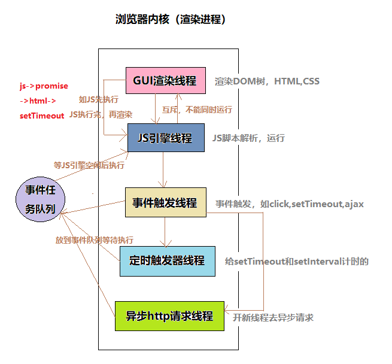
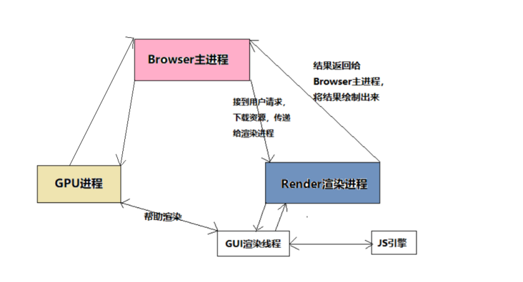

## 浏览器的渲染机制  <!-- omit in toc --> 
    目录
- [页面加载过程](#页面加载过程)
- [线程和进程](#线程和进程)
- [浏览器包含的进程](#浏览器包含的进程)
- [浏览器多进程的优势](#浏览器多进程的优势)
- [浏览器内核（渲染进程）](#浏览器内核渲染进程)
- [Browser主进程和浏览器内核（渲染进程）的通信过程](#browser主进程和浏览器内核渲染进程的通信过程)
- [总结浏览器渲染流程](#总结浏览器渲染流程)
- [浏览器如果渲染过程中遇到JS文件怎么处理](#浏览器如果渲染过程中遇到js文件怎么处理)
- [浏览器渲染的图层](#浏览器渲染的图层)

========

    正文

========

> 参考学习链接 -> [渲染页面：浏览器的工作原理](https://developer.mozilla.org/zh-CN/docs/Web/Performance/How_browsers_work)
### 页面加载过程
- 导航是加载web页面的第一步。它发生在以下情形：用户通过在地址栏输入一个URL、点击一个链接、提交表单或者是其他的行为
- 浏览器根据 DNS 服务器得到域名的 IP 地址
- 向这个 IP 的机器发送 HTTP 请求
    > [了解HTTP](https://baike.baidu.com/item/HTTPS/285356?fr=aladdin)  
    > [网络状态码（HTTP状态码 ）](https://blog.csdn.net/qq_26988127/article/details/72757986)
- 服务器收到、处理并返回 HTTP 请求
- 浏览器得到返回内容
- 例如在浏览器输入 https://juejin.im/timeline，然后经过 DNS 解析， juejin.im对应的 IP 是 36.248.217.149（不同时间、地点对应的 IP 可能会不同）。然后浏览器向该 IP 发送 HTTP 请求。服务端接收到 HTTP 请求，然后经过计算（向不同的用户推送不同的内容），返回 HTTP 请求
### 线程和进程
- 理解概念：
> 进程是一个工厂，工厂有它的独立资源 -- 工厂之间相互独立 -- 线程是工厂中的工人，多个工人协作完成任务 -- 工厂内有一个或多个工人 -- 工人之间共享空间。   
> 工厂有多个工人，就相当于一个进程可以有多个线程，而且线程共享进程的空间。
- 进程是cpu资源分配的最小单位（是能拥有资源和独立运行的最小单位，系统会给它分配内存），它负责为程序的运行提供必备的环境
- 线程是cpu调试的最小单位（线程是建立在进程的基础上的一次程序运行单位，一个进程中可以有多个线程。核心还是属于一个进程。），它负责执行进程中的程序
- 浏览器是多进程的，每打开一个tab页，就相当于创建了一个独立的浏览器进程（进程内有自己的多线程）。
> [深入了解进程和线程](http://www.360doc.com/content/20/0417/14/32196507_906628857.shtml)
### 浏览器包含的进程
- Browser进程：浏览器的主进程（负责协调，主控），只有一个，作用有：
    - 负责浏览器的界面显示，与用户交互，如前进，后退等
    - 负责各个页面的管理，创建和销毁其它进程
    - 将Rendered进程得到的内存中的Bitmap,绘制到用户界面上
        网络资源的管理，下载
- 第三方插件进程：每种类型的插件对应一个进程，仅当使用该插件时才创建。
- GPU进程：最多一个，用于3D绘制等。
- 浏览器渲染进程（浏览器内核）（Render进程，内部是多线程的）：默认每个Tab页面一个进程，互不影响。主要作用为：页面渲染，脚本执行，事件处理等
### 浏览器多进程的优势
- 避免单个页面崩溃影响整个浏览器
- 避免第三方插件崩溃影响整个浏览器
- 多进程充分利用多核优势
- 方便使用沙盒模型隔离插件等进程，提高浏览器稳定性
### 浏览器内核（渲染进程）
   
对于普通的前端操作来说，最重要的渲染进程：页面的渲染，js的执行，事件的循环等都在这个进程内执行。
> 浏览器是多进程的，浏览器的渲染进程是多线程的；
- GUI渲染线程  
负责渲染浏览器界面，解析HTML、CSS，构建DOM树和RenderObject树，布局和绘制等。当界面需要重绘或由于某种操作引发回流时，该线程就会执行。
    - 注意，**GUI渲染线程与JS引擎线程是互斥的**，当JS引擎执行时GUI线程会被挂起，GUI更新会被保存在一个队列中等到JS引擎空闲时立即被执行。
      - Q：为什么JS引擎线程 和 GUI渲染线程不能同时进行？
      - A：由于JavaScript是可操作DOM的，如果在修改这些元素属性同时渲染界面（即JS线程和GUI线程同时运行），那么渲染线程前后获得的元素数据就可能不一致了。
- JS引擎线程（JS内核）  
负责处理JavaScript脚本程序（例如V8引擎）。  
JS引擎一直等待着任务队列中任务的到来，然后加以处理，一个Tab页（render进程）中无论什么时候都只有一个JS线程在运行JS程序。
    - 注意，由于GUI渲染线程与JS引擎线程互斥，所以如果JS执行的时间过长，这样就会造成页面的渲染不连贯，导致页面渲染加载阻塞。
        - 譬如，假设JS引擎正在进行巨量的计算，此时就算GUI有更新，也会被保存在队列中，要等到JS引擎空闲后执行。然后由于巨量计算，所以JS引擎可能很久很久才能空闲，肯定就会感觉很卡。
- 事件触发线程  
该线程归属于浏览器而不是JS引擎，用来控制事件循环（可以理解成JS引擎自己都忙不过来，需要浏览器另开线程协助）。  
当JS引擎执行代码块如setTimeout时（也可来自浏览器内核的其它线程，如鼠标点击，AJAX异步请求等），会将对应任务添加到该线程中。当对应的事件符合触发条件被触发时，该线程会把事件添加到待处理队列的队尾，等待JS引擎的处理。
    - 注意，由于JS的单线程关系，所以这些待处理队列中的事件都得排队等待JS引擎处理（当JS引擎空闲时才会去执行）。
- 定时触发器线程
    - 传说中的`setTimeout`和`setInterval`所在的线程
    - 浏览器定时计数器并不是由JavaScript引擎计数的，（因为JavaScript引擎是单线程的，如果处于阻塞线程状态就会影响计时的准确）。因此通过单独线程来计时并触发定时（计时完毕后，添加到事件队列中，等待JS引擎空闲后执行）
    - 注意，W3C在HTML标准中规定，规定要求`setTimeout`中低于`4ms`的时间间隔定为`4ms`。
- 异步http请求线程
    - 在`XMLHttpRequest`在连接后是通过浏览器新型一个线程请求
    - 将检测到状态变更时，如果设置有回调函数，异步线程就产生状态变更事件，将这个回调再放入事件队列中，再由JavaScript引擎执行

总结：浏览器内核（渲染进程）如下：
    
### Browser主进程和浏览器内核（渲染进程）的通信过程
打开一个浏览器，可以看到：任务管理器出现了2个进程，一个是主进程，一个是打开Tab页的渲染进程。

这张图的意思是：
- Browser主进程收到用户请求，首先需要获取页面内容（如通过网络下载资源），随后将该任务通过RendererHost接口传递给Render渲染进程
- Render渲染进程的Renderer接口收到消息，简单解释后，交给渲染线程GUI，然后开始渲染
- GUI渲染线程接收请求，加载网页并渲染网页，这其中可能需要Browser主进程获取资源和需要GPU进程来帮助渲染
- 当然可能会有JS线程操作DOM（这可能会造成回流并重绘）
- 最后Render渲染进程将结果传递给Browser主进程
- Browser主进程接收到结果并将结果绘制出来
### 总结浏览器渲染流程

- 浏览器输入url，浏览器主进程接管，开一个下载线程，然后进行http请求（略去DNS查询，IP寻址等等操作），然后等待响应，获取内容，随后将内容通过RendererHost接口转交给Render进程--浏览器渲染流程开始
- 浏览器渲染流程拿到内容后，渲染大概可以划分为：
    - 解析 html 建立 DOM 树
    - 解析 css 建立 CSSOM 树
    - 结合 DOM树和 CSSOM树 构建 render树
    - 布局render树（Layout/reflow）,负责各元素尺寸，位置的计算
    - 绘制render树（paint），绘制页面像素信息
    - 浏览器会将各层的信息发送给GPU，GPU会将各层合成（composite）,显示在屏幕上
- 渲染完毕后就是load事件了，之后就是自己的JS逻辑处理了。
    - 当 DOMContentLoaded 事件触发时，仅当DOM加载完成，不包括样式表，图片。(譬如 如果有async加载的脚本就不一定完成)
    - 当 onload 事件触发时，页面上所有的DOM，样式表，脚本，图片都已经加载完成了。（渲染完毕了）
    - 所以，顺序是：DOMContentLoaded -> load
### 浏览器如果渲染过程中遇到JS文件怎么处理
JS文件不只是阻塞DOM的构建，它会导致CSSOM也阻塞DOM的构建。  
如果想首屏渲染的越快，就越不应该在首屏就加载 JS 文件，这也是都建议将 script 标签放在 body 标签底部的原因。  
当然在当下，并不是说 script 标签必须放在底部，因为可以给 script 标签添加 defer 或者 async 属性。
> async和defer的作用是什么？有什么区别?如下图中其中蓝色线代表JavaScript加载；红色线代表JavaScript执行；绿色线代表 HTML 解析。

` 1. `  
没有 defer 或 async，浏览器会立即加载并执行指定的脚本，也就是说不等待后续载入的文档元素，读到就加载并执行。

` 2.(延迟执行)`  
defer 属性表示延迟执行引入的 JavaScript，即这段 JavaScript 加载时 HTML 并未停止解析，这两个过程是并行的。整个 document 解析完毕且 defer-script 也加载完成之后（这两件事情的顺序无关），会执行所有由 defer-script 加载的 JavaScript 代码，然后触发 DOMContentLoaded 事件。
- defer 与相比普通 script，有两点区别：载入 JavaScript 文件时不阻塞 HTML 的解析，执行阶段被放到 HTML 标签解析完成之后。

`3） (异步下载)`  
async 属性表示异步执行引入的 JavaScript，与 defer 的区别在于，如果已经加载好，就会开始执行——无论此刻是 HTML 解析阶段还是 DOMContentLoaded 触发之后。需要注意的是，这种方式加载的 JavaScript 依然会阻塞 load 事件。换句话说，async-script 可能在 DOMContentLoaded 触发之前或之后执行，但一定在 load 触发之前执行。
- 在加载多个JS脚本的时候，async是无顺序的加载，而defer是有顺序的加载
### 浏览器渲染的图层
一般包含两大类：普通图层以及复合图层

复合图层，作用：一般一个元素开启硬件加速后会变成复合图层，可以独立于普通文档流中，改动后可以避免整个页面重绘，提升性能。
- 1.普通文档流内可以理解为一个复合图层（这里默认复合层，里面不管添加多少元素，其实都是在同个复合图层中）
- 2.absolute布局（fixed也一样），虽然可以脱离文档流，但它仍然属于默认复合层
    > absolute和硬件加速的区别
    - 就算absolute中信息改变时不会改变普通文档流中render树，但是，浏览器最终绘制时，是整个复合层绘制的，所以absolute中信息的改变，仍然会影响整个复合层的绘制。（浏览器会重绘它，如果复合层中内容多，absolute带来的绘制信息变化过大，资源消耗是非常严重的）
    - 而硬件加速直接就是在另一个复合层了（另起炉灶），所以它的信息改变不会影响默认复合层（当然了，内部肯定会影响属于自己的复合层），仅仅是引发最后的合成（输出视图）
- 3.可以通过硬件加速的方式，声明一个新的复合图层，它会单独分配资源（当然也会脱离普通文档流，这样一来，不管这个复合图层中怎么变化，也不会影响默认复合层里的回流重绘）
    > 如何变成复合图层（硬件加速）：将元素变成一个复合图层，就是传说中的硬件加速技术
    - translate3d,translatez（最常用的方式）
    - opacity属性/过渡动画（需要动画执行的过程中才会创建合成层，动画没有开始或结束后元素还会回到之前的状态）
    - will-chang属性（这个比较偏僻），一般配合opacity与translate使用（而且经测试，除了上述可以引发硬件加速的属性外，其它属性并不会变成复合层），作用是提前告诉浏览器要变化，这样浏览器会开始做一些优化工作（这个最好用完后就释放）
    - `<video><iframe><canvas><webgl>`等元素
    - 其它，譬如以前的flash插件
    > 硬件加速时请使用index,防止浏览器默认给后续的元素创建复合层渲染
    - 具体的原理是：webkit CSS3中，如果这个元素添加了硬件加速，并且index层级比较低，那么在这个元素的后面其它元素（层级比这个元素高的，或者相同的，并且relective或absolute属性相同的），会默认变为复合层渲染，如果处理不当会极大的影响性能
    - 简单点理解，可以认为是一个隐式合成的概念：如果a是一个复合层，而且b在a上面，那么b也会被隐式转为一个复合图层，这点需要特别注意
- 可以简单理解下：GPU中，各个复合图层是单独绘制的，所以互不影响，这也是为什么某些场景硬件加速效果一级棒