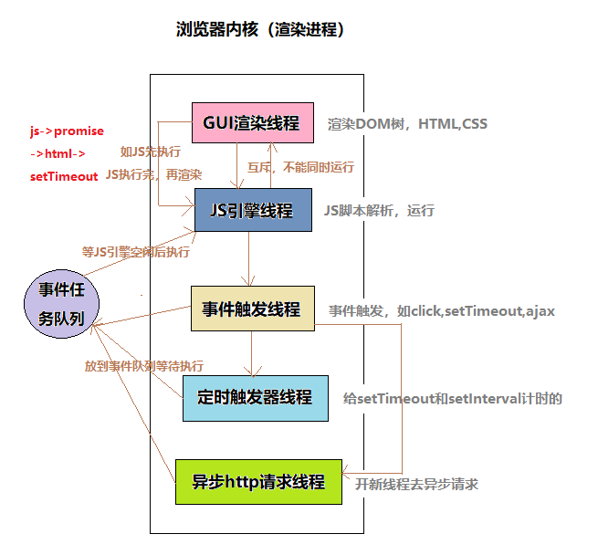
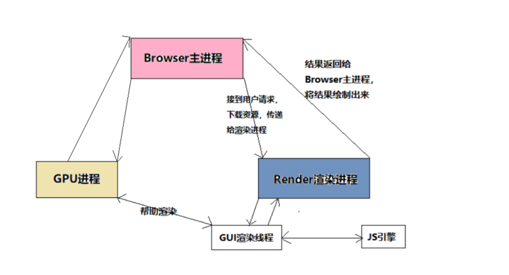
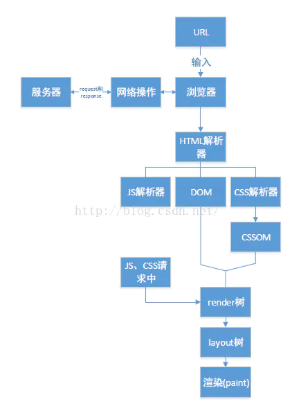
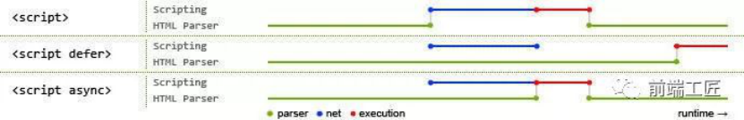

# 浏览器的世界 <!-- omit in toc --> 
    目录
- [事件委托](#事件委托)
  - [事件](#事件)
  - [事件对象](#事件对象)
  - [事件流](#事件流)
  - [事件模型](#事件模型)
  - [事件委托](#事件委托-1)
- [浏览器存储](#浏览器存储)
  - [cookie](#cookie)
  - [web存储](#web存储)
    - [localStorage](#localstorage)
    - [sessionStorage](#sessionstorage)
  - [总结](#总结)
  - [浏览器本地存储与服务器端存储的区别](#浏览器本地存储与服务器端存储的区别)
  - [Session机制](#session机制)
- [内存泄漏](#内存泄漏)
  - [定义](#定义)
  - [常见 JavaScript 内存泄露](#常见-javascript-内存泄露)
  - [内存泄露的解决方案（待完善）](#内存泄露的解决方案待完善)
- [重绘重排](#重绘重排)
  - [浏览器渲染页面的几个步骤：](#浏览器渲染页面的几个步骤)
  - [网页生成过程：](#网页生成过程)
  - [回流（reflow）](#回流reflow)
  - [重排](#重排)
  - [重绘（repaint）](#重绘repaint)
  - [减少回流和重绘的方法](#减少回流和重绘的方法)
  - [性能优化：](#性能优化)
- [浏览器的渲染机制](#浏览器的渲染机制)
  - [页面加载过程](#页面加载过程)
  - [线程和进程](#线程和进程)
  - [浏览器包含的进程：](#浏览器包含的进程)
  - [浏览器多进程的优势](#浏览器多进程的优势)
  - [浏览器内核（渲染进程）](#浏览器内核渲染进程)
  - [Browser主进程和浏览器内核（渲染进程）的通信过程](#browser主进程和浏览器内核渲染进程的通信过程)
  - [总结浏览器渲染流程](#总结浏览器渲染流程)
  - [浏览器如果渲染过程中遇到JS文件怎么处理](#浏览器如果渲染过程中遇到js文件怎么处理)
  - [浏览器渲染的图层](#浏览器渲染的图层)
  
========

     正文

========
## 事件委托
### 事件
事件是与浏览器交互的瞬间，如点击按钮，填写表格等，它是js与html之间交互的桥梁。
### 事件对象
当一个事件被触发时，会创建一个事件对象（Event Object），这个对象里面包含了与该事件相关的属性或者方法。该对象会作为第一个参数传递给监听函数。
- DOM事件模型中的事件对象常用属性：
    - type 事件类型
    - target 获取事件目标
    - stopPropageation() 阻止事件冒泡
    - preventDefault()阻止事件默认行为
- IE事件模型中的事件对象常用属性
    - type 事件类型
    - srcElement 获取事件目标
    - cancelBubble 阻止事件冒泡
        - true阻止；false不阻止；
    - returnValue 阻止事件默认行为
        - true不取消；false取消；
- 注意点：
    - 1、event代表事件的状态，例如触发event对象的元素，鼠标的位置及状态、按下的键等。
    - 2、event对象只在事件发生的过程中才有效
        - firefox里的event和IE中的不同，IE里的是全局变量，随时可用，firefox里的要用参数引导才能用，是运行时的临时变量。
        - 在IE/Opera中是window.event，在Firefox中是event;而事件的对象，在IE中是window.event.srcElement，在Firefox中是event.target，Opera中两者都可用。
### 事件流
两种方式：
- 事件冒泡：事件会从最内层的元素开始发生，一直向上传播，直到document对象。
    - 阻止冒泡：stopPropagation是事件对象(Event)的一个方法，作用是阻止目标元素的冒泡事件，但是不会阻止默认行为。
        ```js
        function stopBulle(e) {
            // 如果提供了事件对象，则这是个非IE浏览器
            if(e && e.stopPropagation) {
                e.stopPropagation();
            } else {
                // 我们需要使用 IE 的方式来取消事件冒泡
                window.event.cancelBubble = true;
            }
        }
        ```
    - 取消默认事件：preventDefault它也是事件对象的一个方法，作用是取消一个目标元素的默认行为
        ```js
        function stopDefault(e) {
            // 阻止默认行为
            if(e && e.preventDefault()) {
                e.preventDefault();
            } else {
                // IE 中阻止默认行为
                return false;
            }
        }
        ```
- 事件捕获：事件从最外层开始发生，直到最具体的元素。

区别：执行顺序不同

提问：当事件捕获和事件冒泡同时存在的情况下，事件又是如何触发的呢？
  - 对于非target节点，则先执行捕获再执行冒泡，对于target节点则先执行先注册的事件，无论冒泡还是捕获。
  - 先执行非target节点的捕获，然后根据注册顺序执行target节点的事件，然后再执行非target节点的冒泡。
### 事件模型
JavaScript事件模型主要分为3种：
- 原始事件模型
  - 这是一种被所有浏览器都支持的事件模型，对于原始事件而言，没有事件流，事件一旦发生将马上进行处理，有两种方式可以实现原始事件：
    ```html
    <!-- 1.在html代码种直接指定属性值： -->
    <button onclick= "handleCilck()" />  
    ```
    ```js
    // 2.在js代码中：
    document.getElementById('demo').onclick = function(){}
    ```
  - 优点：兼容所有浏览器。   
  - 缺点：1. 相同事件的监听函数只能绑定一个，后绑定的会覆盖掉前面的。<br>2.无法通过实现事件的捕获、委托等机制
- DOM2事件模型
    - W3C制定的事件模型种，一次事件的发生包含三个过程：
        - (1) 事件捕获阶段：事件从document一直向下传播到目标元素，依次检查经过的节点是否并定了事件监听函数，如果有则执行。
        - (2) 事件目标阶段：事件到达目标元素，触发目标元素的监听函数。
        - (3) 事件冒泡阶段：事件从目标元素冒泡到document，依次检查经过的节点是否绑定了事件监听函数，如果有则执行。
    - 事件绑定监听函数：addEventListener(eventType, handler, useCapture)
    - 事件移除监听函数：removeEventListener(eventType, handler, useCapture)
        - eventType指定事件类型（不要加on）    
        - handler是事件处理函数     
        - useCapture是一个boolean，设置false为冒泡，true为捕获
- IE事件模型
    - 有两个过程：
        - 事件处理阶段。事件达到目标元素，触发目标元素的监听函数。
        - 事件冒泡阶段。事件从目标元素冒泡到document，依次检查经过的节点是否绑定了事件监听函数，如果有则执行。
    - IE事件绑定监听函数的方式如下：aattachEvent(eventType, handler)
    - IE事件移除监听函数的方式如下：detachEvent(eventType, handler)
        - 参数说明：参数和addEventListener中的前两个参数一样，只是少了最后一个参数。
### 事件委托
把原本需要绑定在子元素的响应事件委托给父元素，让父元素担当事件监听的职务。  
例子：实现效果：移入li、li变红，移出li、li变白，然后点击按钮可以向ul中添加一个li子节点
```html
<input type="button" id="btn" value="添加" />
    <ul id="ul1">
        <li>111</li>
        <li>222</li>
        <li>333</li>
        <li>444</li>
    </ul>
```
下面采用一般的做法，但是新增的li是没有事件的，说明添加子节点的时候，事件没有一起添加进去
```js
window.onload = function() {
    var oBtn = document.getElementById("btn");
    var oUl = document.getElementById("ul1");
    var aLi = oUl.getElementsByTagName('li');
    var num = 4;

    // 鼠标移入变红，移出变白
    for(var i = 0; i < aLi.length; i++) {
        aLi[i].onmouseover = function() {
            this.style.background = 'red';
        };
        aLi[i].onmouseout = function() {
            this.style.background = '#fff';
        }
    }

    // 添加新节点
    oBtn.onclick = function() {
        num++;
        var oLi.onclick = document.createElement('li');
        oLi.innerHTML = 111 * num;
        oUl.appendChild(oLi);
    };
}
```
虽然功能实现了，但实际上无疑是又增加了一个dom操作，在优化性能方面是不可取的，于是我们采用事件委托的方式优化一下
```js
window.onload = function() {
    var oBtn = document.getElementById("btn");
    var oUl = document.getElementById("ul1");
    var aLi = oUl.getElementsByTagName('li');
    var num = 4;

    function mHover() {
        // 鼠标移入变红，移出变白
        for(var i = 0; i < aLi.length; i++) {
            aLi[i].onmouseover = function() {
                this.style.background = 'red';
            };
            aLi[i].onmouseout = function() {
                this.style.background = '#fff';
            }
        }
    }
    mHover();

    // 添加新节点
    oBtn.onclick = function() {
        num++;
        var oLi.onclick = document.createElement('li');
        oLi.innerHTML = 111 * num;
        oUl.appendChild(oLi);
        mHover();
    };
}
```
用事件委托的方式，新添加的子元素是带有事件效果的，我们可以发现，当用事件委托的时候，根本就不需要去遍历元素的子节点，只需要给父级元素添加事件就好了，其他的都是在js里面的执行，这样可以大大的减少dom操作，这才是事件委托的精髓所在。
```js
window.onload = function() {
    var oBtn = document.getElementById("btn");
    var oUl = document.getElementById("ul1");
    var aLi = oUl.getElementsByTagName('li');
    var num = 4;

    // 事件委托，添加的子元素也有事件
    oUl.onmouseover = function(ev) {
        var ev = ev || window.event;
        var target = ev.target || ev.srcElement;
        if(target.nodeName.toLowerCase() == 'li') {
            target.style.background = 'red';
        }
    };
    oUl.onmouseout = function(ev) {
        var ev = ev || window.event;
        var target = ev.target || ev.srcElement;
        if(target.nodeName.toLowerCase() == 'li') {
            target.style.background = '#fff';
        }
    };

    // 添加新节点
    oBtn.onclick = function() {
        num++;
        var oLi.onclick = document.createElement('li');
        oLi.innerHTML = 111 * num;
        oUl.appendChild(oLi);
    };
}
```
- 适合用事件委托的事件：click，mousedown，mouseup，keydown，keyup，keypress。

---

## 浏览器存储
现在市面上最常见的数据存储方案是以下三种：
- Cookie
- web存储 (localStorage和seesionStorage)
- IndexedDB
### cookie
- cookie是什么
    > cookie是指存储在用户本地终端上的数据，同时它是与具体的web页面或者站点相关的。cookie数据会自动在web浏览器和web服务器之间传输，也就是说HTTP请求发送时，会把保存在该请求域名下的所有cookie值发送给web服务器，因此服务器端脚本是可以读、写存储在客户端的cookie的操作。
    - 属于文档对象模型DOM树根节点document
- Cookie的特点
    > （1）不同的浏览器存放的cookie位置不一样，也是不能通用的。  
    （2）cookie的存储是以域名形式进行区分的，不同的域下存储的cookie是独立的。  
    （3）我们可以设置cookie生效的域（当前设置cookie所在域的子域），也就是说，我们能够操作的cookie是当前域以及当前域下的所有子域

- Cookie的缺点
    > （1）存储量小。大小和数量有限制，每个 domain 最多只能有 20 条 cookie，每个 cookie 不能超过4KB，否则会被截断。   
    （2）影响性能。由于Cookie会由浏览器作为请求头发送，因此当Cookie存储信息过多时，会影响特定域的资源获取的效率，增加文档传输的负载（同一个域名下的所有请求都会携带 Cookie）。 且每次访问都要传送cookie给服务器，浪费带宽。  
    （3）安全问题。cookie 一旦被劫持，就可以获取用户的 session 信息。  
    （4）只能储存字符串，且以文本的方式存储。  
    （5）cookie 需要指定作用域，不可以跨域调用。  
    （6）cookie数据有路径（path）的概念，可以限制cookie只属于某个路径下。  
    （7）用户可以操作（禁用）cookie，功能受限；
- 应用场景
    > （1）判断用户是否登陆过网站，以便下次登录时能够实现自动登录（或者记住密码）。如果我们删除cookie，则每次登录必须从新填写登录的相关信息。  
    （2）保存上次登录的时间等信息。  
    （3）保存上次查看的页面  
    （4）浏览计数  
    （5）广告追踪  
    （6）购物车的状态保持
- Cookie的操作
    > 基本的Cookie操作主要有三个：读取，写入和删除。但在JavaScript中去处理cookie是一件很繁琐的事情，因为cookie中的所有的名字和值都是经过URI编码的，所以当我们必须使用decodeURICompoent来进行解码才能得到cookie的值。
    ```js
    expires：过期时间
    默认为这个cookie生命周期为浏览器会话期间，只要关闭浏览器窗口，cookie就消失了。
    如果设置一个时间，当过了到期日期时，浏览器会自动删除该cookie。
    如果想删除一个cookie，只需要把它过期时间设置成过去的时间即可，比如希望设置过期时间一年：new Date().getTime() + 365 * 24 * 60 * 60 * 1000

    path：路径
    值可以是一个目录，或者是一个路径。
    如果cc.com/test/index.html 建立了一个cookie，那么在cc.com/test/目录里的所有页面，以及该目录下面任何子目录里的页面都可以访问这个cookie。因此在cc.com/test/test2/test3 里的任何页面都可以访问cc.com/test/index.html建立的cookie。
    若cc.com/test/ 若想访问cc.com/test/index.html设置的cookes，需要把cookies的path属性设置成“/”。
    在指定路径的时候，凡是来自同一服务器，URL里有相同路径的所有WEB页面都可以共享cookies。

    domain：主机名
    是指同一个域下的不同主机，例如：www.baidu.com和map.baidu.com就是两个不同的主机名。默认情况下，一个主机中创建的cookie在另一个主机下是不能被访问的，但可以通过domain参数来实现对其的控制：document.cookie = "name=value;domain=.baidu.com"
    这样，所有*.baidu.com的主机都可以访问该cookie。
    ```

    ```js
    // 看下具体实现方法：
    document.cookie = "username=John Doe; expires=Thu, 18 Dec 2013 12:00:00 GMT; path=/"    // 设置cookie
    document.cookie = "username=; expires=Thu, 01 Jan 1970 00:00:00 GMT"    // 删除cookie
    ```
    
    我们来看看CookieUtil对象是如何操纵cookie的：
    ```js
    var CookieUtil = {
        // get可根据cookie的名字获取相应的值
        get: function() {
            const cookieName = encodeURIcOMPONET(name) + "=",
                cookieStart = document.cookie.indexOf(cookieName),
                cookieValue = null
            if(cookieStart > -1) {
                const cookieEnd = document.cookie.indexOf(";", cookieStart)
                if(cookieEnd == -1) {
                    cookieEnd = document.cookie.length
                }
                cookieValue = decodeURICompoent(document.cookie.substring(cookieStart + cookieName.length, cookieEnd))	
            }
            return cookieValue
        }
        // set设置一个cookie
        set: function(name, value, expires, path, domain, secure) {
            var cookieText = encodeURIComponet(name)+"="+encodeURIComponet(value)
            if(expires instanceof Date) {
                cookieText += "; expires=" + expires.toGMTString()
            }
            if(path) {
                cookieText += ";path=" + path
            }
            if(domain) {
                cookieText += "; domain" + domain
            }
            if(secure) {
                cookieText += "; secure"
            }
            document.cookie = cookieText
        }
        // 删除已有的cookie
        unset: function(name, path, domain, secure) {
            this.set(name, "", new Date(0), path, domain, secure)
        }
    }
    ```
### web存储
web存储机制最初作为HTML5的一部分被定义成API的形式，但又由于其本身的独特性与其他的一些原因而剥离了出来，成为独立的一个标准。web存储标准的API包括locaStorage对象和seesionStorage对象。它所产生的主要原因主要出于以下两个原因：
- 人们希望有一种在cookie之外存储回话数据的途径。
- 人们希望有一种存储大量可以跨会话存在的数据的机制。
  
`sessionStorage` 和 `localStorage` 属于浏览器对象模型BOM的对象window

`sessionStorage`保存的数据用于浏览器的一次会话（session），当会话结束（通常是窗口关闭），数据被清空；`localStorage`保存的数据长期存在，下一次访问该网站的时候，网页可以直接读取以前保存的数据。除了保存期限的长短不同，这两个对象的其他方面都一致。

保存的数据都以“键值对”的形式存在。也就是说，每一项数据都有一个键名和对应的值。所有的数据都是以文本格式保存。
#### localStorage
- localStorage是什么
    > 在HTML5中，新加入了一个localStorage特性，这个特性主要是用来作为本地存储来使用的，解决了cookie存储空间不足的问题(cookie中每条cookie的存储空间为4k)，localStorage中一般浏览器支持的是5M大小，这个在不同的浏览器中localStorage会有所不同。
- localStorage的优点：
    > 1） localStorage拓展了cookie的4K限制；   
    2） localStorage会可以将第一次请求的数据直接存储到本地，这个相当于一个5M大小的针对于前端页面的数据库，相比于cookie可以节约带宽，但是这个却是只有在高版本的浏览器中才支持的；   
    3） localStorage 方法存储的数据没有时间限制。第二天、第二周或下一年之后，数据依然可用。
- localStorage的缺点：
    > 1）浏览器的大小不统一，并且在IE8以上的IE版本才支持localStorage这个属性；   
    2）目前所有的浏览器中都会把localStorage的值类型限定为string类型，这个在对我们日常比较常见的JSON对象类型需要一些转换；   
    3）localStorage在浏览器的隐私模式下面是不可读取的；   
    4）localStorage本质上是对字符串的读取，如果存储内容多的话会消耗内存空间，会导致页面变卡；   
    5）localStorage不能被爬虫抓取到
- localStorage的操作
    ```js
    window.localStorage.username = 'hehe'            // 设置
    window.localStorage.setItem('username', 'hehe')  // 设置
    window.localStorage.getItem('username')          // 读取
    window.localStorage.removeItem('username')       // 删除
    window.localStorage.key(1)                       // 读取索引为 1 的值
    window.localStorage.clear()                      // 清除所有
    ```
    - 但需要注意的是，以上示例全是存储字符串格式的数据，当我们需要传输其他格式的数据时，我们就需要将这些数据全部转换为字符串格式，然后再进行存储：
        ```js
        const user = {name:"Srtian", age: 22}
        localStorage.setItem("user", JSON.stringify(user))
        ```
    - 在获取值的时候也需要将其转化回来：
        ```js
        var age = JSON.parse(localStorage.user)
        ```
- localStorage储存数据的有效期与作用域
    - 通过localStorage存储的数据时永久性的，除非我们使用removeItem来删除或者用户通过设置浏览器配置来删除，负责数据会一直保留在用户的电脑上，永不过期。
- localStorage的作用域
    - localStorage的作用域限定在文档源级别的（意思就是同源的才能共享），同源的文档间会共享localStorage的数据，他们可以互相读取对方的数据，甚至有时会覆盖对方的数据。当然，localStorage的作用域同样也受浏览器的限制。
#### sessionStorage
sessionStorage与localStorage的唯一一点区别就是localStorage属于永久性存储，而sessionStorage属于当会话结束的时候，sessionStorage中的键值对就会被清空。
- Session Storage只存储当前会话页的数据，且只有当用户关闭当前会话页或浏览器时，数据才会被清除。
- sessionStorage的基本语法
    ```js
    // 保存数据到sessionStorage
    sessionStorage.setItem('name', 'Srtian');

    // 从sessionStorage获取数据
    var data = sessionStorage.getItem('name');

    // 从sessionStorage删除保存的数据
    sessionStorage.removeItem('name');

    // 从sessionStorage删除所有保存的数据
    sessionStorage.clear();
    ```
下面的示例会自动保存一个文本输入框的内容，如果浏览器因偶然因素被刷新了，文本输入框里面的内容会被恢复，写入的内容不会丢失：
```js
// 获取文本输入框
var field = document.getElementById("field")

// 检测是否存在 autosave 键值
// (这个会在页面偶然被刷新的情况下存在)
if (sessionStorage.getItem("autosave")) {
  // 恢复文本输入框的内容
  field.value = sessionStorage.getItem("autosave")
}
// 监听文本输入框的 change 事件
field.addEventListener("change", function() {
  // 保存结果到 sessionStorage 对象中
  sessionStorage.setItem("autosave", field.value)
})
```
> [Storage API](http://javascript.ruanyifeng.com/bom/webstorage.html#toc3)
### 总结
|存储方式|作用与特性|存储数量及大小|
|:--|:--|:--|
|cookie|1.存储用户信息，获取数据需要与服务器建立连接。<br>2.可存储的数据有限，且依赖于服务器，无需请求服务器的数据尽量不要存放在cookie中，以免影响页面性能。<br>3.可设置过期时间。|最好将cookie控制在4095B以内，超出的数据会被忽略。|
|localStorage|1.存储客户端信息，无需请求服务器。<br>2.数据永久保存，除非用户手动清理客户端缓存。<br>3. 开发者可自行封装一个方法，设置失效时间。|5M左右，各浏览器的存储空间有差异。|
|sessionStorage|1.存储客户端信息，无需请求服务器。<br>2.数据保存在当前会话，刷新页面数据不会被清除，结束会话（关闭浏览器、关闭页面、跳转页面）数据失效。|同localStorage|

cookie、localStorage、sessionStorage之间的区别
|异同点|cookie|localStorage|sessionStorage|
|:--|:--|:--|:--|
|数据生命周期|默认是会话结束的时候。也可设置过期时间|永久存储，除非手动删除|会话结束时（当前页面关闭的时候，会自动销毁）|
|存储数据大小|4k左右|一般5M或更大|一般5M或更大|
|存储位置|保存在浏览器端，与服务器进行交互通信|都保存在客户端，不与服务器进行交互通信|都保存在客户端，不与服务器进行交互通信|
|作用域|在所有同源窗口中都是共享的|在所有同源窗口中都是共享的|不在不同的浏览器页面中共享，即使是同一个页面|
### 浏览器本地存储与服务器端存储的区别 
其实数据既可以在浏览器本地存储，也可以在服务器端存储 
- 浏览器可以保存一些数据，需要的时候直接从本地存取，sessionStorage、localStorage和cookie都是由浏览器存储在本地的数据 
- 服务器端也可以保存所有用户的所有数据，但需要的时候浏览器要向服务器请求数据。 
    - 1、服务器端可以保存用户的持久数据，如数据库和云存储将用户的大量数据保存在服务器端 
    - 2、服务器端也可以保存用户的临时会话数据，服务器端的session机制，如jsp的session对象，数据保存在服务器上

实际上，服务器和浏览器之间仅需传递session id即可，服务器根据session id找到对应用户的session对象，会话数据仅在一段时间内有效，这个时间就是server端设置的session有效期

服务器端保存所有的用户的数据，所以服务器端的开销较大，而浏览器端保存则把不同用户需要的数据分别保存在用户各自的浏览器中，浏览器端一般只用来存储小数据，而非服务可以存储大数据或小数据服务器存储数据安全一些，浏览器只适合存储一般数据
### Session机制
- session机制：当程序需要为某个客户端的请求创建一个session的时候，服务器首先**检查这个客户端的请求里是否已包含了一个session标识 - 称为session id**。如果已包含一个session id则说明以前已经为此客户端创建过session，**服务器就按照session id把这个session检索出来使用**；如果客户端请求不包含session id，则为此客户端创建一个session并且生成一个与此session相关联的session id（session id的值应该是一个既不会重复，又不容易被找到规律以仿造的字符串），这个session id将被在本次响应中返回给客户端保存。 
    - 保存session id的方式：①采用cookie；②URL重写。
        - ①把session的id放在cookie里面，这样在交互过程中浏览器可以自动的按照规则把这个标识发挥给服务器。一般这个cookie的名字都是类似于SEEESIONID。
            ```
            比如weblogic对于web应用程序生成的cookie，JSESSIONID=ByOK3vjFD75aPnrF7C2HmdnV6QZcEbzWoWiBYEnLerjQ99zWpBng!-145788764，它的名字就是JSESSIONID。 
            ```
        【由于cookie可以被人为的禁止，必须有其他机制以便在cookie被禁止时仍然能够把session id传递回服务器，即采用URL重写。】
        - ②就是把session id直接附加在URL路径的后面，附加方式也有两种：  
        一种是作为URL路径的附加信息
            ```
            http://...../xxx;jsessionid=ByOK3vjFD75aPnrF7C2HmdnV6QZcEbzWoWiBYEnLerjQ99zWpBng!-145788764 
            ```
            另一种是作为查询字符串附加在URL后面
            ```
            http://...../xxx?jsessionid=ByOK3vjFD75aPnrF7C2HmdnV6QZcEbzWoWiBYEnLerjQ99zWpBng!-145788764 
            ```
            【这两种方式对于用户来说是没有区别的，只是服务器在解析的时候处理的方式不同，采用第一种方式也有利于把session id的信息和正常程序参数区分开来。 】  
            为了在整个交互过程中始终保持状态，就必须在每个客户端可能请求的路径后面都包含这个session id。  
    > [了解Session机制](https://blog.csdn.net/h19910518/article/details/79348051)

用个例子来描述一下cookie和session机制之间的区别与联系：  
> 笔者曾经常去的一家咖啡店有喝5杯咖啡免费赠一杯咖啡的优惠，然而一次性消费5杯咖啡的机会微乎其微，这时就需要某种方式来纪录某位顾客的消费数量：   
1、该店的店员很厉害，能记住每位顾客的消费数量，只要顾客一走进咖啡店，店员就知道该怎么对待了。这种做法就是协议本身支持状态。  
2、发给顾客一张卡片，上面记录着消费的数量，一般还有个有效期限。每次消费时，如果顾客出示这张卡片，则此次消费就会与以前或以后的消费相联系起来。这种做法就是在客户端保持状态。   
3、发给顾客一张会员卡，除了卡号之外什么信息也不纪录，每次消费时，如果顾客出示该卡片，则店员在店里的纪录本上找到这个卡号对应的纪录添加一些消费信息。这种做法就是在服务器端保持状态。   

> 由于HTTP协议是无状态的，而出于种种考虑也不希望使之成为有状态的，因此，后面两种方案就成为现实的选择。具体来说cookie机制采用的是在客户端保持状态的方案，而session机制采用的是在服务器端保持状态的方案。同时我们也看到，由于采用服务器端保持状态的方案在客户端也需要保存一个标识，所以session机制可能需要借助于cookie机制来达到保存标识的目的，尽管实际上它还有其他选择。
- session：用于保存每个用户的专用信息，变量的值保存在服务器端，通过SessionID来区分不同的客户。
- session有期限：当一个网站的第一个窗口关掉了，而没有继续接着访问第二个页面，就没有使用到session。这时候**session不会在中断程序后立刻关闭session，而是会给它一定的保留时间**。当最近一次访问的时候开始计时，每刷新一次重写开始计时。当隔了这么久的时间，还没有访问这个session，就要关闭这个session了。所以**session有过期时间，session什么时候过期，要看配置**。session对象默认30分钟没有使用，则服务器会自动销毁session，在web.xml文件中可以手工配置session的失效时间。
    - 在谈论session机制的时候，常常听到这样一种误解“只要关闭浏览器，session就消失了”。  
    其实可以想象一下会员卡的例子，除非顾客主动对店家提出销卡，否则店家绝对不会轻易删除顾客的资料。对session来说也是一样的，**除非程序通知服务器删除一个session，否则服务器会一直保留，程序一般都是在用户做log off的时候发个指令去删除session**。   
    然而浏览器从来不会主动在关闭之前通知服务器它将要关闭，因此服务器根本不会有机会知道浏览器已经关闭，**之所以会有这种错觉，是大部分session机制都使用会话cookie来保存session id，而关闭浏览器后这个session id就消失了**，再次连接服务器时也就无法找到原来的session。  
    **如果服务器设置的cookie被保存到硬盘上，或者使用某种手段改写浏览器发出的HTTP请求头，把原来的session id发送给服务器，则再次打开浏览器仍然能够找到原来的session。**
- session 的安全性大于 cookie
    > （1）sessionID存储在cookie中，若要攻破session首先要攻破cookie；  
    （2）sessionID是要有人登录，或者启动session_start才会有，所以攻破cookie也不一定能得到sessionID；  
    （3）第二次启动session_start后，前一次的sessionID就是失效了，session过期后，sessionID也随之失效。  
    （4）sessionID是加密的  
    （5）综上所述，攻击者必须在短时间内攻破加密的sessionID，这是有难度的
- session的缺点
    > （1）Session保存的东西越多，就越占用服务器内存，对于用户在线人数较多的网站，服务器的内存压力会比较大。  
    （2）依赖于cookie（sessionID保存在cookie），如果禁用cookie，则要使用URL重写，不安全  
    （3）创建Session变量有很大的随意性，可随时调用，不需要开发者做精确地处理，所以，过度使用session变量将会导致代码不可读而且不好维护。
- Session中的一些常用方法说明：
    ```js
    isNew() //是否是新的Session，一般在第一次访问的时候出现
    getid() //拿到session，获取ID
    getCreationTime() //当前session创建的时间
    getLastAccessedTime() //最近的一次访问这个session的时间。
    getRrquestedSessionid // 跟随上个网页cookies或者URL传过来的session
    isRequestedSessionIdFromCookie() //是否通过Cookies传过来的
    isRequestedSessionIdFromURL() //是否通过重写URL传过来的
    isRequestedSessionIdValid() //是不是有效的sessionID
    ```
- 用途：
  - 网上商城中的购物车   
  - 保存用户登录信息  
  - 将某些数据放入session中，供同一用户的不同页面使用  
  - 防止用户非法登录
> [Session机制详解](https://www.cnblogs.com/lonelydreamer/p/6169469.html)

---

## 内存泄漏
### 定义
不再用到的内存，没有及时释放，就叫做内存泄漏（memory leak），会导致内存溢出。
> 内存溢出： 指程序申请内存时，没有足够的内存供申请者使用。例如，给一块存储int类型数据的存储空间，但却存储long类型的数据，那么结果就是内存不够用，此时就会报错,即所谓的内存溢出。
### 常见 JavaScript 内存泄露 
1. 意外的全局变量   
①未定义的变量会在全局对象创建一个新变量。在浏览器中，全局对象是 window 。
    ```js
    function foo(arg) {
        bar = "this is a hidden global variable";
    }
    // 实际上是：
    function foo(arg) {
        window.bar = "this is an explicit global variable";
    }

    // 如果 bar 是一个应该指向 foo 函数作用域内变量的引用，但是你忘记使用 var 来声明这个变量，这时一个全局变量就会被创建出来。在这个例子中，一个简单的字符串泄露并不会造成很大的危害，但这无疑是错误的。
    ```
    ②另一种意外的全局变量可能由 this 创建：
    ```js
    function foo() {
        this.variable = "potential accidental global";
    }
    // 函数自身发生了调用，this 指向全局对象（window），（译者注：这时候会为全局对象 window 添加一个 variable 属性）而不是 undefined。
    
    foo();
    
    // 为了防止这种错误的发生，可以在你的 JavaScript 文件开头添加 'use strict'; 语句。这个语句实际上开启了解释 JavaScript 代码的严格模式，这种模式可以避免创建意外的全局变量。
    ```
    - 全局变量的注意事项: 如果你必须使用全局变量来存储很多的数据，请确保在使用过后将它设置为 null 或者将它重新赋值。常见的和全局变量相关的引发内存消耗增长的原因就是缓存。缓存存储着可复用的数据。为了让这种做法更高效，必须为缓存的容量规定一个上界。由于缓存不能被及时回收的缘故，缓存无限制地增长会导致很高的内存消耗。
    - 解决方法：①避免创建全局变量；②使用严格模式,在 JavaScript 文件头部或者函数的顶部加上 use strict。
1. 闭包引起的内存泄漏  
    原理：闭包可以读取函数内部的变量，然后让这些变量始终保存在内存中。如果在使用结束后没有将局部变量清除，就可能导致内存泄露。 
    ```js
    var leaks = (function(){  
        var leak = 'xxxxxx';// 被闭包所引用，不会被回收
        return function(){
            console.log(leak);
        }
    })()
    ```
    - 解决方法：将事件处理函数定义在外部，解除闭包，或者在定义事件处理函数的外部函数中。
        ```js
        // 比如：在循环中的函数表达式，能复用最好放到循环外面。
        // bad
        for(var k = 0; k < 10; k++) {
            var t = function(a) {
                // 创建了10次函数对象
                console.log(a)
            }
            t(k)
        }

        // good
        function t(a) {
            console.log(a)
        }
        for(var k = 0; k < 10; k++) {
            t(k)
        }
        t = null
        ```
3. 没有清理的 DOM 元素引用  
原因：虽然别的地方删除了，但是对象中还存在对 dom 的引用。
    ```js
    // 在对象中引用DOM
    var elements = {
        btn:document.getElementById('btn'),
    }
    function doSomeThing() {
        elements.btn.click()
    }
    function removeBtn() {
        // 将body中的btn移除，也就是移除DOM树中的btn
        document.body.removeChild(document.getElementById('button'))
        // 但是此时全局变量elements还是保留了对btn的引用，btn还是存在于内存中，不能被GC回收
    }
    ```
    - 解决方法：手动删除，elements.btn = null。
1. 被遗忘的计时器或回调函数
    ```js
    定时器中有 dom 的引用，即使 dom 删除了，但是定时器还在，所以内存中还是有这个 dom。
    // 定时器
    var serverData = loadData()
    setInterval(function() {
        var renderer = document.getElementById('renderer')
        if(renderer) {
            renderer.innerHTML = JSON.stringify(serverData)
        }
    }, 5000)

    // 观察者模式
    var btn = document.getElementById('btn')
    function onClick(element) {
        element.innerHTML = "I'm innerHTML"
    }
    btn.addEventListener('click', onClick)
    ```
    - 解决方法：①手动删除定时器和 dom；②removeEventListener 移除事件监听
5. 循环引用（解决方法还没写）  
当出现了一个含有DOM对象的循环引用时，就会发生内存泄露。
    ```js
    function A() {
        var a = document.createElement("div");
        a.onclick = function() {
            alert("hi")
        }
    }
    A();
    ```
### 内存泄露的解决方案（待完善）
-  显式类型转换
-  避免事件导致的循环引用
-  不影响返回值地打破循环引用
-  延迟appendChild
-  代理DOM对象
> [解决方法](https://zhuanlan.zhihu.com/p/67843006?from=from_parent_mindnote)

---

## 重绘重排
### 浏览器渲染页面的几个步骤：
- 解析html生成DOM树，解析css，生成CSSOM树，将DOM树和CSSOM树结合，生成渲染树；
- 根据渲染树，浏览器可以计算出网页中有哪些节点，各节点的CSS以及从属关系 - 回流
- 根据渲染树以及回流得到的节点信息，计算出每个节点在屏幕中的位置 - 重绘
- 最后将得到的节点位置信息交给浏览器的图形处理程序，让浏览器中显示页面
### 网页生成过程：
> [阮一峰的网络日志：网页生成的过程](http://www.ruanyifeng.com/blog/2015/09/web-page-performance-in-depth.html)
### 回流（reflow）
- 概念：指的是当渲染树中的节点信息发生了大小、边距等问题，需要重新计算各节点和css具体的大小和位置。
    - 例：在css中对一个div修饰的样式中，使用了宽度50%，此时需要将50%转换为具体的像素，这个计算的过程，就是回流的过程。
- 容易造成回流的操作：
    - 1、布局流相关操作
        - 盒模型的相关操作会触发重新布局
        - 定位相关操作会触发重新布局
        - 浮动相关操作会触发重新布局
    - 2、改变节点内的内容
        - 改变节点的结构或其中的文本结构会触发重新布局
    - 3、css
        - width、height
        - top、left、bottom、right
        - padding、margin
        - border
        - position、float、clear
        - text-align、vertical-align、line-height
        - font-weight、font-size、font-family
        - overflow
        - white-space
### 重排
- 概念：重排也叫重构或者回流。它指的是界面中有部分元素的尺寸，布局发生了变化，那么就会导致发生变化的这部分呈现树重新构建（浏览器会使渲染树中受到影响的部分失效），这叫做浏览器的重排。
- 发生重排的情况：
    - 添加或删除可见的DOM元素
    - 元素位置改变
    - 元素本身的尺寸发生改变
    - 内容改变
    - 页面渲染器初始化
    - 浏览器窗口大小发生改变   

每次回流都会对浏览器造成额外的计算消耗，所以浏览器对于回流和重绘有一定的优化机制。浏览器通常都会将多次回流操作放入一个队列中，等过了一段时间或操作达到了一定的临界值，然后才会挨个执行，这样能节省一些计算消耗。但是在获取布局信息操作的时候，会强制将队列清空，也就是强制回流，比如访问或操作以下或方法时：
```js
offsetTop、offsetLeft、offsetWidth、offsetHeight
scrollTop、scrollLeft、scrollWidth、scrollHeight
clientTop、clientLeft、clientWidth、clientHeight
getComputedStyle()
```
这些属性或方法都需要得到最新的布局信息，所以浏览器必须去回流执行。因此，在项目中，尽量避免使用上述属性或方法，如果非要使用的时候，也尽量将值缓存起来，而不是一直获取。

### 重绘（repaint）
- 完成重排后，浏览器会重新绘制受影响的部分到屏幕中。这个过程称为重绘。比如：改变元素的背景颜色、字体颜色等操作会造成重绘。
- 回流的过程在重绘的过程前面，所以回流一定会重绘，但重绘不一定会引起回流。
- 容易造成重绘操作的css：
    - color
    - border-style
    - border-radius
    - text-decoration
    - box-shadow
    - outline
    - background
### 减少回流和重绘的方法
- 合并样式修改，例：
    ```css
    var oDiv = document.querySelector('.box');
    oDiv.style.padding = '5px';
    oDiv.style.border = '1px solid #000';
    oDiv.style.margin = '5px';
    ```
    - 减少造成回流的次数，如果要给一个节点操作多个css属性，而每一个都会造成回流的话，尽量将多次操作合并成一个。操作div的3个css属性，分别是padding、border、margin，此时就可以考虑将多次操作合并为一次。
        - 方法一：使用style的cssText
            ```css
            oDiv.style.cssText = 'padding:5px; border:1px solid #000; margin:5px'
            ```
        - 方法二：将这几个样式定义给一个类名，然后给标签添加类名
            ```css
            <style>
                .pbm{
                    padding:5px;
                    border:1px solid #000;
                    margin:5px;
                }
            </style>
            <script>
                var oDiv = document.querySelector('.box');
                oDiv.classList.add('pbm');
            </script>
            ```
- 批量操作DOM
    - 在脱离标准流后，对元素进行的多次操作，不会触发回流，等操作完成后，再将元素放回标准流。
    - 脱离标准流的操作有3种：1.隐藏元素。2.使用文档碎片。3.拷贝节点
    - 例：下面对DOM节点的多次操作：每次给ul中新增一个li，每次都会触发回流
        ```js
        var data = [
            {
                id:1,
                name:"商品1",
            },
            {
                id:2,
                name:"商品2",
            },
            .......
        ];

        var oUl = document.querySelector("ul");
        for(var i = 0; i < data.length; i++) {
            var oLi = document.createElement("li");
            oLi.innerText = data[i].name;
            oUl.appendChild(oLi);
        }
        ```
        - 方法一：隐藏ul后，给ul添加节点，添加完成后再将ul显示。此时，在隐藏ul和显示ul的时候，触发了两次回流，给ul添加每个li的时候没有触发回流。
            ```js
            oUl.style.display = 'none';
            for(var i = 0; i < data.length; i++) {
                var oLi = document.createElement("li");
                oLi.innerText = data[i].name;
                oUl.appendChild(oLi);
            }
            oUl.style.display = 'block';
            ```
        - 方法二：创建文档碎片，将所有li先放在文档碎片中，等都放进去以后，再将文档碎片放在ul中
             ```js
            var fragment = document.createDocumentFragment();
            for(var i = 0; i < data.length; i++) {
                var oLi = document.createElement("li");
                oLi.innerText = data[i].name;
                fragment.appendChild(oLi);
            }
            oUl.appendChild(fragment);
            ```
        - 方法三：将ul拷贝一份，将所有li放在拷贝中，等都放进去以后，使用拷贝替换掉ul
           ```js
            var newUl = oUl.cloneNode(true);
            for(var i = 0; i < data.length; i++) {
                var oLi = document.createElement("li");
                oLi.innerText = data[i].name;
                newUl.appendChild(oLi);
            }
            oUl.parentElement.replaceChild(newUl, oUl);
            ```
- 避免多次触发布局
    - 对于页面中比较复杂的动画，尽量将元素设置为绝对定位，操作元素的定位属性，这样只有这一个元素会回流，如果不是定位的话，容易引起其父元素以及子元素的回流。
### 性能优化：
1. 分离读写操作，以下例子发生一次重排，因为所有的读操作放在写操作之后
```js
div.style.left = '10px';
div.style.top = '10px';
div.style.width = '20px';
div.style.height = '20px';
console.log(div.offsetLeft);
console.log(div.offsetTop);
console.log(div.offsetWidth);
console.log(div.offsetHeight);
```
2. 样式集中改变
3. 缓存布局信息
```js
// 强制刷新  触发两次重排
    div.style.left = div.offsetLeft +  + 'px';
    div.style.top = div.offsetTop +  + 'px';
// 缓存布局信息  读写分离
    var curLeft = div.offsetLeft;
    var curTop = div.offseTop;
    div.style.left = curLeft + 1 + 'px';
    div.style.Top = curTop + 1 + 'px';
```
4. position属性为absolute或fixed
- position属性为absolute或fixed的元素，重排开销比较小，不用考虑它对其他元素的影响
5. 优化动画
- 可以把动画效果应用到position属性为absolute或fixed的元素上，这样对其他元素影响较小

---

## 浏览器的渲染机制
> 参考学习链接 -> [渲染页面：浏览器的工作原理](https://developer.mozilla.org/zh-CN/docs/Web/Performance/How_browsers_work)
### 页面加载过程
- 导航是加载web页面的第一步。它发生在以下情形：用户通过在地址栏输入一个URL、点击一个链接、提交表单或者是其他的行为
- 浏览器根据 DNS 服务器得到域名的 IP 地址
- 向这个 IP 的机器发送 HTTP 请求
    > [了解HTTP](https://baike.baidu.com/item/HTTPS/285356?fr=aladdin)  
    > [网络状态码（HTTP状态码 ）](https://blog.csdn.net/qq_26988127/article/details/72757986)
- 服务器收到、处理并返回 HTTP 请求
- 浏览器得到返回内容
- 例如在浏览器输入 https://juejin.im/timeline，然后经过 DNS 解析， juejin.im对应的 IP 是 36.248.217.149（不同时间、地点对应的 IP 可能会不同）。然后浏览器向该 IP 发送 HTTP 请求。服务端接收到 HTTP 请求，然后经过计算（向不同的用户推送不同的内容），返回 HTTP 请求
### 线程和进程
- 理解概念：
> 进程是一个工厂，工厂有它的独立资源 -- 工厂之间相互独立 -- 线程是工厂中的工人，多个工人协作完成任务 -- 工厂内有一个或多个工人 -- 工人之间共享空间。   
> 工厂有多个工人，就相当于一个进程可以有多个线程，而且线程共享进程的空间。
- 进程是cpu资源分配的最小单位（是能拥有资源和独立运行的最小单位，系统会给它分配内存），它负责为程序的运行提供必备的环境
- 线程是cpu调试的最小单位（线程是建立在进程的基础上的一次程序运行单位，一个进程中可以有多个线程。核心还是属于一个进程。），它负责执行进程中的程序
- 浏览器是多进程的，每打开一个tab页，就相当于创建了一个独立的浏览器进程（进程内有自己的多线程）。
> [深入了解进程和线程](http://www.360doc.com/content/20/0417/14/32196507_906628857.shtml)
### 浏览器包含的进程：
- Browser进程：浏览器的主进程（负责协调，主控），只有一个，作用有：
    - 负责浏览器的界面显示，与用户交互，如前进，后退等
    - 负责各个页面的管理，创建和销毁其它进程
    - 将Rendered进程得到的内存中的Bitmap,绘制到用户界面上
        网络资源的管理，下载
- 第三方插件进程：每种类型的插件对应一个进程，仅当使用该插件时才创建。
- GPU进程：最多一个，用于3D绘制等。
- 浏览器渲染进程（浏览器内核）（Render进程，内部是多线程的）：默认每个Tab页面一个进程，互不影响。主要作用为：页面渲染，脚本执行，事件处理等
### 浏览器多进程的优势
- 避免单个page crash影响整个浏览器
- 避免第三方插件crash影响整个浏览器
- 多进程充分利用多核优势
- 方便使用沙盒模型隔离插件等进程，提高浏览器稳定性
### 浏览器内核（渲染进程）
   
对于普通的前端操作来说，最重要的渲染进程：页面的渲染，js的执行，事件的循环等都在这个进程内执行。浏览器是多进程的，浏览器的渲染进程是多线程的；
- GUI渲染线程
    - 负责渲染浏览器界面，解析HTML,CSS,构建DOM树和RenderObject树，布局和绘制等。当界面需要重绘或由于某种操作引发回流时，该线程就会执行。
    - 注意，**GUI渲染线程与JS引擎线程是互斥的**，当JS引擎执行时GUI线程会被挂起（相当于冻结了）,GUI更新会被保存在一个队列中等到JS引擎空闲时立即被执行。
      - Q：为什么JS引擎线程 和 GUI渲染线程不能同时进行？
      - A1：由于JavaScript是可操作DOM的，如果在修改这些元素属性同时渲染界面（即JS线程和GUI线程同时运行），那么渲染线程前后获得的元素数据就可能不一致了。
      - A2：因此，为了防止渲染出现不可预期的结果，浏览器就设置了互斥的关系，当JS引擎执行时GUI线程会被挂起。GUI更新则会被保存在一个队列中等到JS引擎线程空闲时立即被执行。
- JS引擎线程（JS内核）
    - 负责处理JavaScript脚本程序。（例如V8引擎）。
    - JS引擎一直等待着任务队列中任务的到来，然后加以处理，一个Tab页（render进程）中无论什么时候都只有一个JS线程在运行JS程序。
    - 注意，GUI渲染线程与JS引擎线程是互斥的，所以如果JS执行的时间过长，这样就会造成页面的渲染不连贯，导致页面渲染加载阻塞。
        - 譬如，假设JS引擎正在进行巨量的计算，此时就算GUI有更新，也会被保存在队列中，要等到JS引擎空闲后执行。然后由于巨量计算，所以JS引擎可能很久很久才能空闲，肯定就会感觉很卡。
- 事件触发线程
    - 该线程归属于浏览器而不是JS引擎，用来控制事件循环（可以理解成JS引擎自己都忙不过来，需要浏览器另开线程协助）。
    - 当JS引擎执行代码块如setTimeout时（也可来自浏览器内核的其它线程，如鼠标点击，AJAX异步请求等），会将对应任务添加到事件线程中。当对应的事件符合触发条件被触发时，该线程会把事件添加到待处理队列的队尾，等待JS引擎的处理。
    - 注意，由于JS的单线程关系，所以这些待处理队列中的事件都得排队等待JS引擎处理（当JS引擎空闲时才会去执行）。
- 定时触发器线程
    - 传说中的`setTimeout`和`setInterval`所在的线程
    - 浏览器定时计数器并不是由JavaScript引擎计数的，（因为JavaScript引擎是单线程的，如果处于阻塞线程状态就会影响计时的准确）。因此通过单独线程来计时并触发定时（计时完毕后，添加到事件队列中，等待JS引擎空闲后执行）
    - 注意，W3C在HTML标准中规定，规定要求`setTimeout`中低于`4ms`的时间间隔定为`4ms`。
- 异步http请求线程
    - 在`XMLHttpRequest`在连接后是通过浏览器新型一个线程请求
    - 将检测到状态变更时，如果设置有回调函数，异步线程就产生状态变更事件，将这个回调再放入事件队列中，再由JavaScript引擎执行
- 总结：渲染进程如下：
    
### Browser主进程和浏览器内核（渲染进程）的通信过程
打开一个浏览器，可以看到：任务管理器出现了2个进程（一个主进程，一个是打开Tab页的渲染进程）；
- Browser主进程收到用户请求，首先需要获取页面内容（如通过网络下载资源）,随后将该任务通过RendererHost接口传递给Render渲染进程
- Render渲染进程的Renderer接口收到消息，简单解释后，交给渲染线程GUI，然后开始渲染
- GUI渲染线程接收请求，加载网页并渲染网页，这其中可能需要Browser主进程获取资源和需要GPU进程来帮助渲染
- 当然可能会有JS线程操作DOM（这可能会造成回流并重绘）
- 最后Render渲染进程将结果传递给Browser主进程
- Browser主进程接收到结果并将结果绘制出来
### 总结浏览器渲染流程

- 浏览器输入url，浏览器主进程接管，开一个下载线程，然后进行http请求（略去DNS查询，IP寻址等等操作），然后等待响应，获取内容，随后将内容通过RendererHost接口转交给Render进程--浏览器渲染流程开始
- 浏览器渲染流程拿到内容后，渲染大概可以划分为：
    - 解析html建立dom树
    - 解析css构建render树（将css代码解析成树形的数据结构，然后结合dom合并成render树）
    - 布局render树（Layout/reflow）,负责各元素尺寸，位置的计算
    - 绘制render树（paint），绘制页面像素信息
    - 浏览器会将各层的信息发送给GPU，GPU会将各层合成（composite）,显示在屏幕上
- 渲染完毕后就是load事件了，之后就是自己的JS逻辑处理了。
    - 当 DOMContentLoaded 事件触发时，仅当DOM加载完成，不包括样式表，图片。(譬如如果有async加载的脚本就不一定完成)
    - 当 onload 事件触发时，页面上所有的DOM，样式表，脚本，图片都已经加载完成了。（渲染完毕了）
    - 所以，顺序是：DOMContentLoaded -> load
### 浏览器如果渲染过程中遇到JS文件怎么处理
- JS文件不只是阻塞DOM的构建，它会导致CSSOM也阻塞DOM的构建。 
- 如果想首屏渲染的越快，就越不应该在首屏就加载 JS 文件，这也是都建议将 script 标签放在 body 标签底部的原因。当然在当下，并不是说 script 标签必须放在底部，因为可以给 script 标签添加 defer 或者 async 属性。
    > async和defer的作用是什么？有什么区别?如下图中其中蓝色线代表JavaScript加载；红色线代表JavaScript执行；绿色线代表 HTML 解析。

    ` 1.<script src="script.js"></script> `
    - 没有 defer 或 async，浏览器会立即加载并执行指定的脚本，也就是说不等待后续载入的文档元素，读到就加载并执行。
  
    ` 2.<script defer src="script.js"></script>(延迟执行)`
    - defer 属性表示延迟执行引入的 JavaScript，即这段 JavaScript 加载时 HTML 并未停止解析，这两个过程是并行的。整个 document 解析完毕且 defer-script 也加载完成之后（这两件事情的顺序无关），会执行所有由 defer-script 加载的 JavaScript 代码，然后触发 DOMContentLoaded 事件。
    - defer 与相比普通 script，有两点区别：载入 JavaScript 文件时不阻塞 HTML 的解析，执行阶段被放到 HTML 标签解析完成之后。
    - 
    `3）<script async src="script.js"></script> (异步下载)`
    - async 属性表示异步执行引入的 JavaScript，与 defer 的区别在于，如果已经加载好，就会开始执行——无论此刻是 HTML 解析阶段还是 DOMContentLoaded 触发之后。需要注意的是，这种方式加载的 JavaScript 依然会阻塞 load 事件。换句话说，async-script 可能在 DOMContentLoaded 触发之前或之后执行，但一定在 load 触发之前执行。
    - 在加载多个JS脚本的时候，async是无顺序的加载，而defer是有顺序的加载
### 浏览器渲染的图层
一般包含两大类：普通图层以及复合图层

复合图层，作用：一般一个元素开启硬件加速后会变成复合图层，可以独立于普通文档流中，改动后可以避免整个页面重绘，提升性能。
- 1.普通文档流内可以理解为一个复合图层（这里默认复合层，里面不管添加多少元素，其实都是在同个复合图层中）
- 2.absolute布局（fixed也一样），虽然可以脱离文档流，但它仍然属于默认复合层
    > absolute和硬件加速的区别
    - 就算absolute中信息改变时不会改变普通文档流中render树，但是，浏览器最终绘制时，是整个复合层绘制的，所以absolute中信息的改变，仍然会影响整个复合层的绘制。（浏览器会重绘它，如果复合层中内容多，absolute带来的绘制信息变化过大，资源消耗是非常严重的）
    - 而硬件加速直接就是在另一个复合层了（另起炉灶），所以它的信息改变不会影响默认复合层（当然了，内部肯定会影响属于自己的复合层），仅仅是引发最后的合成（输出视图）
- 3.可以通过硬件加速的方式，声明一个新的复合图层，它会单独分配资源（当然也会脱离普通文档流，这样一来，不管这个复合图层中怎么变化，也不会影响默认复合层里的回流重绘）
    > 如何变成复合图层（硬件加速）：将元素变成一个复合图层，就是传说中的硬件加速技术
    - translate3d,translatez（最常用的方式）
    - opacity属性/过渡动画（需要动画执行的过程中才会创建合成层，动画没有开始或结束后元素还会回到之前的状态）
    - will-chang属性（这个比较偏僻），一般配合opacity与translate使用（而且经测试，除了上述可以引发硬件加速的属性外，其它属性并不会变成复合层），作用是提前告诉浏览器要变化，这样浏览器会开始做一些优化工作（这个最好用完后就释放）
    - `<video><iframe><canvas><webgl>`等元素
    - 其它，譬如以前的flash插件
    > 硬件加速时请使用index,防止浏览器默认给后续的元素创建复合层渲染
    - 具体的原理是：webkit CSS3中，如果这个元素添加了硬件加速，并且index层级比较低，那么在这个元素的后面其它元素（层级比这个元素高的，或者相同的，并且relective或absolute属性相同的），会默认变为复合层渲染，如果处理不当会极大的影响性能
    - 简单点理解，可以认为是一个隐式合成的概念：如果a是一个复合层，而且b在a上面，那么b也会被隐式转为一个复合图层，这点需要特别注意
- 可以简单理解下：GPU中，各个复合图层是单独绘制的，所以互不影响，这也是为什么某些场景硬件加速效果一级棒